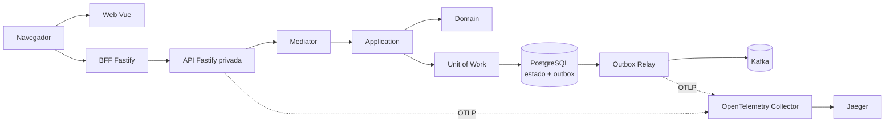
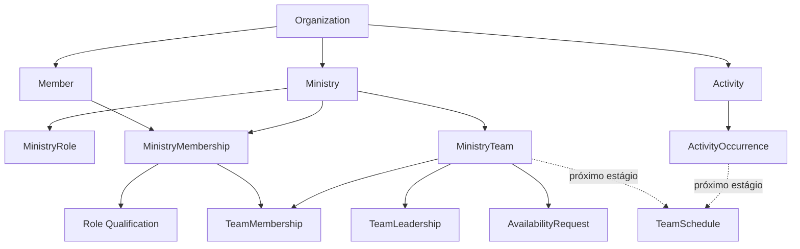

# Servir

### Gestão ministerial com domínio rico, consistência transacional e arquitetura orientada a eventos

[](https://www.typescriptlang.org/)
[](https://vuejs.org/)
[](https://nodejs.org/)
[](https://www.postgresql.org/)
[](https://kafka.apache.org/)
[](https://opentelemetry.io/)
[](https://www.terraform.io/)

Servir é uma plataforma em evolução para organizar a operação ministerial de igrejas locais: membros, ministérios, funções, times, atividades, disponibilidade e, futuramente, escalas colaborativas.

O projeto transforma esse problema real em um estudo aplicado de Domain-Driven Design, arquitetura hexagonal e sistemas orientados a eventos. As regras de negócio permanecem independentes de HTTP, banco, broker e frameworks; decisões arquiteturais e trade-offs são registrados junto ao código.

> **Estado atual:** o backend possui cortes verticais executáveis desde a criação da organização até a abertura de uma coleta de disponibilidade. API, PostgreSQL, outbox transacional, relay Kafka, observabilidade e infraestrutura local estão integrados. A interface web Vue oferece criação da organização, Início orientado a próximos passos e gestão de ministérios com busca, criação e detalhe de suas funções; a formação/publicação de escalas permanece como próximo grande incremento do domínio.

## O produto

Uma igreja local é representada por uma `Organization`, que também define a fronteira de tenant. Dentro dela, o Servir permite construir uma jornada como esta:

```text
criar organização
  → registrar membros
  → criar ministérios e suas funções
  → solicitar e aprovar participação ministerial
  → registrar qualificações
  → formar times e definir liderança
  → criar atividades e ocorrências
  → abrir coletas de disponibilidade
  → planejar e publicar escalas (próximo estágio)
```

O modelo não reduz essa operação a cadastros independentes. Ele preserva regras como vínculo ministerial aprovado, função pertencente ao mesmo ministério, liderança vigente, isolamento entre organizações, intenção civil de datas e histórico das decisões.

### Capacidades

| Área            | Disponível hoje                                           | Evolução planejada                                              |
| --------------- | --------------------------------------------------------- | --------------------------------------------------------------- |
| Organizações    | Criação e isolamento multi-tenant                         | Administração do ciclo da organização                           |
| Membros         | Registro, consulta de detalhes e listagem paginada        | Associação com identidade de acesso                             |
| Ministérios     | Criação, funções, solicitação e aprovação de participação | Suspensão, encerramento e reativação                            |
| Pessoas e times | Qualificações, times, participação e liderança vigente    | Apoio temporário e substituição de liderança                    |
| Atividades      | Criação e agendamento manual de ocorrências               | Recorrência, reagendamento e cancelamento                       |
| Disponibilidade | Abertura de coleta por time e período                     | Respostas, precedência, fechamento e lembretes                  |
| Escalas         | Modelo de domínio documentado                             | Planejamento, atribuição, publicação e substituições históricas |

O [roadmap](docs/roadmap.md) distingue o que está implementado do que ainda está em descoberta ou planejamento.

## O que este projeto demonstra

- **DDD aplicado:** Aggregates, Entities, Value Objects, Policies e linguagem ubíqua orientam o modelo.
- **Arquitetura hexagonal:** o domínio não importa Fastify, PostgreSQL, Kafka ou SDKs.
- **CQRS pragmático:** Commands alteram Aggregates; Queries usam Readers e Read Models orientados ao consumidor.
- **Consistência explícita:** estado do Aggregate e mensagens de outbox são persistidos atomicamente pela Unit of Work.
- **Mensageria durável:** um relay independente publica Integration Events versionados no Kafka com entrega at-least-once.
- **Contratos interoperáveis:** eventos públicos usam CloudEvents; falhas HTTP usam Problem Details.
- **Multi-tenancy estrutural:** dados tenant-owned carregam `organization_id` e constraints compostas impedem vínculos entre organizações.
- **Tempo como domínio:** datas e horários civis preservam timezone, offset e desambiguação de DST antes da conversão para UTC.
- **Validação completa:** erros independentes são acumulados, normalizados e apresentados com códigos estáveis e localização.
- **Composição modular:** Mediator tipado, módulos instaláveis e registros de persistência reduzem alterações centrais.
- **Observabilidade distribuída:** logs estruturados e traces correlacionam HTTP, casos de uso, PostgreSQL, relay e Kafka.
- **Operação reproduzível:** Dockerfiles independentes, Terraform, Liquibase e redes segmentadas separam build, infraestrutura, deploy e schema.
- **Decisões duráveis:** ADRs documentam contexto, alternativas e consequências de cada escolha relevante.
- **Experiência orientada a tarefas:** a interface representa o trabalho da igreja, com estados, acessibilidade e recuperação explícitos, sem espelhar CRUDs ou Aggregates.

## Arquitetura



As dependências de código apontam para o núcleo. A Application define ports conforme as necessidades dos casos de uso; adapters traduzem HTTP, persistência, mensageria, identidade, tempo e telemetria.

Um fluxo de escrita executável segue este caminho:

```text
POST /organizations/{organizationId}/ministries
  → CreateMinistry
  → invariantes do Aggregate Ministry
  → Ministry + outbox no mesmo commit PostgreSQL
  → outbox relay reivindica a mensagem sob lease
  → CloudEvent ministry.created.v1
  → Kafka
  → confirmação da outbox
```

A API e o relay são aplicações e imagens independentes. Isso permite comandos, dependências, recursos e escala próprios. Terraform administra sua infraestrutura de execução, mas não compila as imagens; a evolução do schema permanece sob responsabilidade exclusiva do Liquibase.

Leia a [visão arquitetural](docs/architecture.md) para conhecer as fronteiras e a direção das dependências.

## Modelo de domínio



Algumas escolhas importantes:

- `Ministry` é um Aggregate Root separado de `Organization`, evitando carregar toda a igreja para alterar um ministério.
- `Member` representa a pessoa conhecida pela organização; `User` será a identidade autenticável e não substitui o membro.
- `MinistryRole` representa uma função exercida no ministério, não uma permissão técnica de acesso.
- qualificações registram quais funções um membro está apto a exercer e sustentam futuras atribuições de escala.
- atividades representam o evento planejado; ocorrências representam execuções concretas com data, horário e timezone preservados.
- indisponibilidade prevalece sobre disponibilidade, e silêncio não significa disponibilidade total.
- publicações futuras de escala serão snapshots versionados; mudanças não reescreverão o histórico.

O modelo completo, invariantes e questões ainda abertas estão em [Domínio ministerial e escalas](docs/domain/ministry-scheduling.md).

## Decisões que valem conhecer

| Decisão                                                                                            | Por que importa                                                    |
| -------------------------------------------------------------------------------------------------- | ------------------------------------------------------------------ |
| [Outbox durável com Kafka](docs/decisions/024-kafka-durable-outbox-relay.md)                       | Evita publicar eventos antes do commit e permite retry controlado  |
| [CQRS pragmático](docs/decisions/029-command-query-responsibility-separation.md)                   | Separa modelos de escrita e leitura sem antecipar bancos distintos |
| [Mediator e módulos instaláveis](docs/decisions/042-typed-mediator-and-installable-modules.md)     | Reduz composição manual ao adicionar casos de uso                  |
| [Persistência registrada pelo módulo](docs/decisions/044-module-owned-persistence-registration.md) | Evita cadeias centrais de condições e mantém ownership local       |
| [Fronteiras multi-tenant](docs/decisions/046-organization-tenant-boundaries.md)                    | Protege o tenant também no schema, não apenas na aplicação         |
| [Valores temporais civis](docs/decisions/051-civil-temporal-values.md)                             | Preserva intenção humana diante de timezone e DST                  |
| [API privada atrás do BFF](docs/decisions/058-private-api-behind-containerized-frontend-bff.md)    | Expõe somente a fronteira web e isola a API na rede de aplicação   |
| [Frontend orientado a tarefas](docs/decisions/060-task-oriented-frontend-experience.md)            | Separa experiência, arquitetura de informação e estrutura interna  |

Todos os registros estão no [índice de ADRs](docs/decisions/README.md).

## Tecnologias e responsabilidades

| Tecnologia             | Responsabilidade                                            |
| ---------------------- | ----------------------------------------------------------- |
| TypeScript e Node.js   | Domínio tipado, aplicações e adapters                       |
| Fastify                | Adapter HTTP e ciclo de requisição                          |
| Awilix                 | Composition root e lifetimes explícitos                     |
| PostgreSQL             | Estado transacional, isolamento tenant e outbox             |
| Kafka e CloudEvents    | Transporte e envelope dos Integration Events                |
| OpenTelemetry e Jaeger | Propagação, coleta e visualização de traces                 |
| Liquibase              | Evolução externa e versionada do schema                     |
| Terraform              | Infraestrutura, redes, capacidade e serviços locais         |
| Docker                 | Artefatos isolados da API, relay e ferramentas operacionais |

## Executar localmente

### Desenvolvimento da API no host

Provisionados PostgreSQL e migrations conforme o [guia de infraestrutura](infrastructure/README.md):

```bash
cd backend
npm install
npm run dev:api
```

A API usa os endpoints publicados em `localhost` descritos em [`.env.example`](backend/applications/api/.env.example).

```bash
curl --fail http://localhost:3000/health/live
```

Exemplo de criação:

```bash
curl -X POST http://localhost:3000/organizations \
  -H "Content-Type: application/json" \
  -H "Accept-Language: pt-BR" \
  -d '{"name":"Igreja Batista Filadélfia de Canoas"}'
```

### Ambiente integrado

O fluxo completo mantém responsabilidades separadas:

1. construir as imagens da API e do relay;
2. provisionar redes, serviços e recursos com Terraform;
3. criar os tópicos Kafka pelo state de mensageria;
4. aplicar migrations com Liquibase;
5. habilitar API, frontend BFF e relay conforme suas dependências.

Comandos, variáveis, ordem de bootstrap e cuidados com volumes estão documentados em [Infraestrutura](infrastructure/README.md).

## Qualidade e testes

```bash
cd backend
npm run check
```

Esse comando verifica formatação, lint, testes unitários e build de todos os workspaces. Integrações PostgreSQL são explícitas e exigem banco com migrations aplicadas:

```bash
TEST_DATABASE_URL=postgresql://... npm run test:integration
```

A estratégia combina testes de domínio e Application rápidos com validação real de repositories, readers, transações, constraints e isolamento multi-tenant no PostgreSQL. Consulte a [estratégia de testes](docs/testing-strategy.md).

## Estrutura do repositório

```text
servir/
├── frontend/                          # Web Vue e BFF público independentes
├── backend/
│   ├── applications/
│   │   ├── api/                  # API HTTP e composition root
│   │   └── outbox-relay/         # Worker independente da outbox
│   └── packages/
│       ├── application-foundation/
│       ├── integration-messaging/
│       └── node-observability/
├── infrastructure/
│   ├── database/liquibase/       # Migrations canônicas
│   ├── observability/            # Pipeline local de telemetria
│   └── terraform/                # Plataforma e catálogo Kafka
├── docs/
│   ├── decisions/                # Architecture Decision Records
│   ├── domain/                   # Descoberta e regras do negócio
│   └── primitives/               # Contratos arquiteturais
└── .codex/skills/                # Guardrails locais de desenvolvimento
```

## Documentação

- [Arquitetura](docs/architecture.md)
- [Experiência da aplicação web](docs/frontend-experience.md)
- [Design System](docs/design-system/README.md)
- [Referência visual e de experiências](docs/design-system/servir-ux-ui-reference.md)
- [Domínio](docs/domain/README.md)
- [Vocabulário ubíquo](docs/glossary.md)
- [Architecture Decision Records](docs/decisions/README.md)
- [Estratégia de testes](docs/testing-strategy.md)
- [Validação e normalização](docs/input-validation-and-normalization.md)
- [Estratégia evolutiva de busca](docs/search-strategy.md)
- [Relay durável de outbox](docs/outbox-relay.md)
- [Infraestrutura e migrations](infrastructure/README.md)
- [Roadmap](docs/roadmap.md)

> A documentação em português é a fonte canônica atual. A organização bilíngue permanece registrada no roadmap.
> Toda nova tela ou alteração de interação deve seguir a ordem de decisão e o checklist do guia de experiência antes de ser considerada pronta.

## Autor

Desenvolvido por **Maurício Andrade Gomes**.

- [LinkedIn](https://www.linkedin.com/in/mauricioandradegomes/)
- [mauricioandradegomes@gmail.com](mailto:mauricioandradegomes@gmail.com)
