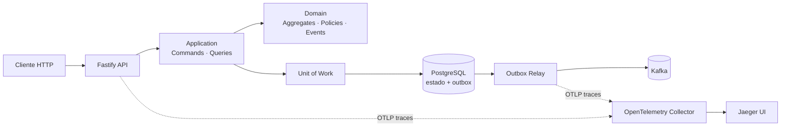
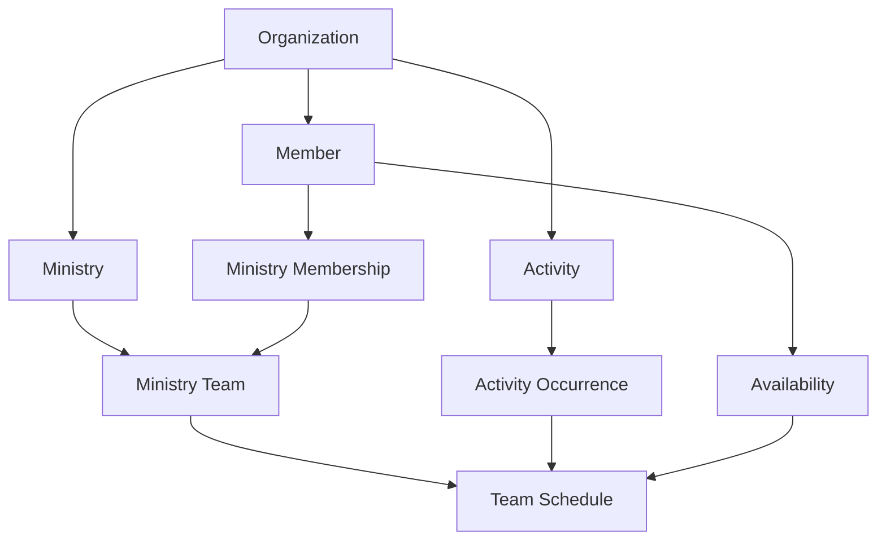

# Servir

### Gestão ministerial orientada a domínio, eventos e decisões explícitas

[](https://www.typescriptlang.org/)
[](https://nodejs.org/)
[](https://www.postgresql.org/)
[](https://kafka.apache.org/)
[](https://opentelemetry.io/)

Servir é uma plataforma em construção para organizar membros, ministérios, times, atividades, disponibilidade e escalas de uma igreja local. O projeto explora como aplicar DDD e arquitetura orientada a eventos em um produto real, mantendo regras de negócio independentes de frameworks, bancos e brokers.

Mais do que reunir tecnologias, o repositório registra as decisões, os limites e os trade-offs que sustentam cada incremento.

> **Estado atual:** a fundação arquitetural e o primeiro fluxo distribuído estão executáveis. Organizations e o registro inicial de Membership possuem cortes verticais completos. Consulte o [roadmap](docs/roadmap.md) para distinguir o que já existe do que está planejado.

## Por que este projeto é diferente?

- **Domínio independente:** Aggregates, Value Objects, Policies e Domain Events não conhecem Fastify, PostgreSQL, Kafka ou SDKs.
- **CQRS pragmático:** Commands usam Repositories orientados a Aggregates; Queries terão Readers e Read Models específicos por consumidor.
- **Decisões nomeadas:** Readers fornecem fatos e Policies puras concentram regras de negócio.
- **Consistência explícita:** Aggregate e outbox são persistidos na mesma transação por uma Unit of Work.
- **Eventos duráveis:** um relay independente publica Integration Events versionados no Kafka com entrega at-least-once.
- **Contratos interoperáveis:** mensagens externas usam CloudEvents e propagação W3C Trace Context.
- **Observabilidade desacoplada:** logs JSON estruturados e OpenTelemetry preservam correlação sem contaminar casos de uso.
- **Infraestrutura governada:** Terraform administra recursos persistentes; Liquibase administra migrations fora do lifecycle das aplicações.
- **Falhas seguras:** erros esperados possuem códigos estáveis, localização e representação HTTP por Problem Details.
- **Testes como especificação:** caminhos, condições, fluxo de dados, partições e limites orientam casos comportamentais determinísticos.

## Arquitetura em uma visão



As dependências de código apontam para o núcleo. Ports pertencem às necessidades da Application; adapters traduzem HTTP, persistência, mensageria, tempo, identidade e telemetria.

O fluxo distribuído já implementado é:

```text
POST /organizations
  → CreateOrganization
  → OrganizationCreated
  → PostgreSQL: Organization + outbox no mesmo commit
  → outbox-relay reivindica a mensagem sob lease
  → CloudEvent organization.created.v1
  → Kafka servir.organizations.events
  → confirmação da outbox
```

Leia a [visão arquitetural](docs/architecture.md) e os [Architecture Decision Records](docs/decisions/README.md) para conhecer as razões por trás do desenho.

## Domínio do produto

O modelo parte da igreja local como fronteira operacional, sem impedir redes ou estruturas maiores no futuro.



O domínio considera atividades manuais ou recorrentes, várias execuções de uma mesma atividade, escalas independentes por time, qualificações por função, indisponibilidade prioritária e histórico preservado. Os conceitos ainda em descoberta estão claramente separados dos já implementados na [documentação do domínio](docs/domain/README.md).

## Tecnologias e responsabilidades

| Tecnologia | Responsabilidade no Servir |
|---|---|
| TypeScript e Node.js | Domínio tipado, aplicações e adapters |
| Fastify | Adapter HTTP e ciclo de requisição |
| PostgreSQL | Estado transacional e outbox durável |
| Kafka | Transporte de Integration Events |
| CloudEvents | Envelope público interoperável |
| OpenTelemetry | Traces e propagação de contexto |
| Jaeger | Busca e visualização local de traces |
| Liquibase | Evolução externa e versionada do schema |
| Terraform | Ownership da infraestrutura local persistente |
| Docker | Execução isolada dos serviços e ferramentas |

## Estrutura do repositório

```text
servir/
├── backend/
│   ├── applications/
│   │   ├── api/                  # API HTTP e composition root
│   │   └── outbox-relay/         # Worker independente da outbox
│   └── packages/
│       └── integration-messaging/ # Contratos serializáveis compartilhados
├── frontend/                     # Aplicações web futuras
├── infrastructure/
│   ├── database/liquibase/       # Migrations canônicas
│   └── terraform/                # Plataforma local e tópicos Kafka
├── docs/
│   ├── decisions/                # ADRs
│   ├── domain/                   # Descoberta e modelagem do negócio
│   └── primitives/               # Contratos arquiteturais
└── .codex/skills/                # Guardrails de contribuição assistida
```

## Comece em poucos minutos

### Pré-requisitos

- Node.js compatível com ES2022 e npm workspaces.
- Docker, Terraform e Docker Compose somente para o fluxo completo.
- No Windows, a infraestrutura foi preparada para execução pelo WSL com acesso ao Docker Engine.

### API em memória

Essa opção não exige PostgreSQL nem Kafka:

```bash
cd backend
npm install
npm run dev:api
```

Em outro terminal:

```bash
curl -X POST http://localhost:3000/organizations \
  -H "Content-Type: application/json" \
  -H "Accept-Language: pt-BR" \
  -d '{"name":"Igreja Batista Filadélfia de Canoas"}'
```

Uma criação válida responde com `201 Created` e a representação direta do recurso. Falhas esperadas usam `application/problem+json` conforme RFC 9457.

### Testes e build

```bash
cd backend
npm test
npm run build
```

### Fluxo completo com PostgreSQL e Kafka

O fluxo completo possui quatro etapas:

1. Provisionar PostgreSQL, Kafka, rede e volumes com Terraform.
2. Provisionar o tópico Kafka com o state de mensageria.
3. Aplicar o schema com o job Liquibase.
4. Executar API e outbox relay em processos separados.

Os comandos, variáveis, cuidados de rede e proteção dos volumes estão no guia de [infraestrutura local e migrations](infrastructure/README.md). Os arquivos `.env.example` da [API](backend/applications/api/.env.example) e do [relay](backend/applications/outbox-relay/.env.example) documentam a configuração de cada processo.

## Estado atual

### Implementado

- Primitivas de domínio, Result, Notification, Instant e IDs nominais com UUIDv7.
- Contexto de execução com correlação e request; locale é resolvido na apresentação e o trace é propagado pelos adapters.
- Logging estruturado, instrumentação HTTP/PostgreSQL e tracing de casos de uso.
- Representação REST de sucesso e Problem Details localizado para falhas.
- `CreateOrganization` completo em memória e PostgreSQL.
- Outbox transacional com Integration Event versionado.
- Relay PostgreSQL independente, lease, retry exponencial com jitter e falha terminal.
- Publicação Kafka em CloudEvents com entrega at-least-once.
- Infraestrutura local com Terraform e migrations externas com Liquibase.
- Membership com `RegisterMember`, Policy, Reader de fatos, persistência PostgreSQL, entrada HTTP localizada e Integration Event v1.

### Em evolução

- Queries de Membership.
- Ministérios, funções, participação, aprovação e times.
- Atividades, recorrência e ocorrências com modelagem temporal explícita.
- Disponibilidade e escalas versionadas por time.
- Auditoria durável, notificações e consumidores idempotentes.
- Avaliação dos traces locais e evolução orientada por lacunas observadas.
- Frontend e documentação bilíngue.

O [roadmap completo](docs/roadmap.md) preserva critérios de saída e evita apresentar intenção como funcionalidade pronta.

## Documentação

- [Arquitetura](docs/architecture.md)
- [Filosofia e princípios](docs/philosophy.md)
- [Vocabulário ubíquo](docs/glossary.md)
- [Domínio ministerial](docs/domain/README.md)
- [Primitivas arquiteturais](docs/primitives/README.md)
- [Architecture Decision Records](docs/decisions/README.md)
- [Estratégia de testes](docs/testing-strategy.md)
- [Relay durável de outbox](docs/outbox-relay.md)
- [Infraestrutura e migrations](infrastructure/README.md)
- [Roadmap](docs/roadmap.md)

> A documentação em português é atualmente a fonte canônica. Uma versão em inglês está registrada no roadmap.

## Autor

Desenvolvido por **Maurício Andrade Gomes**.

- [LinkedIn](https://www.linkedin.com/in/mauricioandradegomes/)
- [mauricioandradegomes@gmail.com](mailto:mauricioandradegomes@gmail.com)
