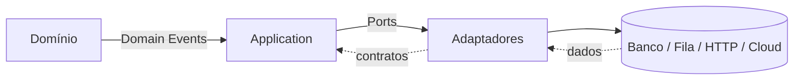
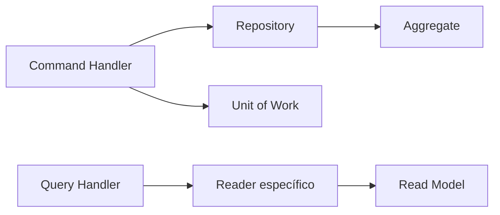

# Arquitetura

## Motivação

Construir uma linguagem arquitetural estável que permita compor aplicações diferentes sobre o mesmo núcleo.

## Problema que resolve

Aplicações crescem com acoplamento quando domínio, orquestração e detalhes técnicos compartilham responsabilidades. A arquitetura define limites e contratos antes que frameworks imponham seu modelo.

## Responsabilidades

- Definir camadas conceituais, direção das dependências e formas de comunicação.
- Preservar invariantes no domínio.
- Separar fatos, decisões, orquestração e efeitos colaterais.
- Tornar infraestrutura substituível.

## O que não faz

- Não prescreve framework, banco, protocolo ou topologia de implantação.
- Não transforma toda função em abstração.
- Não autoriza casos de uso antes da fundação.

## Fluxo

Dependências de código apontam para dentro: adaptadores conhecem contratos da aplicação e do domínio; o domínio não conhece adaptadores.

Capacidades transversais usadas por mais de uma aplicação residem em pacotes nomeados, não em um diretório `shared` genérico. `application-foundation` contém contratos independentes de runtime; `node-observability` implementa adapters de observabilidade para Node. API e relay dependem desses pacotes, enquanto decisões semânticas de cada processo permanecem locais.

A API usa um container Awilix tipado somente na composition root. Registros são separados entre dependências compartilhadas, persistência e bounded contexts; o bootstrap resolve objetos e os injeta explicitamente. Rotas, casos de uso, presenters e domínio não consultam o container. O `ExecutionContext` permanece um dado da execução, criado na borda e passado ao handler, não uma dependência global ou request-scoped escondida.

## Commands e Queries

A Application aplica separação pragmática de responsabilidades. Commands alteram estado por meio de Aggregates, Repository ports e, quando necessário, Unit of Work. Queries não reconstituem Aggregates sem necessidade: cada consulta define um Read Model e um Reader port orientados ao consumidor.

Essa separação não implica bancos ou serviços distintos. A topologia física evolui somente com uma necessidade concreta. A decisão completa está no [ADR 029](decisions/029-command-query-responsibility-separation.md).

Quando um Command depende de estado externo ao Aggregate que será alterado, um Reader pode fornecer fatos mínimos para uma Policy pura e nomeada. O Reader não retorna a decisão pronta: adapters obtêm dados, Policies decidem negócio e handlers orquestram o fluxo.

## Exemplos

- Um agregado registra `OrderCreated`; um publicador externo encaminha o evento.
- Um caso de uso depende de `Clock` e `Repository`, nunca de `Date` ou ORM.

## Relacionamento com outras primitivas

`Result` e `Notification` representam resultados esperados; entidades, agregados e value objects modelam estado; eventos comunicam fatos; ports como `Clock`, `Logger` e `Repository` isolam efeitos.

## Possíveis evoluções

Definir contratos de aplicação, envelopes de mensagem, consistência transacional e fronteiras entre bounded contexts após estabilizar a fundação.

## Boas práticas

- Fazer contratos pequenos e orientados à necessidade do consumidor.
- Registrar decisões irreversíveis ou transversais em ADR.
- Manter eventos no passado e políticas como decisões explícitas.

## Anti-patterns

- Domínio importando ORM, HTTP, filas ou SDKs.
- “Shared” como depósito de utilitários sem semântica.
- Interfaces criadas apenas para espelhar classes concretas.
