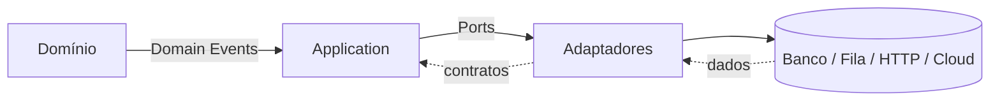
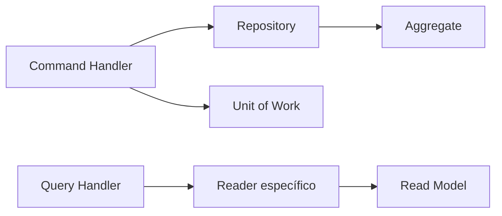

# Arquitetura

## Motivação

Construir uma linguagem arquitetural estável que permita compor aplicações diferentes sobre o mesmo núcleo.

## Problema que resolve

Aplicações crescem com acoplamento quando domínio, orquestração e detalhes técnicos compartilham responsabilidades. A arquitetura define limites e contratos antes que frameworks imponham seu modelo.

## Responsabilidades

- Definir camadas conceituais, direção das dependências e formas de comunicação.
- Preservar invariantes no domínio.
- Separar fatos, decisões, orquestração e efeitos colaterais.
- Tornar infraestrutura substituível.

## O que não faz

- Não prescreve framework, banco, protocolo ou topologia de implantação.
- Não transforma toda função em abstração.
- Não autoriza casos de uso antes da fundação.

## Fluxo

Dependências de código apontam para dentro: adaptadores conhecem contratos da aplicação e do domínio; o domínio não conhece adaptadores.

A interface reside em um workspace independente com duas aplicações. A web Vue executa no navegador e organiza cada feature entre services de Application, gateways de Infrastructure e componentes de Presentation. Componentes não conhecem `fetch`, caminhos do BFF ou contratos da API interna. A URL preserva o `organizationId` como contexto explícito do tenant, enquanto estado global só entra quando houver compartilhamento e lifecycle próprios.

O BFF Fastify é a única fronteira pública de servidor da interface. O navegador acessa somente rotas relativas `/bff/*`; cada rota é registrada explicitamente e traduz uma necessidade da tela para a API privada configurada por `API_BASE_URL`. O BFF também serve o bundle estático da web, portanto web e BFF possuem código, build e testes separados, mas o artefato inicial executa apenas o processo do BFF. Uma rede de aplicação conecta exclusivamente BFF e API; somente o BFF participa da borda e publica HTTP. A API não se torna confiável por estar numa rede privada: autenticação, autorização e isolamento de Organization continuam responsabilidades de suas fronteiras. As decisões completas estão nos [ADRs 057](decisions/057-vue-web-application-foundation.md) e [058](decisions/058-private-api-behind-containerized-frontend-bff.md).

Capacidades transversais usadas por mais de uma aplicação residem em pacotes nomeados, não em um diretório `shared` genérico. `application-foundation` contém contratos independentes de runtime, como `Logger` e `IdGenerator<TId>`; `node-observability` implementa adapters de observabilidade e a mecânica comum do OpenTelemetry para Node. API e relay especializam os contratos conforme suas necessidades e escolhem explicitamente suas instrumentações, enquanto nomes, atributos, links e decisões semânticas de cada processo permanecem locais.

Mecânicas pequenas e equivalentes, como parsing de severidade e extração segura de atributos técnicos, também podem ser compartilhadas. Lifecycle, sinais, ordem de shutdown, códigos fallback e configuração específica permanecem nas applications porque expressam garantias operacionais distintas.

A API usa um container Awilix tipado somente na composition root. Uma `ServiceCollection` oferece registros explícitos com lifetimes singleton, transient e scoped, sem expor o container ao núcleo. Cada bounded context fornece um manifesto instalável que registra seus handlers e suas rotas; adicionar um caso de uso não exige alterar listas centrais de handlers ou endpoints.

Commands e Queries são enviados por um Mediator tipado. O manifesto associa cada token de mensagem a exatamente um handler e o Mediator aplica o pipeline transversal de tracing antes da execução. Rotas conhecem o token e o Mediator, não a classe concreta do handler. O `ExecutionContext` continua explícito: nasce na borda HTTP e acompanha a mensagem, sem ambient context, Service Locator ou estado request-scoped escondido.

O runtime recebe uma única `ApplicationPersistence`, composta por um registry de tokens tipados e seu lifecycle. Cada bounded context registra as próprias portas, write scopes PostgreSQL e traduções de Integration Events. A composition root resolve tokens somente durante a montagem; o registry não atravessa para handlers, rotas ou domínio. A implementação de persistência é exclusivamente PostgreSQL; testes unitários de handlers fornecem apenas colaboradores locais mínimos dos ports que precisam observar, sem manter adapters alternativos de repositories ou readers.

Um builder acrescenta automaticamente a outbox PostgreSQL a cada write scope, enquanto a `UnitOfWork` e o uso da outbox continuam explícitos no handler. Mappers externos são registrados por `DomainEvent.name` e resolvidos em O(1), sem cadeia central de condições. As decisões completas estão nos [ADRs 042](decisions/042-typed-mediator-and-installable-modules.md) e [044](decisions/044-module-owned-persistence-registration.md).

## Isolamento multi-tenant

`Organization` é a fronteira de tenant dos dados de uma igreja local. O schema PostgreSQL é compartilhado, mas toda tabela tenant-owned carrega `organization_id`; relacionamentos entre essas tabelas usam constraints compostas para impedir referências entre Organizations. Repositories e Readers escopam leituras e escritas pelo tenant explicitamente, sem ambient context. IDs globalmente únicos ajudam a identidade, mas não substituem essa proteção. Tabelas operacionais globais podem permanecer sem tenant quando seus contratos não possuem um único proprietário. A decisão completa está no [ADR 046](decisions/046-organization-tenant-boundaries.md).

## Commands e Queries

A Application aplica separação pragmática de responsabilidades. Commands alteram estado por meio de Aggregates, Repository ports e, quando necessário, Unit of Work. Queries não reconstituem Aggregates sem necessidade: cada consulta define um Read Model e um Reader port orientados ao consumidor.

Essa separação não implica bancos ou serviços distintos. A topologia física evolui somente com uma necessidade concreta. A decisão completa está no [ADR 029](decisions/029-command-query-responsibility-separation.md).

Quando um Command depende de estado externo ao Aggregate que será alterado, um Reader pode fornecer fatos mínimos para uma Policy pura e nomeada. O Reader não retorna a decisão pronta: adapters obtêm dados, Policies decidem negócio e handlers orquestram o fluxo.

## Exemplos

- Um agregado registra `OrderCreated`; um publicador externo encaminha o evento.
- Um caso de uso depende de `Clock` e `Repository`, nunca de `Date` ou ORM.

## Relacionamento com outras primitivas

`Result` e `Notification` representam resultados esperados; entidades, agregados e value objects modelam estado; eventos comunicam fatos; ports como `Clock`, `Logger` e `Repository` isolam efeitos.

## Possíveis evoluções

Definir contratos de aplicação, envelopes de mensagem, consistência transacional e fronteiras entre bounded contexts após estabilizar a fundação.

## Boas práticas

- Fazer contratos pequenos e orientados à necessidade do consumidor.
- Registrar decisões irreversíveis ou transversais em ADR.
- Manter eventos no passado e políticas como decisões explícitas.

## Anti-patterns

- Domínio importando ORM, HTTP, filas ou SDKs.
- “Shared” como depósito de utilitários sem semântica.
- Interfaces criadas apenas para espelhar classes concretas.
