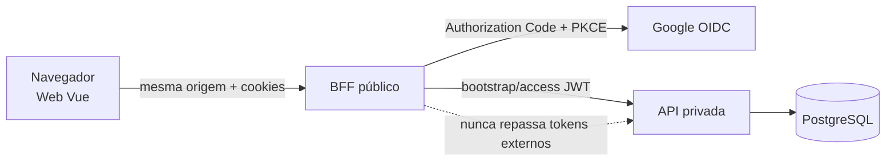
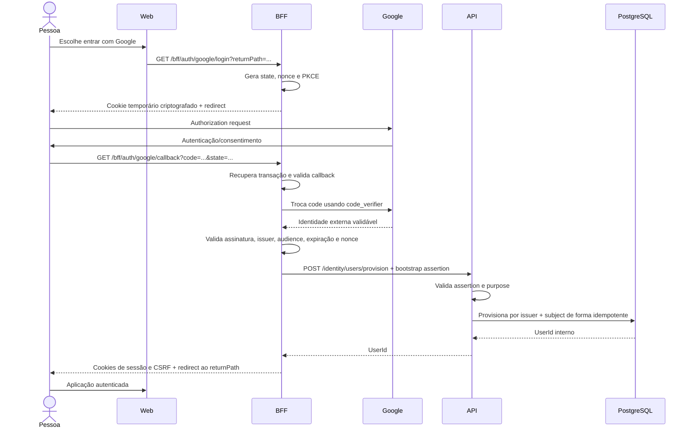
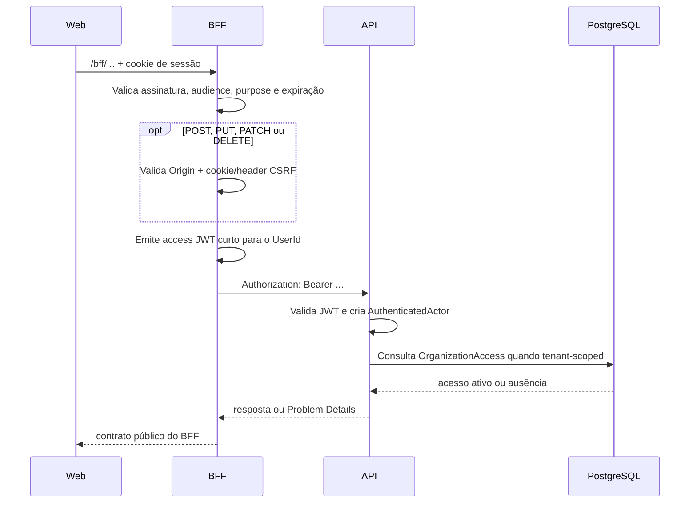

# Autenticação

## Objetivo

Explicar como o Servir autentica uma pessoa hoje, como Web, BFF, provedor OIDC e API colaboram e quais pontos precisam mudar ao integrar um novo Identity Provider (IdP).

Este guia descreve a implementação. O modelo de `User`, identidade externa e vínculo futuro com `Member` permanece em [Identity & Access](domain/identity-access.md); decisões de acesso a uma igreja permanecem na [estratégia de autorização](authorization.md).

## Estado atual

- Google é o IdP implementado; Microsoft está planejado.
- O BFF é o cliente OIDC confidencial e a única fronteira pública do backend.
- O navegador recebe cookies da sessão Servir, nunca tokens do Google ou o access token da API.
- A API reconhece o `UserId` interno e consulta `OrganizationAccess` para autorizar recursos tenant-scoped.
- A sessão é stateless, tem validade absoluta e não possui renovação deslizante.
- O vínculo explícito entre mais de um IdP e o mesmo `User`, convites e associação com `Member` estão planejados.

## Responsabilidades e fronteiras

| Participante | Responsabilidade | Não deve fazer |
| --- | --- | --- |
| Web Vue | Apresentar login, consultar o estado opaco da sessão e reagir a `401` | Armazenar ou interpretar JWTs, conhecer secrets ou autorizar operações |
| BFF Fastify | Executar OIDC, proteger cookies e CSRF, provisionar o usuário e emitir credenciais internas | Decidir sozinho o acesso a uma igreja ou repassar tokens externos |
| IdP | Autenticar a conta externa e afirmar sua identidade ao cliente OIDC | Definir `UserId`, tenant, papel ou permissão no Servir |
| API Fastify | Validar credenciais internas, criar o `AuthenticatedActor` e aplicar autorização | Receber tokens do Google ou confiar apenas na URL/BFF |
| PostgreSQL | Persistir `User`, `ExternalIdentity` e `OrganizationAccess` | Armazenar cookies, authorization codes ou tokens do IdP |



Autenticação responde **quem está operando**. Autorização responde **o que esse usuário pode fazer nessa igreja**. `Member` representa a pessoa conhecida pela igreja e não é substituído por `User`, que representa a conta global autenticável.

## Fluxo completo de login



1. A Web navega para o endpoint de login do BFF. O `returnPath` é aceito somente como caminho local seguro.
2. O BFF gera `state`, `nonce` e o par lógico PKCE. A transação é criptografada no cookie temporário `__Host-servir-oidc-login`.
3. `state` vincula início e callback e reduz login CSRF; `nonce` vincula o ID Token à transação; PKCE impede que um authorization code interceptado seja usado sem o `code_verifier`.
4. O adapter Google troca o code e valida o resultado segundo OIDC. Somente `issuer + subject` verificados formam a identidade externa.
5. Como o primeiro login ainda não conhece um `UserId`, o BFF emite uma bootstrap assertion curta, com purpose `user-provisioning`.
6. A API aceita essa credencial somente na rota de provisionamento e cria ou encontra o usuário pela identidade externa.
7. Com o `UserId` devolvido pela API, o BFF emite a sessão Servir e cria o segredo CSRF correspondente.

E-mail e nome são atributos mutáveis. Eles nunca associam automaticamente identidades, usuários ou membros.

## Requisição autenticada



O `organizationId` da rota seleciona o tenant, mas não concede acesso. A decisão continua na API mesmo que a Web esconda uma ação e o BFF tenha aceitado a sessão.

## Credenciais e cookies

| Artefato | Emissor → consumidor | Finalidade | Exposição e validade padrão |
| --- | --- | --- | --- |
| Authorization code | IdP → BFF | Resultado descartável do redirect OIDC | Passa pelo navegador; uso único e curto |
| ID Token/resposta OIDC | IdP → BFF | Provar a identidade externa ao cliente | Processado no BFF; não vai à Web ou API |
| Cookie de transação | BFF → BFF | Preservar `state`, `nonce`, PKCE e retorno | Criptografado, `HttpOnly`, `Secure`, 5 min |
| Bootstrap assertion | BFF → API | Provisionar `User` antes de existir sessão | JWT interno, purpose restrito, 60 s |
| Cookie de sessão | BFF → BFF | Identificar o `UserId` e vincular CSRF | `__Host-`, `HttpOnly`, `Secure`, 8 h |
| Cookie/token CSRF | BFF ↔ Web | Comprovar intenção same-origin em mutações | Cookie legível pela Web, `SameSite=Strict`, 8 h |
| Access token interno | BFF → API | Autenticar o `UserId` na chamada privada | JWT interno, não entregue à Web, 5 min |

Os tempos são configuráveis. Os valores da tabela são os fallbacks atuais, não um contrato permanente de produto.

## Validade e renovação

O access token de cinco minutos não usa refresh token. Em cada requisição autenticada, o BFF valida o cookie de sessão e emite um novo access token exclusivo da API. O token existe apenas durante o encaminhamento daquela chamada e pode expirar sem interromper a sessão do navegador.

```text
cookie de sessão válido
  → BFF emite access token curto
  → API processa a chamada
  → próxima chamada recebe outro token
```

A sessão atual possui validade absoluta de oito horas. Atividade não prolonga esse prazo. Depois da expiração, o BFF retorna `401` e a Web conduz a pessoa ao login. Se a sessão do Google ainda estiver válida, o novo fluxo OIDC pode terminar sem solicitar a senha novamente, mas continua sendo uma nova autenticação.

Não há refresh token do Google porque o Servir não chama APIs Google depois do login. Solicitar acesso offline adicionaria uma credencial durável sem consumidor.

Uma evolução possível é renovar a sessão Servir perto da expiração, mantendo dois limites: tempo máximo de inatividade e validade absoluta desde o login. Isso exige nova decisão sobre rotação do cookie e CSRF, revogação, múltiplos dispositivos e replay. Apenas aumentar indefinidamente o prazo da sessão não é equivalente a refresh seguro.

## Relação entre os arquivos

### Web

| Arquivo | Importância e relação |
| --- | --- |
| `src/main.ts` | Monta a aplicação e instala o store de sessão e o router. |
| `src/app/providers/session-provider.ts` | Cria e disponibiliza a sessão como dependência da aplicação. |
| `src/app/router/authentication-guard.ts` | Carrega a sessão antes da navegação e separa rotas públicas e autenticadas. |
| `src/shared/auth/session.ts` | Define o contrato público de `/bff/auth/session` e constrói a URL same-origin do Google. |
| `src/shared/auth/session-store.ts` | Mantém o snapshot opaco, evita consultas concorrentes e permite invalidá-lo no logout. |
| `src/shared/api/http-client.ts` | Centraliza requests, cookies same-origin, CSRF, locale e tradução de Problem Details. |
| `src/pages/sign-in/SignInPage.vue` | Apresenta a jornada de entrada; não implementa OIDC. |
| `src/features/sign-out/sign-out.ts` | Solicita logout ao BFF; componentes apenas disparam a intenção. |

Componentes não devem chamar endpoints diretamente nem interpretar detalhes de credenciais. Features e `shared/auth` concentram esse conhecimento.

### BFF

| Arquivo | Importância e relação |
| --- | --- |
| `src/config.ts` | Valida configuração OIDC, secrets, audiences e TTLs no startup. |
| `src/service.ts` | Composition root: cria provider, codecs, emissor e cliente da API. |
| `src/create-application.ts` | Instala segurança, rotas de autenticação, guard, módulos e entrega da Web. |
| `src/authentication/oidc-provider.ts` | Contrato comum entre o fluxo do BFF e adapters de IdP. |
| `src/authentication/google-oidc-provider.ts` | Adapter Google: descoberta, authorization URL e validação do callback. |
| `src/authentication/register-google-authentication-routes.ts` | Orquestra login, callback, provisionamento, sessão e logout atuais. |
| `src/authentication/authentication-cookie-codec.ts` | Criptografa e autentica a transação temporária de login. |
| `src/authentication/internal-credential-issuer.ts` | Assina bootstrap assertions, sessões e access tokens com purposes/audiences distintos. |
| `src/authentication/user-provisioning-client.ts` | Chama a rota privada de provisionamento da API. |
| `src/authentication/session-guard.ts` | Valida sessão e defesa CSRF sem conhecer módulos de negócio. |
| `src/http/register-session-guard.ts` | Aplica o guard às rotas `/bff/*` e emite o access token por request. |
| `src/shared/api-forwarder.ts` | Encaminha à API privada o Bearer token obtido do guard. |
| `src/authentication/authentication-error.ts` e `src/shared/*problem*` | Mantêm falhas estáveis e localizáveis sem controlar fluxo por texto. |

O contrato do provider já é genérico, mas composição, dependências e rotas ainda carregam nomes Google. Um novo IdP deve primeiro generalizar essa orquestração; duplicar todo o fluxo por provedor criaria divergências de segurança.

### API

| Arquivo | Importância e relação |
| --- | --- |
| `src/shared/infrastructure/authentication/jose-credential-verifiers.ts` | Valida access tokens e bootstrap assertions com chaves públicas e propósitos distintos. |
| `src/shared/infrastructure/http/fastify/register-fastify-authentication.ts` | Extrai a credencial HTTP e cria o ator autenticado para o contexto da requisição. |
| `src/shared/application/context/execution-context.ts` | Propaga o `AuthenticatedActor` sem transportar Fastify ou JWT para a Application. |
| `src/modules/identity/application/provision-user-from-external-identity.ts` | Orquestra o provisionamento idempotente a partir da assertion externa. |
| `src/modules/identity/infrastructure/register-provision-user-route.ts` | Expõe a única entrada que aceita a credencial de bootstrap. |
| `src/modules/identity/infrastructure/postgres-user-provisioner.ts` | Persiste/encontra `User` e identidade externa pela chave estável do IdP. |
| `src/modules/identity/infrastructure/register-organization-access-guard.ts` | Exige acesso ativo nas rotas tenant-scoped. |
| `src/composition/modules/register-identity-module.ts` | Registra rotas e guards de Identity sem espalhar composição pelo núcleo. |

## Adicionar um novo IdP

O roteiro abaixo pressupõe OIDC. Um protocolo diferente exige uma decisão própria.

1. Confirmar discovery URL, issuer exato, audiences, algoritmos permitidos, claims e regras específicas do provedor.
2. Implementar um adapter de `OidcProvider`, preservando validação de callback, `state`, `nonce` e PKCE.
3. Generalizar `register-google-authentication-routes.ts` para uma orquestração compartilhada e manter somente path, provider e configuração como variações.
4. Generalizar os tipos `GoogleAuthenticationRouteDependencies` usados pela composição e pelo guard.
5. Adicionar configuração validada em `src/config.ts`; configuração parcial deve impedir o startup ou desabilitar explicitamente apenas o provider incompleto.
6. Instanciar o adapter em `src/service.ts` e registrá-lo em `src/create-application.ts`.
7. Adicionar uma ação de entrada na feature Web; o componente deve usar uma função de `shared/auth`, não uma URL espalhada.
8. Incluir códigos de erro e traduções `pt-BR`/`en-US` sem tomar decisões por texto localizado.
9. Configurar origem e callback exatos no console do IdP, nos envs e na infraestrutura/deploy.
10. Testar authorization URL, callback válido, issuer/audience/nonce incorretos, transação ausente/expirada, erro do IdP e provisionamento repetido.
11. Manter a API inalterada quando o novo adapter produzir o mesmo `issuer + subject` verificado e o mesmo contrato de bootstrap.

Ao associar dois IdPs ao mesmo usuário, exigir sessão existente e nova autenticação no segundo provedor. Nunca vincular automaticamente por coincidência de e-mail ou nome.

## Configuração e secrets

O BFF usa `GOOGLE_OIDC_CLIENT_ID`, `GOOGLE_OIDC_CLIENT_SECRET`, `GOOGLE_OIDC_REDIRECT_URI` e as configurações `AUTH_*` de issuer, audience, `kid`, TTLs, chave de cookies e JWK privada. A API recebe o mesmo issuer/audience e um JWKS somente com material público. Os exemplos canônicos ficam em [`frontend/.env.example`](../frontend/.env.example) e [`backend/applications/api/.env.example`](../backend/applications/api/.env.example).

Em produção, o deploy deve materializar secrets como arquivos ou variáveis antes do startup. Não se consulta um secret store a cada request. Arquivos montados reduzem exposição em listagens de ambiente, mas ainda exigem permissões, rotação e proteção do host.

Para rotacionar a assinatura sem interromper sessões:

1. gerar o novo par e um novo `kid`;
2. publicar na API as chaves públicas antiga e nova;
3. alterar o BFF para assinar com a nova chave;
4. aguardar expirar toda credencial assinada pela chave antiga;
5. remover a chave pública antiga.

## Observabilidade e diagnóstico

- Nunca registrar authorization code, cookies, client secret, ID Token, assertions ou access tokens.
- Registrar códigos de falha, IdP, etapa, correlation/request IDs e resultado técnico sem PII desnecessária.
- `state` inválido, `nonce` inválido ou transação ausente indicam callback rejeitado, não usuário inexistente.
- `401` do BFF indica sessão ausente/inválida; `403` em mutação pode indicar CSRF; `403` da API tenant-scoped pode indicar ausência de `OrganizationAccess`.
- `kid` desconhecido normalmente indica rotação fora de ordem ou JWKS divergente.
- Callback URI deve coincidir exatamente entre console do IdP e `GOOGLE_OIDC_REDIRECT_URI`.

Os testes unitários ficam junto dos codecs, emissores, guards e adapters. O provisionamento, persistência e limites de acesso também precisam de integração com PostgreSQL real.

## Decisões relacionadas

- [ADR 058 — API privada atrás do BFF](decisions/058-private-api-behind-containerized-frontend-bff.md)
- [ADR 066 — Identity & Access e vínculo com Member](decisions/066-identity-access-and-member-linking.md)
- [ADR 067 — OIDC direto e credenciais emitidas pelo Servir](decisions/067-direct-oidc-and-servir-issued-credentials.md)
- [ADR 068 — Contexto causal e auditoria](decisions/068-causal-execution-context-and-audit-boundary.md)
- [ADR 069 — Bootstrap do acesso do criador](decisions/069-organization-creator-access-bootstrap.md)

## Anti-patterns

- Guardar tokens em `localStorage` ou expô-los à Web.
- Usar ID/access token do IdP como credencial da API Servir.
- Misturar autenticação, acesso à igreja e vínculo com `Member`.
- Autorizar apenas porque o BFF aceitou a sessão ou a rota contém um `organizationId`.
- Duplicar o fluxo de segurança inteiro para cada IdP.
- Renovar sessões indefinidamente sem limite absoluto e estratégia de revogação.
- Solicitar refresh token externo sem uma API externa que precise dele.
