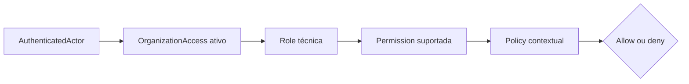

# Autorização

## Objetivo

Definir como o Servir decide quem pode executar uma operação sem misturar autenticação, vínculo com a igreja, função ministerial e permissão técnica.

## Estado atual

Estão implementados autenticação Google pelo BFF, `User` interno, sessão segura, access token próprio, `AuthenticatedActor` na API, o bootstrap atômico do `OrganizationAccess` `owner` ao criar uma Organization e o primeiro guard HTTP tenant-scoped baseado em acesso ativo.

Rotas autenticadas que recebem `organizationId` agora exigem um `OrganizationAccess` ativo para o par `UserId + OrganizationId`; ausência de identidade produz `401` e ausência de acesso produz `403`. Capabilities, policies específicas, papéis administrativos adicionais, convites e vínculo com Member permanecem incrementais. Exemplos marcados como planejados não representam APIs disponíveis.

`GET /organizations` lista somente Organizations ligadas ao ator autenticado por um acesso ativo. O cliente não fornece `userId`; a identidade vem da credencial validada. Essa consulta sustenta a seleção segura de igreja sem transformar conhecimento de um `organizationId` em autorização.

## Perguntas separadas

| Pergunta                                      | Conceito                      | Responsável                     |
| --------------------------------------------- | ----------------------------- | ------------------------------- |
| Quem é a pessoa autenticada?                  | `User` e `AuthenticatedActor` | OIDC, BFF e autenticação da API |
| Ela possui acesso a esta igreja?              | `OrganizationAccess`          | Identity & Access na API        |
| Qual capacidade técnica recebeu?              | role e permission             | autorização do Servir           |
| A capacidade vale para este recurso e estado? | policy contextual             | Application e domínio           |
| Qual serviço ministerial ela exerce?          | `MinistryRole`                | domínio ministerial             |

`organizationId` na URL seleciona contexto; não concede acesso. `MinistryRole` nunca substitui role ou permission técnica.

## Modelo incremental

O Servir combina mecanismos conforme a pergunta, sem criar um motor genérico antecipadamente:

- ReBAC: `User` possui um `OrganizationAccess` ativo para a Organization.
- RBAC: roles agrupam capabilities administrativas quando surgirem consumidores concretos.
- ABAC: policies avaliam tenant, estado do recurso e outros atributos necessários à operação.



O primeiro papel sistêmico é `owner`. Um único papel base por acesso atende o consumidor atual; múltiplos papéis, roles customizadas e associações role-permission só serão introduzidos quando uma jornada administrativa demonstrar essa necessidade.

## Enforcement e decisão

O ponto que bloqueia ou permite uma entrada é o Policy Enforcement Point (PEP). HTTP é um PEP, mas não o único: consumidores de mensagens e jobs também precisam aplicar autorização quando executarem ações em nome de um ator.

O componente que decide allow ou deny é o Policy Decision Point (PDP). Inicialmente ele permanece modular dentro da API e é expresso por readers, authorizers e policies orientados a casos de uso. Não haverá um serviço remoto nem uma API genérica `Can(user, action, resource)` sem consumidores que provem esse contrato.

Fluxo de uma operação tenant-scoped:

```text
access token válido?
  não → 401
  sim → resolver UserId
       → existe OrganizationAccess ativo para o organizationId?
           não → 403
           sim → possui capability exigida?
                 não → 403
                 sim → policy contextual permite?
                       não → 403 ou falha de domínio apropriada
                       sim → executar caso de uso
```

O guard HTTP reduz repetição, mas não substitui a proteção do caso de uso quando ele puder ser chamado por outra entrada. O `ExecutionContext` transporta identidade causal validada; não transporta JWT, request HTTP ou um service locator.

## Banco e código

Princípio central: o código define capacidades e invariantes suportadas; o banco registra relações e atribuições mutáveis.

| Elemento                                 | Local canônico                  |
| ---------------------------------------- | ------------------------------- |
| `User`, `OrganizationAccess` e vínculos  | banco                           |
| role atribuída ao acesso                 | banco                           |
| relação futura com `Member`              | banco                           |
| capabilities reconhecidas pela aplicação | código                          |
| significado de cada capability           | código                          |
| isolamento tenant e invariantes          | código e constraints            |
| role → permissions configurável          | banco, quando houver consumidor |
| expressões arbitrárias de policy         | não suportadas inicialmente     |

Capabilities futuras devem usar vocabulário estável, como `member:invite`, `ministry:create` ou `schedule:publish`, e existir somente quando uma operação real as consumir. O banco não se transforma em linguagem de programação.

## Princípios de segurança

- Deny by default: ausência de acesso, capability ou condição produz negação.
- Least privilege: nenhum papel recebe capacidades apenas por conveniência.
- Backend authoritative: ocultar uma ação no frontend melhora UX, mas não autoriza nem protege.
- Tenant explicit: acesso sempre combina `UserId` e `OrganizationId`.
- Falhas distintas: `401` para identidade ausente ou inválida; `403` para ator conhecido sem autorização.
- Sem associação por coincidência: nome e e-mail não vinculam User, Member ou OrganizationAccess.
- Segredos mínimos: tokens, cookies e claims sensíveis não entram em logs, eventos ou domínio.
- Constraints como segunda barreira: unicidade e referências tenant-safe permanecem no PostgreSQL.

## Evolução

1. ~~Verificar `OrganizationAccess` ativo nas primeiras operações tenant-scoped.~~
2. Centralizar o contrato mínimo de decisão demonstrado por esses consumidores.
3. Introduzir capabilities para operações administrativas concretas.
4. Adicionar novos papéis sistêmicos somente quando suas diferenças forem especificadas.
5. Tornar roles e associações configuráveis se a administração da igreja exigir isso.
6. Avaliar múltiplos papéis, ACLs de recursos ou relações genéricas apenas com casos reais.
7. Extrair PDP, cache ou Policy Engine somente quando escala, múltiplos serviços ou políticas dinâmicas justificarem seus custos de latência, disponibilidade e operação.

## Anti-patterns

- Confiar no BFF ou no frontend como barreira única.
- Autorizar porque o recurso existe ou porque o tenant veio na URL.
- Usar `MinistryRole` como permissão técnica.
- Criar tabelas genéricas de relationships antes de relações concretas.
- Espalhar strings de permission sem catálogo tipado.
- Colocar regras booleanas arbitrárias no banco e interpretá-las como código.
- Consultar um serviço remoto de autorização por request sem necessidade operacional.
- Carregar todas as permissões no JWT e aceitar decisões obsoletas durante toda a sessão.

## Relações

- [Identity & Access](domain/identity-access.md)
- [Arquitetura](architecture.md)
- [ADR 066 — Identity & Access](decisions/066-identity-access-and-member-linking.md)
- [ADR 067 — OIDC e credenciais do Servir](decisions/067-direct-oidc-and-servir-issued-credentials.md)
- [ADR 069 — Bootstrap do acesso do criador](decisions/069-organization-creator-access-bootstrap.md)
- [ADR 070 — Estratégia incremental de autorização](decisions/070-incremental-hybrid-authorization.md)
