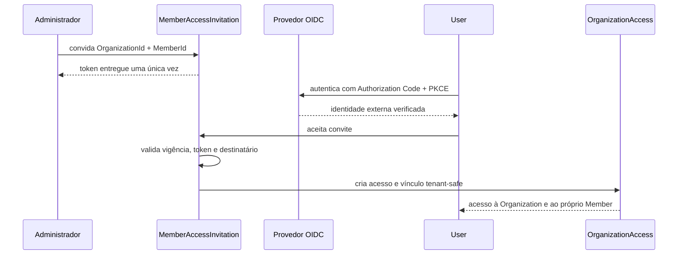

# ADR 066 — Identity & Access e vínculo seguro com Member

- Estado: aceita
- Data: 2026-08-15
- Complementa: [ADR 046](046-organization-tenant-boundaries.md) e [ADR 058](058-private-api-behind-containerized-frontend-bff.md)

## Contexto

`Member` representa uma pessoa conhecida por uma igreja e pode existir antes de ela usar o Servir. A mesma pessoa pode posteriormente criar uma conta global, participar de mais de uma Organization ou autenticar-se por provedores diferentes. Nome e e-mail não provam que dois cadastros representam a mesma pessoa; associação automática poderia conceder acesso aos dados de outro membro.

A URL contém `organizationId`, mas esse identificador apenas seleciona contexto e não concede acesso. A API privada também não se torna confiável por estar atrás do BFF. É necessário separar autenticação, acesso à Organization, vínculo com Member e funções ministeriais.

## Decisão

O Servir terá um contexto `Identity & Access` com três fronteiras iniciais:

- `User` é uma Aggregate Root global que representa a conta autenticável. Credenciais continuam no provedor OIDC; o Aggregate preserva identidades externas pelo par imutável `issuer + subject`.
- `OrganizationAccess` é uma Aggregate Root tenant-scoped que concede a um `User` acesso a uma `Organization` e pode vinculá-lo a exatamente um `Member` da mesma Organization.
- `MemberAccessInvitation` é uma Aggregate Root tenant-scoped, temporária e de uso único, que convida uma identidade autenticada a assumir o vínculo com um `Member` específico.

`Member` não recebe credenciais nem `UserId`. `User` não recebe dados ministeriais. Permissões técnicas pertencem a `OrganizationAccess`; `MinistryRole` continua descrevendo serviço ministerial.

As invariantes estruturais iniciais são:

- no máximo um acesso vigente por `OrganizationId + UserId`;
- no máximo um acesso vigente vinculado a `OrganizationId + MemberId`;
- o Member vinculado precisa pertencer à mesma Organization;
- um User pode vincular-se a um Member diferente em cada Organization;
- nome e e-mail nunca criam vínculo automaticamente;
- convite expira, é consumido uma única vez e armazena somente o digest de um token aleatório de alta entropia;
- aceitação exige User autenticado e, quando o convite possuir destinatário, e-mail verificado compatível;
- consumir o convite e criar `OrganizationAccess` ocorre atomicamente;
- conflitos de unicidade continuam protegidos pelo PostgreSQL, além das Policies da Application.

O primeiro protocolo de autenticação será OIDC com Authorization Code e PKCE. O contrato será independente de fornecedor. O BFF conduz redirecionamento, `state`, `nonce`, PKCE e sessão em cookie `HttpOnly`, `Secure` e `SameSite`; tokens não entram em `localStorage`. A API valida issuer, audience, assinatura, expiração e demais claims exigidas, e continua responsável pela autorização.

O `ExecutionContext` será ampliado com ator autenticado e acesso tenant selecionado depois da validação na borda. Handlers não recebem objetos HTTP, JWTs ou SDKs do provedor. `organizationId` vindo da rota precisa coincidir com um acesso autorizado; não é fonte de autorização.

## Consequências

Um cadastro de Member permanece útil sem conta. Um User autenticado pode existir sem acesso a nenhuma Organization. Convites resolvem o vínculo exato sem permitir que uma pessoa navegue por membros e escolha uma identidade. Contas administrativas que não representem um Member continuam possíveis porque vínculo pessoal e autorização organizacional são conceitos distintos.

Identity & Access passa a ser transversal à API, BFF, frontend, `ExecutionContext`, infraestrutura e testes. Sessões precisam de proteção CSRF e rotação; tokens, códigos e claims sensíveis não podem aparecer em logs, URLs persistidas, Domain Events ou Integration Events. Dados de contato exigem retenção e minimização explícitas.

Cadastros duplicados de Member não são mesclados por Identity. Uma futura operação auditável de merge deverá preservar referências históricas e exigirá decisão própria.

## Alternativas

Vincular por nome foi rejeitado porque nomes não são únicos nem estáveis. Vincular automaticamente por e-mail foi rejeitado porque e-mails podem ser incorretos, compartilhados, alterados ou ainda não verificados. Colocar senha ou `UserId` em Member foi rejeitado porque mistura pessoa tenant-scoped com identidade global. Permitir que o usuário escolha um Member numa lista foi rejeitado por exposição de dados e tomada de identidade. Implementar senha local foi rejeitado porque amplia desnecessariamente a superfície de segurança; OIDC mantém credenciais num provedor especializado.
