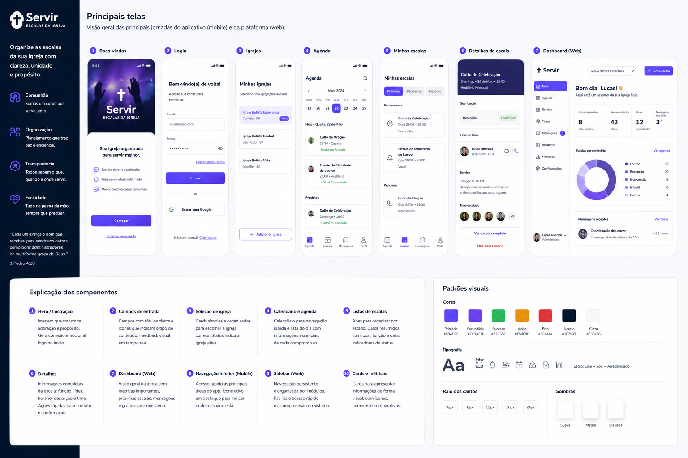
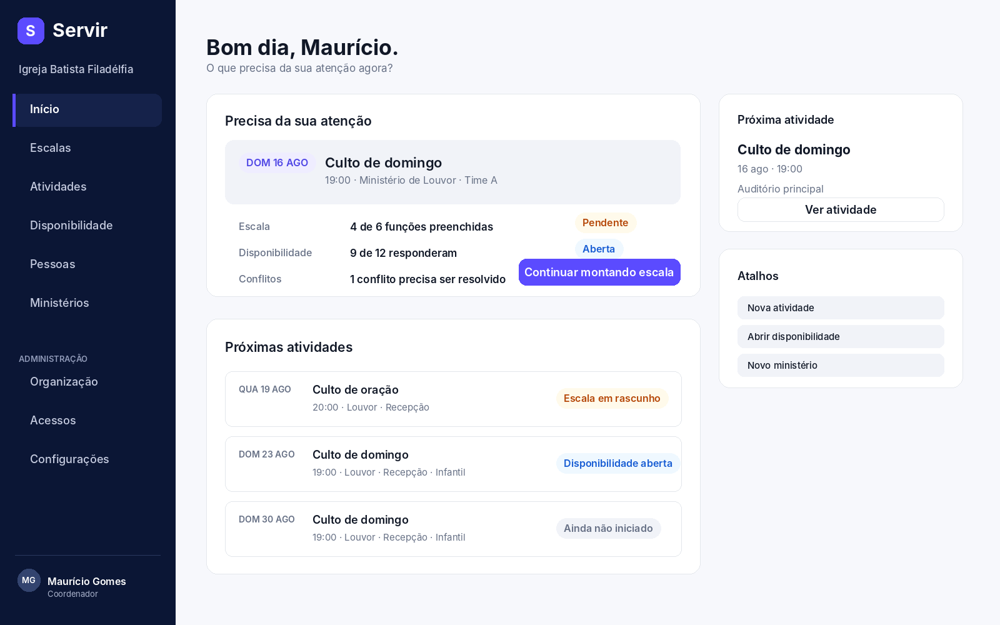
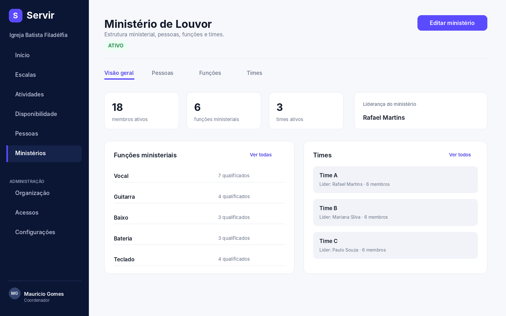
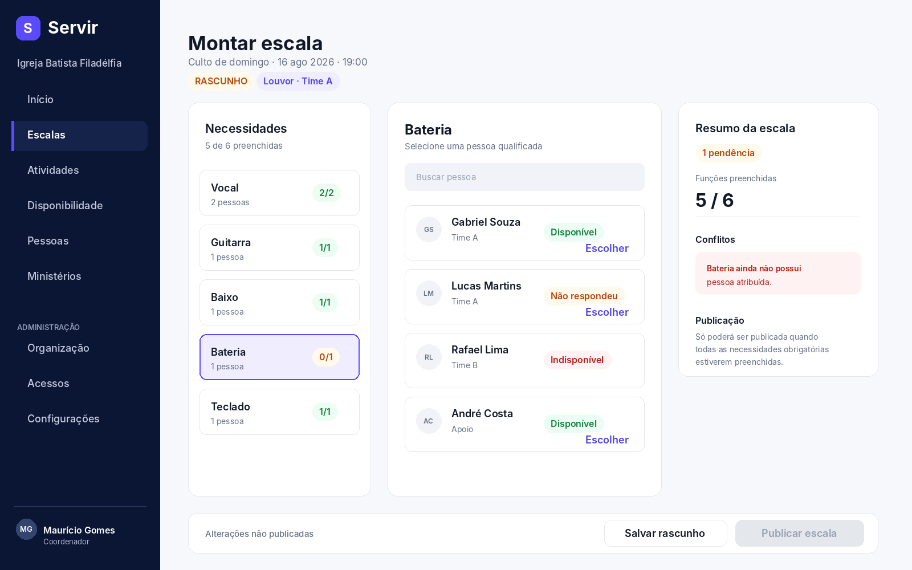
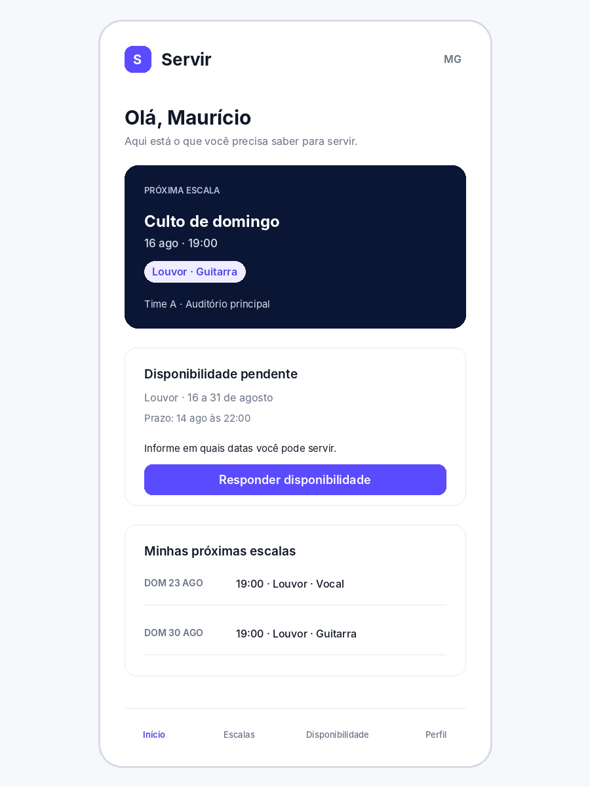

# Servir — Referência de UX/UI para implementação no Codex

**Produto:** gestão ministerial e escalas para igrejas locais  
**Escopo deste documento:** direção visual, arquitetura de informação, contratos de interação, componentes e especificações de telas  
**Data da revisão:** 13 de agosto de 2026  
**Status:** referência complementar ao repositório; não substitui o domínio nem os ADRs

> **Vocabulário vigente:** `MinistryRole` permanece como nome técnico do domínio. A interface apresenta esse conceito como **função ministerial**, evitando confundi-lo com papel ou permissão de acesso. Em caso de divergência nos mockups, prevalecem o glossário e `docs/frontend-experience.md`.

---

## 0. Como o Codex deve usar este documento

Este documento existe para reduzir decisões visuais improvisadas durante a implementação do frontend. Ele descreve **como o Servir deve parecer e se comportar**, mas não redefine regras de negócio.

### Hierarquia de autoridade

Quando houver conflito, obedecer nesta ordem:

1. regras e invariantes do domínio no repositório;
2. `docs/frontend-experience.md`;
3. `docs/domain/ministry-scheduling.md` e vocabulário do domínio;
4. documentos do design system, especialmente `docs/design-system/button.md`;
5. este documento de direção visual e especificação de telas;
6. o mockup visual utilizado como inspiração.

> **Regra crítica:** o mockup é referência de estética, densidade, hierarquia e composição. O conteúdo do mockup não é fonte de verdade. Se uma tela bonita contradizer o domínio, a tela deve ser alterada.

### Não inventar funcionalidades

O Codex não deve criar endpoints, DTOs, dados falsos em produção, permissões, autenticação, recorrência, mensagens ou funcionalidades não existentes apenas para completar visualmente uma tela.

Quando uma experiência ainda não possuir read model ou caso de uso executável, existem três opções válidas:

- não expor a entrada na navegação ainda;
- implementar apenas a estrutura visual quando isso fizer parte explícita da tarefa;
- documentar a dependência e deixar o estado honesto, sem fabricar dados operacionais.

### Status usados neste documento

- **IMPLEMENTÁVEL AGORA:** pode ser construído com capacidades já presentes ou com o frontend existente.
- **PRÓXIMO CORTE:** o domínio/backend possui parte relevante, mas a experiência ainda depende de integração/read model complementar.
- **CONCEITUAL:** referência para a evolução planejada; não deve ser tratada como funcionalidade pronta.

---

# 1. O produto que estamos desenhando

O Servir é um sistema de **gestão ministerial e escalas para igrejas locais**. Ele não é um marketplace de voluntariado, não é uma rede social cristã e não é um sistema genérico de gestão de pessoas.

A unidade operacional é uma igreja local, representada por uma `Organization`. Dentro dela, o trabalho real envolve:

**membros → ministérios → funções ministeriais → participação aprovada → qualificações → times → liderança → atividades → ocorrências → disponibilidade → escala → publicação → histórico**.

O usuário não precisa conhecer esses nomes técnicos. A interface traduz o domínio para tarefas reconhecíveis da rotina da igreja.

## 1.1 Modelo mental do coordenador

Um coordenador ou líder ministerial pensa em perguntas como:

- Quem vai servir no próximo culto?
- Quem respondeu a disponibilidade?
- Quem está apto para bateria?
- O Time A já está completo?
- Falta alguém na recepção?
- Qual escala ainda está em rascunho?
- Quem já serve no Ministério de Louvor?
- Qual é a próxima ocorrência do Culto de domingo?

A interface deve organizar o produto ao redor dessas perguntas, e não ao redor de tabelas ou aggregates.

## 1.2 Modelo mental do membro

O membro da igreja precisa de um fluxo mais simples:

- Onde vou servir?
- Em qual data e horário?
- Qual é a minha função?
- Em quais datas preciso informar disponibilidade?
- O que já respondi?

A experiência do membro deve ser especialmente boa no celular.

## 1.3 Regras do domínio que afetam diretamente a UI

A interface deve refletir, no mínimo, estas regras:

- uma função ministerial pertence a um ministério;
- uma pessoa precisa ter vínculo ministerial aprovado e qualificação ativa para ser atribuída regularmente a uma função;
- times pertencem a um ministério;
- uma atividade planejada é diferente de uma ocorrência concreta;
- indisponibilidade prevalece sobre disponibilidade;
- silêncio não significa disponibilidade;
- `unspecified` pode entrar no planejamento apenas com alerta/confirmação quando o domínio permitir;
- uma pessoa não pode possuir duas atribuições ativas na mesma ocorrência;
- necessidades obrigatórias precisam estar preenchidas antes da publicação;
- uma escala publicada deve preservar histórico/versionamento e não ser silenciosamente sobrescrita.

---

# 2. Princípios de experiência

A direção usa a hierarquia já estabelecida no repositório: adequação à tarefa, heurísticas de Nielsen, Don Norman, WCAG 2.2, Gestalt e convenções consistentes da web.

## 2.1 Tarefa antes da entidade

Cada página deve responder uma pergunta ou permitir concluir uma tarefa.

| Área | Pergunta principal |
|---|---|
| Início | O que precisa da minha atenção agora? |
| Escalas | Quem vai servir? |
| Disponibilidade | Quem pode servir? |
| Atividades | Quando precisamos de pessoas? |
| Ministérios | Como a estrutura ministerial está organizada? |
| Pessoas | Quem são as pessoas e onde elas servem? |

## 2.2 Estado do sistema sempre visível

O usuário deve saber quando algo está:

- carregando;
- salvando;
- salvo;
- em rascunho;
- publicado;
- pendente;
- concluído;
- com conflito;
- indisponível;
- sem resposta;
- em erro recuperável.

Não usar apenas cor para comunicar esses estados.

## 2.3 Prevenir antes de explicar erro

Se uma pessoa está indisponível, não permitir uma seleção silenciosa e depois retornar erro no fim do fluxo. Se a publicação exige todas as necessidades obrigatórias preenchidas, isso deve estar visível antes do clique em Publicar.

## 2.4 Reconhecimento em vez de memorização

Durante a montagem da escala, manter visíveis:

- atividade e ocorrência;
- data e horário;
- ministério e time;
- função selecionada;
- quantidade necessária;
- disponibilidade da pessoa;
- conflitos conhecidos.

O usuário não deve precisar voltar a outra tela para lembrar o contexto.

## 2.5 Controle e reversibilidade

- salvar rascunho não é publicar;
- cancelar edição deve existir quando houver estado local relevante;
- alterações em conteúdo publicado precisam deixar claro o efeito sobre histórico;
- quando uma ação puder ser desfeita com segurança, preferir desfazer a confirmações excessivas.

---

# 3. Direção visual

## 3.1 Personalidade

A interface deve transmitir:

- organização;
- confiança;
- calma;
- cuidado com pessoas;
- modernidade sem modismo;
- contexto de igreja sem parecer um site institucional religioso.

Evitar:

- dashboards genéricos cheios de métricas sem ação;
- excesso de cruzes, pombas, mãos levantadas ou iconografia religiosa decorativa;
- visual de ONG/voluntariado social;
- gradientes chamativos como padrão de superfície;
- glassmorphism, neon e sombras profundas;
- cards para todo conteúdo;
- roxo em todo elemento da tela.

## 3.2 Referência estética

A prancha abaixo foi a direção visual aprovada como inspiração. Usar **paleta, leveza, navegação escura, contraste, radius e organização** como referência. Não copiar literalmente os conteúdos de “Igrejas”, “Mensagens”, gráficos ou quaisquer partes que não pertençam ao domínio atual.

{width=92%}

## 3.3 Paleta sugerida

A identidade pode partir de indigo/violeta com navegação em azul-marinho profundo. Estados funcionais continuam usando cores semânticas próprias.

| Token | Valor inicial | Uso |
|---|---:|---|
| `--color-brand-600` | `#5B4BFF` | CTA, seleção, marca, destaque principal |
| `--color-brand-700` | `#4F46E5` | hover e texto de ação sobre fundo claro |
| `--color-brand-800` | `#4338CA` | pressed / contraste reforçado |
| `--color-brand-soft` | `#EFEDFF` | seleção suave, chips contextuais |
| `--color-nav-bg` | `#0B1635` | sidebar desktop |
| `--color-surface-app` | `#F7F8FC` | fundo geral |
| `--color-surface` | `#FFFFFF` | superfícies principais |
| `--color-surface-subtle` | `#F1F3F8` | campos neutros, grupos, skeleton |
| `--color-border` | `#E4E7EC` | divisórias e contornos |
| `--color-text` | `#111827` | texto principal |
| `--color-text-secondary` | `#667085` | metadados e descrições |
| `--color-success` | `#15803D` | concluído, disponível, válido |
| `--color-warning` | `#B54708` | pendência, rascunho, não respondeu |
| `--color-danger` | `#B42318` | conflito, indisponível, destrutivo |
| `--color-info` | `#175CD3` | informação e coleta aberta |

### Uso de cor

- brand não substitui cores semânticas;
- “Disponível” usa sucesso, não brand;
- “Indisponível” usa perigo, não brand;
- “Não respondeu” usa atenção/neutro, nunca verde;
- `RASCUNHO` deve parecer diferente de `PUBLICADO` mesmo em escala de cinza;
- toda cor semântica deve ter label textual ou outro significado acessível.

## 3.4 Tipografia

Família recomendada: **Inter**.

Escala inicial:

| Papel | Tamanho | Peso | Uso |
|---|---:|---:|---|
| Display | 32–36px | 700 | títulos principais desktop |
| H1 | 28–32px | 700 | título de página |
| H2 | 20–24px | 600–700 | seções principais |
| H3 | 16–18px | 600 | blocos e subtítulos |
| Body | 16px | 400 | conteúdo padrão |
| Body small | 14px | 400–500 | metadados |
| Label | 14–16px | 500–600 | campos e controles |
| Caption | 12–13px | 500 | informações secundárias curtas |

Regras:

- evitar texto de interface menor que 12px;
- body deve ter line-height aproximado de 1.45–1.6;
- títulos usam tamanho e peso antes de recorrer à cor;
- não usar uppercase em textos longos; uppercase pode aparecer em pequenos overlines/statuses.

## 3.5 Espaçamento

Usar grade base de 4px com preferência por múltiplos de 8px.

Escala: `4, 8, 12, 16, 20, 24, 32, 40, 48, 64`.

Padrões:

- gap interno de campo/botão: 8px;
- entre label e controle: 8px;
- entre itens de um mesmo grupo: 8–12px;
- entre grupos: 24–32px;
- entre seções grandes: 40–64px;
- padding de painel desktop: 24–32px;
- padding horizontal mobile: 16–20px.

## 3.6 Radius e sombras

- controles: 10–12px;
- cards/painéis: 14–18px;
- modais/drawers: 16–20px;
- chips: pill quando o conteúdo for status/contexto curto.

Sombras devem ser discretas. Priorizar `border + background + whitespace`. Painéis normais podem não ter sombra.

## 3.7 Ícones

Direção: outline, 1.75–2px, visual simples e consistente.

Não introduzir biblioteca de ícones automaticamente apenas por causa deste documento. Se o projeto adotar uma biblioteca, manter uma única família. Ícones importantes continuam acompanhados de labels.

---

# 4. Layout e navegação

## 4.1 Desktop

Estrutura preferida:

- sidebar fixa ou sticky de aproximadamente 240–280px;
- conteúdo com largura fluida e limite confortável em telas muito largas;
- cabeçalho de página dentro do conteúdo, não uma topbar gigante;
- ações globais raras; ações ficam próximas ao contexto que modificam.

### Navegação principal

**Início**

**Operação**
- Escalas
- Atividades
- Disponibilidade

**Pessoas**
- Pessoas

**Ministérios**
- Ministérios

**Administração**
- Organização
- Acessos
- Configurações

O agrupamento visual pode usar labels de seção, mas não deve adicionar cliques desnecessários para abrir destinos frequentes.

## 4.2 Contexto da organização

A organização atual deve aparecer de forma persistente e reconhecível na sidebar ou header.

- não pedir ao usuário para digitar `organizationId`;
- não exibir UUID como conteúdo normal;
- se no futuro o usuário pertencer a mais de uma organização, um switcher poderá substituir o nome estático;
- não criar uma página “Minhas igrejas” como destino principal sem uma necessidade real de produto.

## 4.3 Mobile

Mobile não replica a sidebar.

Para o membro, priorizar:

- Início;
- Minhas escalas;
- Disponibilidade;
- Perfil.

Para coordenadores em telas estreitas, o menu administrativo pode usar drawer, mas ações críticas da tarefa atual devem permanecer visíveis na tela.

---

# 5. Componentes-base

O design system deve crescer por contratos reais. Os componentes abaixo são os primeiros candidatos porque se repetem em múltiplas experiências.

## 5.1 `AppShell`

**Responsabilidade:** fornecer navegação, contexto da organização, largura de conteúdo e regiões semânticas principais.

**Não deve:** carregar lógica de ministério, escala ou atividade.

**Semântica:** `<header>`, `<nav>`, `<main>` e regiões coerentes.

## 5.2 `AppButton`

Seguir `docs/design-system/button.md` integralmente.

Variantes:

- `primary`;
- `secondary`;
- `tertiary`;
- `destructive`.

Tamanhos:

- small 36px;
- medium 44px;
- large 48px.

Labels usam verbo + objeto quando apropriado: “Criar ministério”, “Salvar rascunho”, “Publicar escala”.

## 5.3 `PageHeader`

Conteúdo:

- título;
- descrição curta opcional;
- contexto/status opcional;
- ações da página.

Não transformar em card. Deve parecer parte estrutural da página.

## 5.4 `StatusBadge`

Usado para estado curto e categórico:

- Rascunho;
- Publicado;
- Disponível;
- Indisponível;
- Não respondeu;
- Ativo;
- Pendente.

Badge não substitui explicação quando a consequência é importante.

## 5.5 `AppField`

Contrato:

- label persistente;
- hint opcional;
- erro próximo ao campo;
- `aria-describedby` para hint/erro;
- preservar valor válido após erro;
- placeholder apenas como exemplo, nunca como label.

## 5.6 `SearchField`

Busca é uma variação de campo, não uma barra visualmente dominante sem necessidade.

- debounce apenas se necessário pelo contrato;
- botão limpar quando houver texto;
- estado vazio diferencia “não há dados” de “nenhum resultado para a busca”.

## 5.7 `EntityList` / `EntityRow`

Preferir listas a grades de cards para coleções administrativas densas.

Uma linha pode conter:

- nome;
- metadados úteis;
- status;
- ação contextual;
- affordance de navegação quando a linha abre detalhe.

Não usar toda a linha como link e ao mesmo tempo inserir botões internos sem tratar corretamente foco e eventos.

## 5.8 `EmptyState`

Deve explicar:

1. o que está vazio;
2. por que isso importa;
3. qual é o próximo passo quando houver um.

Exemplos diferentes:

- organização ainda não possui ministérios;
- busca não encontrou ministérios;
- disponibilidade ainda não recebeu respostas.

## 5.9 `InlineFeedback` / `Alert`

Usar para:

- conflito;
- bloqueio de publicação;
- erro recuperável;
- informação relevante que altera decisão.

Evitar toasts para mensagens que o usuário precisa consultar enquanto corrige o problema.

## 5.10 `ProgressSummary`

Usado quando progresso afeta decisão:

- `9 de 12 responderam`;
- `5 de 6 funções preenchidas`.

Não usar progress bar apenas como decoração. Se houver barra, sempre manter a informação numérica/textual.

## 5.11 `PersonIdentity`

Apresenta pessoa de modo consistente:

- avatar/fallback de iniciais;
- nome;
- contexto curto: time, função ou vínculo relevante.

Nunca usar avatar como única forma de reconhecimento.

## 5.12 `Tabs`

Usar para seções irmãs dentro do mesmo recurso, por exemplo:

`Visão geral · Pessoas · Funções · Times` dentro de um ministério.

Não usar tabs para etapas obrigatórias de um wizard.

## 5.13 `Dialog` e `Drawer`

Dialog para decisões focadas e bloqueantes. Drawer para contexto complementar ou edição que deve preservar referência da tela principal.

Não colocar fluxos complexos inteiros em modal só para evitar criar rota.

---

# 6. Tela: Início

**Status:** PRÓXIMO CORTE para a experiência completa; a tela atual deve permanecer honesta com os dados disponíveis.  
**Pergunta:** “O que precisa da minha atenção agora?”  
**Usuário principal:** coordenador/líder.

{width=96%}

## 6.1 Objetivo

Ser uma fila de trabalho resumida. O usuário deve conseguir identificar em poucos segundos o que precisa fazer primeiro.

## 6.2 Hierarquia

1. título e saudação opcional;
2. bloco “Precisa da sua atenção”;
3. próxima ocorrência relevante;
4. lista curta de próximas atividades;
5. atalhos somente para ações frequentes e reais.

## 6.3 Conteúdo permitido

Quando os read models existirem:

- escala incompleta;
- escala pronta aguardando publicação;
- disponibilidade aberta com progresso;
- conflitos de atribuição;
- próxima atividade relevante;
- próximas atividades.

## 6.4 Conteúdo a evitar

- “42 horas servidas”;
- “250 pessoas impactadas”;
- gráficos de produtividade sem ação;
- contagem de membros apenas para preencher layout;
- mensagens motivacionais ocupando prioridade operacional.

## 6.5 Padrão de item de atenção

Cada item deve responder:

- **qual contexto?** Culto de domingo, data e horário;
- **qual problema/estado?** 4 de 6 funções preenchidas;
- **qual consequência?** escala não pode ser publicada;
- **qual ação?** Continuar montando escala.

## 6.6 Estados

- **sem pendências:** mostrar estado positivo discreto e próximas atividades;
- **sem dados suficientes:** orientar o próximo passo real, como criar ministério ou atividade;
- **loading:** skeleton com estrutura aproximada, sem pular layout;
- **erro:** explicar qual bloco não carregou e permitir tentar novamente sem derrubar a página inteira quando possível.

## 6.7 Responsividade

Desktop pode usar coluna principal + rail secundário. Mobile vira fluxo vertical; “Precisa da sua atenção” vem antes de qualquer conteúdo secundário.

---

# 7. Tela: Ministérios

**Status:** IMPLEMENTÁVEL AGORA.  
**Pergunta:** “Como a estrutura ministerial está organizada?”

## 7.1 Lista de ministérios

Cabeçalho:

- `Ministérios`;
- descrição curta;
- botão `Criar ministério`.

Depois:

- busca;
- lista de ministérios ativos;
- resumo útil apenas quando os dados existirem.

### Linha recomendada

**Ministério de Louvor**  
`18 pessoas · 6 funções · 3 times`  
`Ativo`

A quantidade não precisa existir no primeiro corte se o read model não a fornecer. Não fazer N+1 requests apenas para enriquecer a linha.

## 7.2 Estados de vazio

**Primeiro ministério:**

> Sua organização ainda não possui ministérios. Crie o primeiro para começar a organizar funções e pessoas.

CTA: `Criar ministério`.

**Busca sem resultado:**

> Nenhum ministério corresponde a “louvor jovem”.

Ação: limpar busca.

Não mostrar CTA de criação automaticamente como se busca sem resultado significasse ausência real da entidade.

---

# 8. Tela: Detalhe do Ministério

**Status:** PRÓXIMO CORTE.  
**Usuário:** coordenador/líder.  
**Pergunta:** “Como este ministério está organizado?”

{width=96%}

## 8.1 Cabeçalho

- nome do ministério;
- estado (`Ativo`, futuramente outros);
- ação de editar quando suportada;
- evitar breadcrumb se a profundidade ainda for pequena e o voltar do navegador preservar contexto.

## 8.2 Tabs

`Visão geral · Pessoas · Funções · Times`

### Visão geral

Mostra síntese real:

- membros ativos;
- funções ministeriais;
- times;
- liderança relevante;
- pendências que exigem ação, se existirem.

### Pessoas

Lista pessoas com:

- nome;
- estado do vínculo;
- funções para as quais está qualificada;
- time(s), quando relevante.

### Funções

Exemplos:

- Vocal;
- Guitarra;
- Baixo;
- Bateria;
- Teclado;
- Sonoplastia.

Não chamar isso de “roles” na interface portuguesa nem confundir com permissões técnicas.

### Times

Cada time mostra:

- nome;
- líder vigente;
- quantidade de membros;
- estado.

## 8.3 Regra visual importante

Tabs organizam dimensões do mesmo ministério. Não transformar cada informação em card. Preferir listas e seções com separadores.

---

# 9. Tela: Pessoas

**Status:** PRÓXIMO CORTE para frontend; backend já possui capacidades de membro.  
**Pergunta:** “Quem são as pessoas e onde elas servem?”

## 9.1 Lista

Cabeçalho:

- Pessoas;
- busca;
- filtros somente quando volume justificar;
- CTA `Adicionar pessoa` quando existir caso de uso correspondente.

Colunas/linha desktop sugerida:

- Pessoa;
- Ministérios;
- Funções;
- Times;
- Estado.

Em mobile, priorizar nome + ministérios/times e levar detalhes para a página da pessoa.

## 9.2 Detalhe da pessoa

Consolidar em uma única experiência:

- identidade;
- ministérios ativos;
- funções ministeriais qualificadas;
- times;
- liderança, se houver;
- próximas escalas quando futuramente disponível;
- disponibilidade relevante.

Não duplicar uma página por aggregate técnico.

---

# 10. Tela: Atividades

**Status:** PRÓXIMO CORTE.  
**Pergunta:** “Quando precisamos de pessoas?”

## 10.1 Conceito obrigatório

A UI deve distinguir:

- **Atividade:** plano recorrente ou conceito, por exemplo `Culto de domingo`;
- **Ocorrência:** execução concreta, por exemplo `domingo, 16/08/2026 às 19:00`.

Evitar usar “evento” para tudo se isso apagar a distinção.

## 10.2 Visualizações

Oferecer:

- `Lista` como modo padrão eficiente;
- `Calendário` como modo complementar.

Não obrigar o usuário a usar calendário para tarefas que são melhores em lista.

## 10.3 Item de ocorrência

Exemplo:

**DOM 16 AGO**  
**Culto de domingo**  
`19:00 · Auditório principal`  
`Louvor · Recepção · Infantil`  
`Escala: em rascunho`  
`Disponibilidade: aberta`

Ações rápidas podem abrir escala/disponibilidade relacionadas quando existirem.

---

# 11. Tela: Disponibilidade — acompanhamento do coordenador

**Status:** PRÓXIMO CORTE.  
**Pergunta:** “Quem pode servir?”

## 11.1 Cabeçalho de contexto

Sempre manter visível:

- ministério/time;
- período da coleta;
- ocorrência ou contexto relacionado, quando houver;
- prazo de resposta;
- progresso `8 de 12 responderam`.

## 11.2 Tabela/lista

Estados aceitos:

- `Disponível`;
- `Indisponível`;
- `Não respondeu`.

Não usar apenas ícones ✓, ✕ e ? sem texto acessível.

## 11.3 Semântica de disponibilidade

- indisponível deve bloquear atribuição regular;
- disponível identifica candidato preferencial;
- não respondeu não é verde e não deve ser interpretado como “livre”;
- se `unspecified` puder ser escalado no fluxo futuro, a escolha deve exibir alerta e exigir confirmação quando aplicável.

## 11.4 Filtros

Adicionar filtro por time/ministério somente quando houver volume que o justifique. Em uma coleta de 8 pessoas, filtro complexo aumenta custo sem valor.

---

# 12. Tela: Responder disponibilidade — membro/mobile

**Status:** CONCEITUAL enquanto respostas não estiverem completas no backend.  
**Pergunta:** “Em quais datas posso servir?”

## 12.1 Estrutura

- nome da coleta;
- período;
- prazo;
- lista de ocorrências/datas;
- escolha explícita por data;
- resumo antes de salvar se houver muitas datas.

## 12.2 Controle de escolha

Quando houver três estados, não representar como um único toggle.

Uma opção adequada é grupo segmentado/radio por ocorrência:

`Disponível | Indisponível | Sem resposta`

Se “sem resposta” for apenas estado inicial e não escolha persistida, oferecer `Disponível | Indisponível` e permitir deixar sem marcação antes de salvar conforme o contrato real.

## 12.3 Feedback

Após salvar:

> Disponibilidade atualizada.

Se houver erro parcial, preservar escolhas e indicar o que não foi salvo.

---

# 13. Tela: Montagem de escala

**Status:** CONCEITUAL — próximo grande incremento do domínio.  
**Pergunta:** “Quem vai servir?”  
**Esta é a principal experiência futura do produto.**

{width=96%}

## 13.1 Modelo de workspace

Desktop pode usar três regiões:

1. **Necessidades** — funções e quantidades;
2. **Candidatos** — pessoas aptas para a necessidade selecionada;
3. **Resumo/validação** — progresso, conflitos e condição de publicação.

Essa composição mantém contexto e reduz navegação de ida e volta.

## 13.2 Cabeçalho

Mostrar sempre:

- atividade;
- ocorrência/data/horário;
- ministério;
- time;
- estado da escala: `RASCUNHO` ou `PUBLICADA`.

## 13.3 Necessidades

Exemplo baseado no domínio:

- Vocal — 2 pessoas;
- Guitarra — 1;
- Baixo — 1;
- Bateria — 1;
- Teclado — 1.

Cada item mostra `preenchido / necessário`.

Priorizar visualmente necessidades incompletas, sem transformar sucesso em ruído excessivo.

## 13.4 Lista de candidatos

Para cada pessoa:

- nome;
- time/vínculo relevante;
- estado de disponibilidade;
- conflito conhecido;
- ação de escolher somente quando permitido.

Ordenação recomendada quando o contrato permitir:

1. disponível e qualificado;
2. disponível em apoio permitido;
3. não respondeu/unspecified com alerta;
4. indisponível aparece para compreensão, mas sem ação normal de selecionar.

A ordenação não deve criar uma regra de negócio invisível. Se houver critérios adicionais futuros, documentá-los.

## 13.5 Conflitos

Antes da publicação, detectar e mostrar:

- pessoa já atribuída na mesma ocorrência;
- indisponibilidade;
- ausência de qualificação;
- necessidade obrigatória vazia;
- vínculo/time inválido quando conhecido.

Erro deve aparecer próximo à decisão e também no resumo quando bloquear publicação.

## 13.6 Salvar x Publicar

**Salvar rascunho**

- persiste trabalho incompleto quando permitido;
- não comunica escala ao membro como definitiva;
- não deve parecer ação destrutiva ou irreversível.

**Publicar escala**

- é ação de maior consequência;
- exige todas as necessidades obrigatórias válidas;
- se a publicação gerar comunicação/efeito relevante, usar confirmação explicando consequência;
- depois de publicada, o histórico não é silenciosamente reescrito.

Quando houver bloqueio conhecido, `Publicar escala` pode ficar desabilitado **somente se a razão estiver imediatamente visível**. Alternativamente, manter acionável e apresentar validação contextual; escolher uma estratégia consistente.

## 13.7 Teclado

O workspace deve ser totalmente operável sem mouse.

- tab order lógico entre necessidades, busca, candidatos e ações;
- item selecionado não sequestra foco;
- não exigir drag-and-drop para atribuir pessoa;
- se drag-and-drop for futuramente oferecido, manter alternativa por botão/teclado.

## 13.8 Mobile

Não tentar manter três colunas comprimidas.

Fluxo sugerido:

1. lista de necessidades;
2. tocar em uma função abre página/drawer de candidatos;
3. escolher pessoa retorna à lista com progresso atualizado;
4. resumo e ações ficam ao fim ou em barra sticky acessível.

---

# 14. Tela: Escala publicada — visão do coordenador

**Status:** CONCEITUAL.

## 14.1 Objetivo

Permitir consultar uma publicação como fato histórico e executar ações permitidas sem confundir com edição de rascunho.

## 14.2 Conteúdo

- versão/publicação;
- atividade e ocorrência;
- time/ministério;
- pessoas por função;
- instante de publicação;
- alterações/substituições posteriores quando existirem.

## 14.3 Alterações

Não abrir a escala publicada no mesmo estado visual de um rascunho editável.

Se uma substituição for permitida:

- mostrar pessoa atual;
- mostrar quem substituirá;
- explicar impacto;
- preservar histórico da atribuição anterior.

---

# 15. Tela: Início do membro / minhas escalas

**Status:** CONCEITUAL.  
**Usuário:** membro da igreja.

{width=55%}

## 15.1 Prioridade

A primeira informação deve ser o próximo compromisso:

**Culto de domingo**  
`16 ago · 19:00`  
`Louvor · Guitarra`  
`Time A · Auditório principal`

Depois:

- disponibilidade pendente;
- próximas escalas;
- perfil/configurações essenciais.

## 15.2 O que não mostrar

Membro comum não precisa visualizar:

- contagem de pessoas da organização;
- configuração de ministérios;
- detalhes de tenant;
- métricas administrativas;
- comandos técnicos de escala.

A interface muda conforme tarefa e autorização, não apenas escondendo botões de uma mesma página administrativa.

---

# 16. Formulários

## 16.1 Criação de ministério

Campos iniciais devem ser mínimos. Se atualmente só o nome for necessário, pedir apenas o nome.

**Label:** Nome do ministério  
**Placeholder:** Ex.: Ministério de Louvor  
**CTA:** Criar ministério

Não pedir descrição, cor, ícone, líder ou outras propriedades apenas porque “fica completo”.

## 16.2 Validação

- validar formato útil no cliente;
- backend continua soberano;
- erro aparece próximo ao campo;
- preservar o valor digitado;
- mensagem explica recuperação;
- códigos internos não aparecem ao usuário.

## 16.3 Datas e horários

Como tempo é parte importante do domínio:

- apresentar data/hora em formato local compreensível;
- manter timezone/contexto quando isso puder evitar ambiguidade;
- não converter silenciosamente intenção civil em horário inesperado;
- datas em cards podem ser compactas, mas detalhes completos precisam estar disponíveis.

---

# 17. Estados de carregamento, vazio e erro

## 17.1 Loading

Skeleton é preferível quando a estrutura é previsível. Spinner isolado pode ser usado em ações pontuais.

Não mostrar skeleton para dados que nunca existirão no estado atual.

## 17.2 Salvando

Botão mantém label e indica progresso. Evitar mudar largura bruscamente.

Exemplo:

`[spinner] Salvar rascunho`

Não trocar por apenas um spinner sem nome acessível.

## 17.3 Sucesso

Sucesso não precisa sempre de modal.

- criação de ministério: navegar para resultado ou atualizar lista + feedback;
- atualização pequena: mensagem inline/toast acessível quando o resultado já está visível;
- publicação: feedback forte e estado `PUBLICADA` claramente visível.

## 17.4 Erro recuperável

Mensagem em linguagem de produto:

> Não foi possível salvar a escala. Suas alterações continuam nesta tela. Tente novamente.

Evitar:

> HTTP 500 / INTERNAL_SERVER_ERROR / command_failed.

## 17.5 Erro de regra conhecida

Exemplo:

> Rafael está indisponível em 16 de agosto e não pode ser atribuído a esta ocorrência.

A mensagem deve apontar a pessoa e a data, não apenas “conflito de disponibilidade”.

---

# 18. Acessibilidade

O alvo é WCAG 2.2 AA no que se aplica ao produto.

## 18.1 Contraste

- texto normal: mínimo 4.5:1;
- componentes e estados precisam manter contraste não textual adequado;
- `#5B4BFF` sobre branco possui contraste suficiente para texto/controle principal em uso normal, mas cada combinação final deve ser auditada;
- texto secundário muito claro não pode virar body essencial.

## 18.2 Foco

- usar `:focus-visible`;
- indicador preferencial de pelo menos 2px com contraste claro;
- foco não pode ficar oculto por barras sticky, drawers ou headers;
- ordem acompanha leitura e tarefa.

## 18.3 Alvos

O produto prefere 40–48px para controles frequentes. O `AppButton` já parte de 36/44/48px conforme contexto.

## 18.4 Semântica

- botão é `<button>`;
- navegação é `<a>`/`RouterLink`;
- tabs usam padrão de tabs apenas se realmente necessário e implementado corretamente;
- tabelas só quando relações tabulares forem reais;
- headings seguem hierarquia;
- ARIA complementa, não substitui HTML nativo.

## 18.5 Cor

Estados sempre possuem texto, forma ou semântica adicional. Nunca usar “bolinha verde = disponível” como única informação.

---

# 19. Responsividade

## 19.1 Breakpoints

Não basear arquitetura em modelos de aparelho. Definir breakpoints onde o conteúdo realmente quebra.

Ponto de partida possível:

- compacto: `< 720px`;
- intermediário: `720–1099px`;
- desktop: `>= 1100px`.

Esses valores são tokens de layout, não regras de negócio.

## 19.2 Prioridade de conteúdo

### Desktop

Pode mostrar contexto + lista + resumo simultaneamente.

### Mobile

Mostrar uma decisão por vez quando a tarefa for complexa.

Na montagem da escala:

- desktop: 3 regiões;
- mobile: necessidade → candidatos → retorno.

Na lista de pessoas:

- desktop: metadados em colunas;
- mobile: resumo + detalhe navegável.

---

# 20. Microcopy e vocabulário

## 20.1 Usar linguagem da igreja

Preferir:

- ministério;
- função ministerial;
- time/equipe conforme vocabulário estabilizado;
- líder;
- culto;
- atividade;
- ocorrência;
- disponibilidade;
- escala;
- rascunho;
- publicar.

Evitar na UI:

- Aggregate;
- Entity;
- Command;
- Role quando significar função ministerial;
- tenant;
- ID;
- assignment;
- staffing requirement.

## 20.2 Labels de ação

Boas:

- Criar ministério;
- Salvar rascunho;
- Publicar escala;
- Responder disponibilidade;
- Adicionar pessoa;
- Definir função;
- Ver atividade.

Ruins quando ambíguas:

- OK;
- Confirmar;
- Continuar;
- Enviar;
- Ação.

---

# 21. Regras específicas para o Codex implementar frontend Vue

A organização técnica deve seguir o padrão já documentado no repositório.

Para uma experiência com estado e ações relevantes:

```text
experience/
├── ExperienceView.vue
├── use-experience-view.ts
├── experience-view.css
└── ExperienceView.test.ts
```

## 21.1 SFC

O `.vue` deve concentrar:

- template semântico;
- composição de componentes;
- bindings do estado da experiência.

Não colocar chamadas HTTP diretas no template.

## 21.2 Composable

`use-*.ts` concentra:

- carregamento;
- efeitos;
- ações;
- estado derivado da tela;
- coordenação de gateways.

Não criar composable vazio para componente puramente visual.

## 21.3 CSS

- estilos específicos ficam próximos da tela;
- tokens semânticos são globais;
- não espalhar hex codes por SFCs;
- não usar `!important` como estratégia normal;
- preservar `prefers-reduced-motion`, zoom e contraste;
- não depender de hover.

## 21.4 Componentização

Criar componente compartilhado apenas quando houver mais de um consumidor com **mesmo contrato de comportamento**.

Não extrair um componente só porque dois blocos possuem border-radius igual.

## 21.5 Dados

- UI consome read models orientados à experiência;
- não compor manualmente 8 endpoints no componente se o BFF deveria fornecer um contrato de tarefa;
- não fazer N+1 apenas para enriquecer cards;
- não expor DTO privado como modelo visual por conveniência.

## 21.6 Testes

Preferir queries por:

- role;
- accessible name;
- label;
- texto visível significativo.

Evitar testes baseados apenas em classes CSS ou estrutura interna.

Cobrir, quando aplicável:

- loading;
- vazio;
- sucesso;
- erro;
- teclado;
- estados de botão;
- validação;
- rascunho/publicado;
- disponibilidade;
- conflitos.

---

# 22. Sequência recomendada de evolução visual

## Fase 1 — consolidar a fundação atual

1. tokens de cor, tipografia, spacing, radius e focus;
2. AppShell e navegação;
3. AppButton alinhado ao documento existente;
4. campos, feedback e estados;
5. criação da organização;
6. Início honesto com dados disponíveis;
7. Ministérios: busca, vazio, criação, lista.

## Fase 2 — estrutura ministerial

1. detalhe de ministério;
2. funções;
3. pessoas/participações;
4. times e liderança;
5. pessoa consolidada.

## Fase 3 — operação

1. atividades lista;
2. ocorrências;
3. disponibilidade acompanhamento;
4. resposta do membro.

## Fase 4 — escalas

1. template/necessidades;
2. rascunho;
3. candidatos e conflitos;
4. publicação;
5. visão do membro;
6. substituição e histórico.

A sequência visual deve acompanhar a disponibilidade real dos contratos de backend, não antecipar telas decorativas.

---

# 23. Checklist de uma tela pronta

Antes de considerar uma tela concluída, o Codex deve verificar:

- [ ] A tarefa principal está explícita?
- [ ] A informação mais importante aparece antes da informação secundária?
- [ ] O usuário sabe em qual organização/contexto está?
- [ ] A linguagem é ministerial e não técnica?
- [ ] A ação principal descreve o resultado?
- [ ] Loading foi projetado?
- [ ] Estado vazio foi projetado?
- [ ] Erro recuperável foi projetado?
- [ ] Sucesso/resultado foi comunicado?
- [ ] Rascunho/publicado são inequivocamente diferentes quando aplicável?
- [ ] Disponível/indisponível/não respondeu não dependem apenas de cor?
- [ ] Regras conhecidas previnem ações inválidas antes do backend quando possível?
- [ ] O backend continua sendo a fonte final das invariantes?
- [ ] O foco por teclado é visível?
- [ ] A ordem de tabulação faz sentido?
- [ ] Nenhuma operação essencial depende de hover?
- [ ] O layout funciona com zoom e labels maiores?
- [ ] Mobile prioriza a tarefa em vez de comprimir desktop?
- [ ] Ações críticas continuam acessíveis em telas estreitas?
- [ ] Componentes compartilhados possuem contrato real compartilhado?
- [ ] Não há dados operacionais falsos apenas para preencher layout?
- [ ] Testes usam semântica e nomes acessíveis?

---

# 24. Prompt operacional curto para o Codex

Use este trecho como instrução complementar em tarefas de frontend:

> Implemente a experiência respeitando `docs/frontend-experience.md`, o domínio ministerial e os documentos do design system. O Servir é um sistema de gestão de ministérios, disponibilidade e escalas para igrejas locais. Projete para a tarefa, não para entities/endpoints. Use a direção visual indigo + navy deste documento, hierarquia por tipografia/espaço antes de decoração e componentes acessíveis. Não invente dados, endpoints ou funcionalidades para completar o layout. Modele explicitamente loading, vazio, erro e sucesso. Preserve contexto da organização. Não use cor como único significado. Mobile deve priorizar a tarefa em vez de comprimir o desktop. Antes de extrair um componente compartilhado, confirme que existe um contrato de interação repetido.

Para telas de escala, acrescente:

> Mantenha atividade, ocorrência, ministério e time visíveis. Diferencie rascunho de publicação. Mostre necessidades e progresso. Somente pessoas com vínculo/qualificação válidos podem ser candidatas regulares. Indisponibilidade bloqueia; silêncio não significa disponível. Detecte conflitos antes da publicação. Não permita publicação com necessidades obrigatórias não preenchidas. Publicações preservam histórico.

---

# 25. Fontes e referências

## Repositório Servir — fontes canônicas para este documento

- `README.md`
- `docs/frontend-experience.md`
- `docs/domain/ministry-scheduling.md`
- `docs/design-system/button.md`
- `docs/roadmap.md`
- `frontend/applications/web/`

Repositório: `github.com/MauricioGomes02/servir`

## Literatura e padrões

- ISO 9241-110:2020 — Ergonomics of human-system interaction — Interaction principles.
- Jakob Nielsen — 10 Usability Heuristics for User Interface Design, Nielsen Norman Group.
- Don Norman — princípios de affordance, signifiers, mapping, constraints e feedback em design de interação.
- W3C — Web Content Accessibility Guidelines (WCAG) 2.2.
- Princípios de organização perceptiva da Gestalt aplicados a proximidade, similaridade, região comum, continuidade e figura/fundo.

---

## Nota final

O objetivo não é fazer o Servir “parecer um SaaS moderno”. O objetivo é fazer uma pessoa responsável por uma igreja local compreender rapidamente **o que precisa organizar, quem pode servir, quem foi escalado e o que ainda impede uma publicação segura**.

A identidade visual aprovada deve reforçar essa clareza: navegação navy, ação indigo, superfícies leves, estados semânticos inequívocos, tipografia limpa e densidade adequada ao trabalho administrativo. O domínio continua sendo a fonte de verdade; o design torna essa verdade compreensível.
