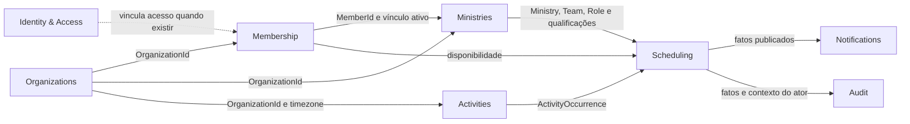

# Descoberta do domínio

Esta área registra a linguagem e as fronteiras descobertas com o negócio antes da implementação. Ela não representa automaticamente contratos estabilizados: cada documento diferencia fatos confirmados, modelos candidatos e questões em aberto.

## Contextos candidatos

| Contexto | Responsabilidade candidata | Limite explícito |
|---|---|---|
| Organizations | Identidade e ciclo da fronteira organizacional local | Não contém membros, ministérios ou escalas como coleções internas |
| Membership | Pessoas e vínculos com a organização | `Member` pode existir sem `User` autenticado |
| Ministries | Ministérios, times, funções, participação, qualificação e liderança | Não decide disponibilidade nem conflito entre escalas |
| Activities | Atividades e suas ocorrências concretas, manuais ou recorrentes | “Evento” do negócio não é `Domain Event` |
| Scheduling | Coleta de disponibilidade, necessidades, atribuições e publicações por time | Não autentica usuários nem administra o cadastro dos ministérios |
| Identity & Access | Usuários, autenticação e autorização | `User` não substitui `Member` |
| Notifications | Reações de comunicação aos fatos publicados | Não participa da transação do caso de uso produtor |
| Audit | Histórico imutável de ações relevantes enriquecido pelo contexto | Não é log de observabilidade |

Organizations, Membership, Ministries, Activities e Scheduling são fronteiras candidatas. A separação física em módulos ou aplicações só será decidida com os primeiros casos de uso consumidores.

## Documentos

- [Membership](membership.md)
- [Ministérios, atividades, disponibilidade e escalas](ministry-scheduling.md)

## Regras de descoberta

- Modelar somente conceitos que alterem decisões ou invariantes.
- Referenciar outros agregados por IDs nominais, sem compartilhar seus objetos internos.
- Preservar histórico de negócio por vigência, substituição, revogação ou snapshots publicados; não adotar Event Sourcing sem necessidade demonstrada.
- Manter estado atual eficiente e auditoria append-only como responsabilidades diferentes.
- Tratar nomes e eventos listados durante a descoberta como candidatos até seu primeiro caso de uso estabilizá-los.
