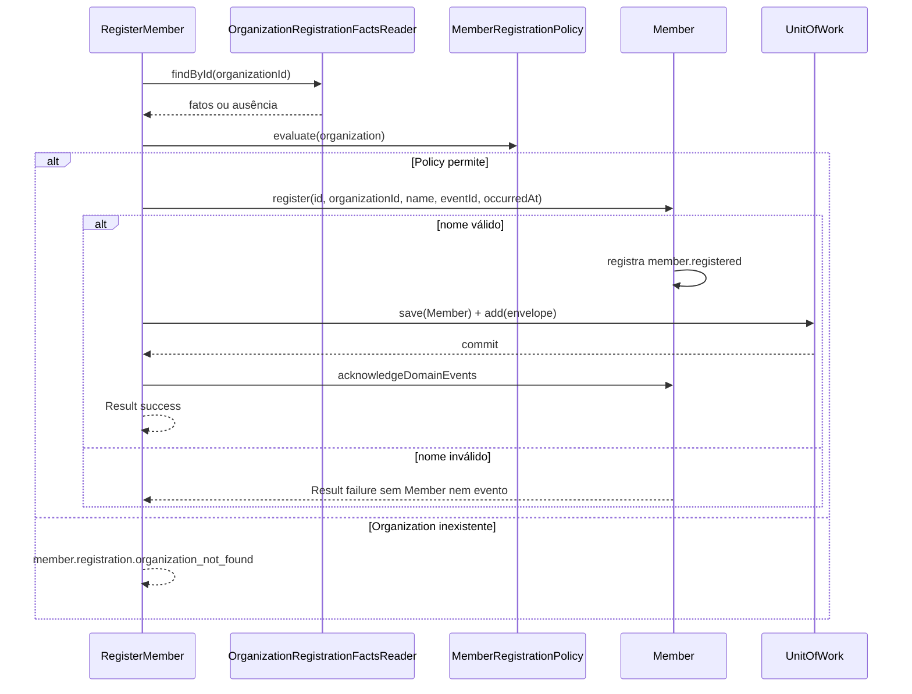

# Membership

## Estado

Núcleo de domínio, `RegisterMember`, `GetMemberDetails`, `ListMembers`, persistência PostgreSQL, contrato de integração v1 e entradas HTTP implementados.

## Motivação

Representar pessoas conhecidas pela igreja sem exigir que possuam credenciais e sem criar uma identidade global entre organizações antes de existir esse caso de uso.

## Responsabilidades

- Identificar um membro de forma estável dentro de uma Organization.
- Validar e normalizar seu nome.
- Preservar o vínculo obrigatório com uma única Organization.
- Registrar o fato `MemberRegistered` junto da criação válida.
- Manter o ciclo ministerial separado de autenticação e autorização.

## Limites

- `Member` não contém senha, credencial ou `UserId`.
- Não representa participação ou qualificação num ministério.
- Não tenta deduplicar a mesma pessoa entre organizações.
- Contato, endereço, nascimento e documentos não existem sem consumidor e regras de privacidade concretos.
- O domínio não consulta infraestrutura. `OrganizationRegistrationFactsReader` fornece fatos e `MemberRegistrationPolicy` decide se o registro pode continuar.

## Modelo inicial

```text
Member
├── MemberId
├── OrganizationId
├── MemberName
├── MemberStatus: active | inactive
└── registeredAt: Instant
```

`MemberId` aceita UUID canônico reconhecido e usa UUIDv7 para novas identidades por meio do adapter de geração. `MemberName` remove espaços externos, exige conteúdo e aceita até 120 caracteres. Nomes iguais não definem igualdade nem implicam duplicidade. `registeredAt` representa o instante absoluto do registro e também fornece o `occurredAt` do fato, sem inferir tempo do UUID.

## Registro



O caso de uso recebe dados ainda não confiáveis, valida `OrganizationId`, solicita fatos ao Reader e entrega a decisão à Policy antes de criar o Aggregate. O adapter não decide negócio. `MemberRepository` e `EventOutbox` participam do mesmo `MemberWriteScope`; a garantia transacional concreta caberá ao adapter PostgreSQL. O evento só é reconhecido no Aggregate depois que a Unit of Work conclui.

O payload interno do fato contém somente `memberId`, `organizationId` e o nome normalizado. Ator, correlação e request pertencem ao envelope/contexto. O mapper externo produz `member.registered` v1 com `memberId`, `organizationId`, `name` e `registeredAt`; usa `memberId` como Aggregate ID, `organizationId` como chave de partição e `servir.membership.events` como canal.

No PostgreSQL, `registeredAt` usa `timestamptz`. O estado é persistido como `smallint` protegido por `CHECK`: `1` representa `active` e `2`, `inactive`. A tradução fica no adapter; códigos numéricos não entram no domínio.

## Relações

- Organizations fornece `OrganizationId` como referência nominal.
- Ministries consumirá `MemberId` por meio de `MinistryMembership`.
- Scheduling usará `MemberId` em disponibilidade e atribuições.
- Identity & Access associa `User` e `Member` por `OrganizationAccess` criado mediante convite explícito, sem colocar credenciais no Aggregate.

## Entrada HTTP

`POST /organizations/{organizationId}/members` recebe o nome e devolve a representação direta do membro com `201 Created` e `Location`. A rota distingue identificador malformado (`400`), Organization inexistente (`404`) e nome inválido (`422`). Falhas esperadas seguem Problem Details, códigos estáveis e localização por `Accept-Language`; a execução cria o span semântico `RegisterMember`.

No modo em memória, o Reader recebe da composition root uma fonte viva de identidades de Organizations. Membership continua dependendo apenas de seu port de fatos, sem importar o Repository ou o adapter de outro módulo. No PostgreSQL, o mesmo port é atendido por consulta própria.

## Consulta de detalhes

`GetMemberDetails` é a primeira Query concreta do projeto. Ela valida `OrganizationId` e `MemberId`, consulta `MemberDetailsReader` e retorna o Read Model imutável `MemberDetails` com identidade, organização, nome e estado. Ausência usa o código estável `member.details.not_found` sem revelar se o Member existe em outra Organization.

`GET /organizations/{organizationId}/members/{memberId}` devolve a representação direta com `200 OK`. Identificadores malformados produzem `400`; Member ausente ou pertencente a outra Organization produz `404`. A consulta cria o span semântico `GetMemberDetails`.

O adapter PostgreSQL projeta somente `name` e `status`, usando os IDs já validados da Query. Ele traduz o `smallint` persistido para `active | inactive`. O adapter em memória lê uma fonte viva do mesmo storage usado pelo Command. Ambos seguem a mesma suíte de contrato, sem reconstituir o Aggregate para leitura.

`registeredAt` permanece fora dessa representação até a implementação da estratégia de apresentação temporal e timezone registrada no roadmap.

## Listagem

`ListMembers` atende a navegação administrativa da primeira interface sem reconstituir Aggregates. `GET /organizations/{organizationId}/members` aceita `page`, `pageSize`, busca por prefixo em `search` e filtro `active | inactive` em `status`. A resposta preserva ordenação estável por nome e identidade, além de totais exatos adequados ao volume esperado de uma igreja local.

O Reader PostgreSQL aplica `organization_id` em toda consulta e devolve ausência quando a própria Organization não existe. Assim, uma Organization existente sem membros produz uma página vazia, enquanto tenant inexistente produz `404`. O índice de listagem combina tenant, nome normalizado para ordenação e identidade.

## Próximos comportamentos candidatos

- Desativação e reativação preservam histórico por eventos próprios.
- Renomeação registra fato sem alterar publicações históricas que guardem snapshots.

## Boas práticas

- Tratar `Member` como unidade do Repository.
- Usar `MemberId`, nunca string intercambiável com outros IDs.
- Coletar somente dados exigidos por um fluxo real.
- Permitir nomes iguais e resolver identidade pelo ID.
- Fazer Readers fornecerem fatos e Policies nomeadas tomarem decisões.

## Anti-patterns

- Usar e-mail ou nome como identidade do membro.
- Tornar login obrigatório para cadastrar um voluntário.
- Compartilhar automaticamente um Member entre organizações.
- Colocar participações de todos os ministérios dentro do Aggregate.
- Esconder decisão de elegibilidade dentro de um adapter de leitura.
