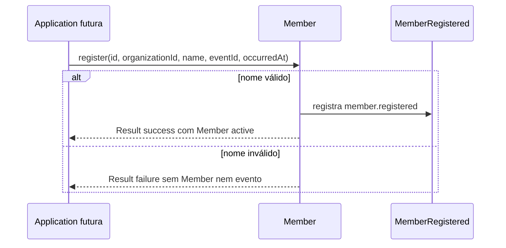

# Membership

## Estado

Núcleo de domínio inicial implementado. O caso de uso `RegisterMember`, persistência, integração e apresentação permanecem planejados.

## Motivação

Representar pessoas conhecidas pela igreja sem exigir que possuam credenciais e sem criar uma identidade global entre organizações antes de existir esse caso de uso.

## Responsabilidades

- Identificar um membro de forma estável dentro de uma Organization.
- Validar e normalizar seu nome.
- Preservar o vínculo obrigatório com uma única Organization.
- Registrar o fato `MemberRegistered` junto da criação válida.
- Manter o ciclo ministerial separado de autenticação e autorização.

## Limites

- `Member` não contém senha, credencial ou `UserId`.
- Não representa participação ou qualificação num ministério.
- Não tenta deduplicar a mesma pessoa entre organizações.
- Contato, endereço, nascimento e documentos não existem sem consumidor e regras de privacidade concretos.
- O núcleo atual não verifica existência ou estado da Organization; essa decisão pertence ao futuro caso de uso.

## Modelo inicial

```text
Member
├── MemberId
├── OrganizationId
├── MemberName
└── MemberStatus: active | inactive
```

`MemberId` aceita UUID canônico reconhecido e usa UUIDv7 para novas identidades por meio do adapter de geração. `MemberName` remove espaços externos, exige conteúdo e aceita até 120 caracteres. Nomes iguais não definem igualdade nem implicam duplicidade.

## Registro



O payload interno do fato contém somente `memberId`, `organizationId` e o nome normalizado. Ator, correlação e request pertencem ao envelope/contexto; nenhum contrato de integração foi definido.

## Relações

- Organizations fornece `OrganizationId` como referência nominal.
- Ministries consumirá `MemberId` por meio de `MinistryMembership`.
- Scheduling usará `MemberId` em disponibilidade e atribuições.
- Identity & Access poderá associar `User` e `Member` por um fluxo futuro sem colocar credenciais no Aggregate.

## Próximos comportamentos candidatos

- `RegisterMember` verifica se a Organization permite cadastro e persiste Member + outbox atomicamente.
- Desativação e reativação preservam histórico por eventos próprios.
- Renomeação registra fato sem alterar publicações históricas que guardem snapshots.

## Boas práticas

- Tratar `Member` como unidade do Repository.
- Usar `MemberId`, nunca string intercambiável com outros IDs.
- Coletar somente dados exigidos por um fluxo real.
- Permitir nomes iguais e resolver identidade pelo ID.

## Anti-patterns

- Usar e-mail ou nome como identidade do membro.
- Tornar login obrigatório para cadastrar um voluntário.
- Compartilhar automaticamente um Member entre organizações.
- Colocar participações de todos os ministérios dentro do Aggregate.
