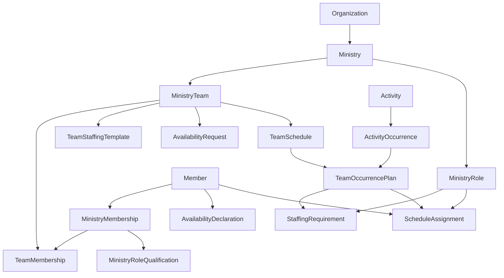

# Ministérios, atividades, disponibilidade e escalas

## Estado

Descoberta em andamento. Os cortes verticais iniciais de `Member` e `Ministry` estão implementados; os demais tipos deste documento permanecem planejados.

## Objetivo

Modelar como uma igreja local organiza ministérios e times, coleta disponibilidade e publica escalas para ocorrências de atividades, preservando histórico e evitando conflitos de atribuição.

## Linguagem confirmada

- `Organization` é a fronteira operacional de uma igreja local. Redes e denominações permanecem fora do modelo enquanto não alterarem regras de escala.
- Uma organização possui ministérios; um ministério possui times e funções.
- A entrada no ministério exige aprovação.
- Um membro pode estar qualificado para várias funções e exercer funções diferentes em escalas diferentes.
- Cada time possui liderança, e o responsável pela escala pode ser outra pessoa.
- As escalas são organizadas por time e podem cobrir qualquer período explícito.
- Uma atividade pode envolver um ou vários ministérios e possuir várias ocorrências.
- Ocorrências podem ser criadas manualmente ou geradas por recorrência.
- Disponibilidades e indisponibilidades são aceitas; indisponibilidade tem precedência.
- Mudanças relevantes preservam histórico e não sobrescrevem publicações anteriores.

## Relações candidatas



As setas representam relações por identidade. Elas não significam que todos os objetos pertencem ao mesmo Aggregate.

## Agregados candidatos

### Organization

Mantém identidade e ciclo da igreja local. Ministérios, membros e escalas referenciam `OrganizationId` e não integram sua coleção interna.

### Ministry

É um Aggregate Root separado de Organization e mantém identidade, `OrganizationId`, nome, estado e suas funções internas. O nome ativo é único por organização, ignorando caixa e preservando acentos. `MinistryRole` é uma entidade interna definida por `DefineMinistryRole`, com ID estável e nome único entre funções ativas. Uma função desativada permanece referenciável pelo histórico.

### MinistryTeam

É um Aggregate Root separado criado por `CreateMinistryTeam`, com identidade, Organization, Ministry, nome e estado ativo. O nome ativo é único dentro do Ministry. Times não formam inicialmente uma árvore recursiva. Participação, liderança e responsabilidade por escala entram em cortes posteriores; autorização técnica pertence a Identity & Access.

### MinistryMembership

É um Aggregate Root separado que representa o vínculo histórico entre `Member` e `Ministry`. `RequestMinistryMembership` cria o vínculo em `requested`; `ApproveMinistryMembership` realiza a entrada efetiva ao transicionar para `active` e preservar o instante da aprovação. Apenas um vínculo `requested` ou `active` pode existir para o mesmo Member e Ministry. `QualifyMemberForMinistryRole` adiciona uma `MinistryRoleQualification` identificada ao vínculo ativo; só uma qualificação ativa pode existir por função, e a função deve estar ativa no mesmo ministério. Rejeição, suspensão, reativação, encerramento e revogação permanecem planejados.

### TeamMembership

É um Aggregate Root histórico criado por `AssignMemberToTeam`. Associa um vínculo ministerial ativo a um time ativo do mesmo Ministry; apenas uma participação ativa existe por par, mas um membro pode participar de vários times. Participação de apoio numa ocorrência permanece futura e pode dispensar vínculo permanente com o time, mas exige vínculo e qualificação ativos no ministério.

### Activity

Representa o evento planejado do negócio, como “Culto de domingo” ou “Entrega de alimentos”. Declara ministérios participantes e padrões de recorrência versionados por vigência. O código usa `Activity` para não confundir o evento do calendário com `Domain Event`.

### ActivityOccurrence

Representa uma execução concreta de uma atividade. Pode ter origem `generated` ou `manual`; reagendamento e cancelamento preservam revisões. Ocorrências passadas e ocorrências ligadas a publicações não são recalculadas silenciosamente quando uma recorrência muda.

### AvailabilityDeclaration

Registra uma disponibilidade ou indisponibilidade do membro na organização para um dia, intervalo ou padrão recorrente. Declarações são revogadas e substituídas, nunca editadas sem histórico.

### AvailabilityRequest

Abre para um time a coleta referente a um `SchedulePeriod` e a um prazo de resposta. Cada time escolhe seu próprio horizonte — quinze dias, um mês, trimestre ou intervalo excepcional. Uma resposta distingue `pending`, restrições enviadas e confirmação explícita de `NoRestrictions`.

### TeamSchedule

Planeja um time durante um período explícito. Cada ocorrência contém necessidades e atribuições. O template do time sugere funções e quantidades, não pessoas fixas; o plano materializado pode adicionar apoio ou aumentar a quantidade em atividades especiais.

Publicação cria snapshot imutável e versionado. `published` significa versão oficial, não acesso anônimo. A visibilidade candidata é `team`, `ministry` ou `organization`.

## Regras de recorrência

O primeiro modelo candidato suporta recorrência semanal, dias da semana, um ou mais horários civis, timezone IANA e período de vigência. Um caso de uso gera somente um horizonte finito e precisa ser idempotente por uma chave equivalente a:

```text
activityId + recurrencePatternId + civilDate + civilTime
```

Não será adotada toda a expressividade de iCalendar antes de um consumidor exigir. O domínio utiliza valores civis próprios; Luxon pode implementar conversões num adapter sem atravessar a fronteira do domínio.

## Resolução de disponibilidade

O resultado possui três estados:

```text
unavailable > available > unspecified
```

- `unavailable` impede a atribuição;
- `available` torna o membro candidato preferencial;
- `unspecified` permite planejamento com alerta e confirmação;
- silêncio numa solicitação não equivale a disponibilidade total;
- a declaração pertence ao membro na organização e pode atender solicitações sobrepostas de times diferentes.

Uma exceção administrativa à indisponibilidade não será criada até o negócio demonstrar necessidade. Inicialmente o membro precisa revogar ou substituir sua declaração.

## Necessidades e atribuições

`TeamStaffingTemplate` é versionado e define necessidades usuais, por exemplo duas pessoas no vocal e uma na guitarra. Ao criar o plano de uma ocorrência, as necessidades são copiadas e podem ser ajustadas sem reescrever o template ou outras escalas.

`ScheduleAssignment` escolhe uma pessoa qualificada para uma necessidade. Sua origem candidata é `team_template`, `manual`, `replacement` ou `additional_support`. Substituição encerra a atribuição anterior e cria outra ligada ao histórico.

## Invariantes candidatas

- Toda entidade pertence à mesma `OrganizationId` do fluxo.
- Ministério, time, função, ocorrência e vínculos necessários precisam estar ativos.
- O time pertence ao ministério e a função pertence ao mesmo ministério.
- Uma ocorrência da escala está dentro de seu período.
- Uma atribuição exige vínculo ministerial aprovado e qualificação ativa.
- Participação regular exige `TeamMembership`; apoio exige autorização explícita.
- Uma pessoa possui no máximo uma atribuição ativa na mesma ocorrência, mesmo entre times ou ministérios.
- Uma escala não é publicada com necessidades obrigatórias não preenchidas.
- Alterar uma ocorrência já publicada exige reação explícita e possível reconfirmação; não altera snapshots anteriores.

A exclusividade global por pessoa e ocorrência atravessa Aggregates. A Application consulta conflitos e a persistência deve proteger concorrência com uma restrição equivalente a `OrganizationId + ActivityOccurrenceId + MemberId` para atribuições vigentes.

## Commands candidatos

```text
CreateMinistry
DefineMinistryRole
RequestMinistryMembership
ApproveMinistryMembership
QualifyMemberForMinistryRole
CreateMinistryTeam
AssignMemberToTeam
AppointTeamLeader
ConfigureActivityRecurrence
GenerateActivityOccurrences
OpenAvailabilityRequest
DeclareMemberAvailability
CreateTeamSchedule
AssignMemberToOccurrence
PublishTeamSchedule
ReplaceScheduleAssignment
```

## Domain Events candidatos

```text
MinistryCreated
MinistryRoleDefined
MinistryMembershipRequested
MinistryMembershipApproved
MemberQualifiedForMinistryRole
MinistryTeamCreated
MemberAssignedToTeam
TeamLeaderAppointed
ActivityCreated
ActivityRecurrenceConfigured
ActivityOccurrenceGenerated
ActivityOccurrenceScheduled
ActivityOccurrenceRescheduled
AvailabilityRequestOpened
MemberAvailabilityDeclared
TeamScheduleCreated
MemberAssignedToTeamSchedule
TeamSchedulePublished
ScheduleAssignmentReplaced
```

Nem todo fato candidato se tornará Integration Event. O primeiro consumidor define mapper, payload público, versão e tópico. Rejeições sem mudança, como conflito detectado, são resultados esperados e não Domain Events por padrão.

## Histórico, auditoria e observabilidade

- Regras de recorrência e templates usam versões e vigência.
- Ocorrências usam revisões; atribuições usam substituição; publicações usam snapshots.
- O estado atual continua disponível para decisões e consultas eficientes.
- Mudança e outbox são atômicas; handlers de auditoria materializam registros imutáveis com ator e correlação do `ExecutionContext`.
- O ator só entra no payload do fato quando integrar seu significado de negócio.
- Logs ajudam observabilidade e não constituem trilha de auditoria.
- Retenção histórica respeita minimização, anonimização e obrigações sobre dados pessoais.

## Member e User

`Member` representa uma pessoa conhecida pela organização e pode participar do negócio antes de possuir acesso ao sistema. Seu núcleo inicial possui `MemberId`, `OrganizationId`, `MemberName`, estado ativo e o fato `MemberRegistered`. `User` representa uma identidade autenticável em Identity & Access. Uma associação futura entre ambos não deve transformar credenciais em propriedade do Aggregate de membro.

## Questões abertas

- Um time possui exatamente um líder vigente ou permite colegiado?
- Como ocorre e quem aprova participação de apoio de outro time?
- A proibição de duas funções na mesma ocorrência é universal ou admite combinações explícitas?
- Uma mudança de horário exige confirmação individual ou apenas alerta ao líder?
- Quais dados de uma escala podem aparecer para toda a organização?
- Quais motivos são obrigatórios em rejeição, suspensão, substituição e cancelamento?
- Como níveis de habilidade, treinamentos e validade de qualificações evoluem?

## Sequência incremental candidata

1. Criar `Member` separado de `User` e registrar seu vínculo com Organization. **Concluído.**
2. Implementar `Ministry` e `CreateMinistry`, sem antecipar funções. **Concluído.**
3. Implementar `MinistryRole` por `DefineMinistryRole`. **Concluído.**
4. Implementar solicitação de `MinistryMembership`. **Concluído.**
5. Implementar aprovação de `MinistryMembership`. **Concluído.**
6. Implementar qualificações ministeriais. **Concluído.**
7. Implementar `MinistryTeam` e `TeamMembership`. **Concluído.** Implementar liderança em corte seguinte.
8. Introduzir valores temporais civis exigidos por `ActivityOccurrence` e `SchedulePeriod`.
9. Implementar Activity manual; adicionar recorrência somente depois do fluxo manual estável.
10. Implementar disponibilidade e sua coleta por período.
11. Implementar rascunho, necessidades e atribuições de `TeamSchedule`.
12. Implementar publicação versionada, substituições e reações de auditoria/notificação.

Cada incremento inclui Aggregate, testes, Repository específico, Unit of Work/outbox quando houver fatos externos, apresentação e documentação. Banco, API e eventos entram apenas com o caso de uso do incremento.
