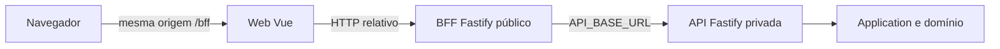
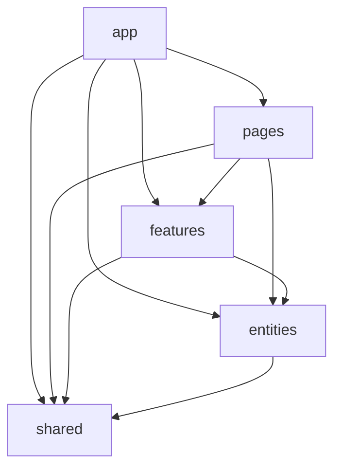
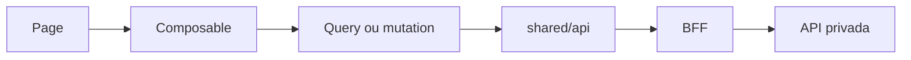

# Arquitetura do frontend web

## Objetivo

Definir onde cada responsabilidade da aplicação Vue deve residir, quem pode conhecê-la e como o frontend evolui sem reproduzir a arquitetura do backend. O objetivo não é maximizar camadas, mas tornar previsível onde uma mudança deve acontecer e limitar sua área de impacto.

Este documento complementa o [guia de experiência](frontend-experience.md) e o [design system](design-system/README.md):

- arquitetura técnica organiza código, estado e dependências;
- arquitetura de informação organiza páginas, jornadas e tarefas;
- design system estabelece contratos visuais e de interação;
- backend continua sendo a fonte de verdade das invariantes.

## Topologia do Servir

O frontend possui duas aplicações independentes:

- `applications/web`: aplicação Vue executada no navegador;
- `applications/bff`: fronteira HTTP pública que serve o bundle e traduz contratos da experiência para a API privada.



O navegador não conhece `API_BASE_URL`, endereços internos ou endpoints privados. O BFF pode agregar respostas para uma tarefa, mas não implementa invariantes, autorização ou isolamento de tenant. Estar atrás do BFF também não dispensa a API dessas proteções.

## Estrutura do BFF

O BFF aplica o mesmo princípio de localidade sem reproduzir a arquitetura hexagonal da API:

```text
src/
├── authentication/  protocolo OIDC, cookies e credenciais
├── http/            segurança, sessão e entrega da aplicação web
├── modules/         rotas agrupadas pela experiência proprietária
├── shared/          proxy da API e localização sem conhecimento de produto
└── create-application.ts  composition root
```

`create-application.ts` apenas instala mecanismos e módulos. Cada diretório em `modules` mantém juntos parâmetros, filtros, paths e registro das suas rotas. Módulos não implementam autorização ou regra de negócio: eles traduzem o contrato público da experiência para a API privada.

O proxy compartilhado preserva método, idioma, conteúdo, credencial interna e correlação, mas não conhece endpoints. A allowlist de filtros permanece no módulo dono da rota. Segurança HTTP, verificação de sessão e entrega da SPA são mecanismos transversais explícitos, não hooks escondidos dentro de módulos de produto.

Mensagens produzidas pelo próprio BFF, como indisponibilidade do upstream e recurso público ausente, usam catálogo com `pt-BR` como padrão e `en-US` como alternativa. Mensagens de domínio continuam pertencendo à API; textos da experiência continuam próximos das páginas e features Vue que os apresentam.

## Princípios

### Responsabilidade explícita

Cada módulo deve possuir uma razão principal para mudar. Uma view não deve simultaneamente implementar transporte, normalização HTTP, cache, validação de negócio, navegação e apresentação.

### Alta coesão e colocation

Arquivos que implementam o mesmo comportamento e mudam juntos permanecem próximos. Template Vue, composable, CSS e teste de uma experiência podem compartilhar o mesmo diretório.

No BFF, o mesmo princípio mantém uma rota junto dos parâmetros e filtros que formam seu contrato. Composition root, proxy e hooks transversais não acumulam detalhes de Organizations, Ministries, Members ou Activities.

### Dependências pequenas e direcionadas

Camadas inferiores não conhecem consumidores superiores. Código compartilhado não importa páginas, features ou conceitos ministeriais. Uma feature não importa outra feature por conveniência; a composição acontece numa page ou o conceito compartilhado encontra um dono mais adequado.

### Sem simetria artificial com o backend

O frontend não reproduz `domain/application/infrastructure/presentation`, Aggregates, Repositories ou Use Cases apenas porque esses conceitos existem no backend. Seus limites respondem a páginas, ações, dados apresentados e infraestrutura do navegador.

### Abstração depois do consumidor

Não criar pastas vazias, interfaces com uma única implementação sem substituição concreta, factories triviais ou wrappers que apenas renomeiam uma chamada. A menor solução local e explícita é o ponto de partida.

### Backend soberano

O cliente valida formato e oferece prevenção imediata, mas regras de negócio, autorização, consistência e isolamento multi-tenant permanecem no backend. Ocultar uma ação por permissão melhora UX; não constitui segurança.

## Estrutura canônica

```text
src/
├── app/
├── pages/
├── features/
├── entities/
└── shared/
```

A estrutura é orientadora, não um requisito para criar cinco diretórios em todo corte. Um módulo cria somente as subdivisões exigidas por seus consumidores.



Dependências inversas são proibidas. Dependências laterais entre features devem ser evitadas. Imports dentro do próprio módulo podem ser relativos; consumidores externos usam sua API pública.

## `app`

Responsável por iniciar e configurar a aplicação:

- bootstrap;
- router e guards;
- layouts globais;
- plugins e providers;
- configuração validada;
- tema global;
- error boundary global quando houver consumidor.

Não contém ações ministeriais como criar ministério, publicar escala ou responder disponibilidade.

## `pages`

Uma page representa um destino de rota e compõe a experiência. Ela responde a uma pergunta do usuário, lê parâmetros navegáveis e organiza entities e features.

Uma page pode definir layout específico, ler parâmetros da URL, coordenar seções e compor visualizações e ações. Não deve chamar `fetch`, conhecer a API privada, implementar cliente HTTP, concentrar regras de negócio ou duplicar features.

Uma experiência com estado relevante mantém colocation:

```text
pages/ministry-details/
├── MinistryDetailsPage.vue
├── use-ministry-details-page.ts
├── ministry-details-page.css
└── MinistryDetailsPage.test.ts
```

O composable só é criado quando existe estado, efeito ou coordenação real. Componentes puramente visuais não recebem composables vazios.

## `features`

Uma feature representa algo que o usuário consegue fazer, como `create-ministry`, `publish-schedule`, `respond-availability` ou `assign-member`.

```text
features/create-ministry/
├── api/
├── model/
├── ui/
├── use-create-ministry.ts
└── index.ts
```

- `api`: operação `/bff`, payload e resposta específicos da ação;
- `model`: tipos locais, validação de entrada e funções puras de apresentação;
- `ui`: controles e formulários específicos;
- composable: mutation, lifecycle e estados percebidos da ação.

Não criar todas as pastas por simetria. A camada HTTP não abre modal, mostra toast, navega nem manipula estado visual. O orquestrador que conhece a interação decide como comunicar sucesso, preservar o formulário ou mudar de página.

## `entities`

Uma entity do frontend representa algo sobre o qual a interface fala, não uma Entity DDD nem uma classe rica. Pode reunir contratos de leitura, queries, DTOs locais, mappers úteis, query keys e visualizações reutilizáveis que conhecem o conceito.

```text
entities/ministry/
├── api/
│   ├── get-ministry.ts
│   └── list-ministries.ts
├── model/
│   └── ministry.ts
├── ui/
│   └── MinistryStatusBadge.vue
└── index.ts
```

Queries normalmente pertencem à entity. Mutations orientadas a uma ação normalmente pertencem a features. Uma entity de frontend não contém invariantes autoritativas, Domain Events, Repository nem comportamento que permita ao navegador declarar sozinho uma transição válida.

## `shared`

Contém somente código transversal sem conhecimento de Organization, Ministry, Member, Activity, Availability ou Schedule.

```text
shared/
├── api/
├── auth/
├── i18n/
├── ui/
├── theme/
├── styles/
├── config/
└── lib/
```

Antes de promover algo para `shared`, perguntar se conhece o produto, se existem dois consumidores com o mesmo contrato, se o nome funciona fora do contexto e se o comportamento é igual ou apenas parecido. Na dúvida, manter local.

### `shared/api`

Centraliza requisições relativas ao BFF, headers, serialização, cancelamento e Problem Details. Não conhece endpoints de ministérios, atividades ou membros. Operações específicas ficam na entity ou feature proprietária.

### `shared/ui`

Contém contratos visuais sem domínio, como Button, Field e Dialog. `MinistryStatusBadge` pertence à entity ou experiência que conhece Ministry. Componentes compartilhados preservam HTML nativo, teclado, foco, nomes acessíveis e tokens do design system.

### Localidade e internacionalização

`shared/i18n` é o mecanismo transversal para resolver locale, persistir a preferência explícita e manter o atributo `lang` do documento. `pt-BR` é o fallback do produto e `en-US` é a primeira alternativa suportada. O cliente HTTP envia o locale corrente em `Accept-Language`; não usa o idioma do navegador diretamente em cada request.

Catálogos compartilhados contêm apenas textos globais, como shell, autenticação e configurações. Textos específicos de uma jornada permanecem próximos da page, feature ou entity proprietária e usam o mesmo contrato tipado de tradução. Uma opção de idioma só deve ser apresentada como completa quando todas as superfícies alcançáveis naquela experiência possuírem catálogo correspondente; misturar idiomas na mesma jornada é falha de UX, não fallback aceitável.

Pages e features definem arquivos `*.messages.ts` em colocation. `defineLocalizedMessages` exige que `pt-BR` e `en-US` possuam as mesmas chaves, enquanto `useLocalizedMessages` observa o locale global sem tornar `shared` dependente dos módulos consumidores. Templates, fallbacks de composables, estados, plurais e nomes acessíveis usam o catálogo proprietário; texto literal fica restrito a marcas, valores técnicos e conteúdo não linguístico.

Datas, horários, números e nomes de locale são formatados pelas APIs `Intl` com o locale corrente. Traduzir texto não altera valores de domínio, identificadores, códigos de erro ou instantes transportados pela API.

### Sessão no navegador

`shared/auth` contém o contrato de consulta da sessão opaca e seu store, pois não conhece uma página específica. `app/providers` instala a instância e o guard global coordena navegação. Features possuem ações concretas como entrar e sair; pages apenas compõem a jornada.

O navegador recebe cookies de sessão, mas nunca lê o JWT `HttpOnly`. O cookie CSRF legível é ecoado no header das mutações de mesma origem. Quando autenticação não está configurada no BFF, o contrato de sessão informa isso explicitamente e o guard mantém o desenvolvimento local disponível.

Cookies com prefixo `__Host-` são criados e removidos pelo BFF com os mesmos atributos de escopo e segurança (`Path=/`, `Secure`, `SameSite` e `HttpOnly` quando aplicável). O frontend só limpa a sessão local e redireciona após o BFF confirmar o logout; em caso de falha, preserva o estado e apresenta uma mensagem traduzida para que o usuário possa tentar novamente.

## API pública dos módulos

Cada módulo expõe somente o necessário por um `index.ts` na sua raiz. Consumidores externos usam essa API e evitam deep imports; imports relativos continuam válidos dentro do próprio módulo. Barrels não devem ser globais nem ocultar ciclos.

## Estado

O estado é classificado antes da escolha de ferramenta.

| Categoria     | Exemplos                                             | Fonte preferencial                              |
| ------------- | ---------------------------------------------------- | ----------------------------------------------- |
| Server state  | ministérios, membros, escalas                        | query/composable orientado à entity             |
| URL state     | busca, página, filtro, aba navegável                 | Vue Router                                      |
| Form state    | valor, dirty, touched, erros                         | estado local da feature                         |
| UI state      | menu, dialog, tema, etapa local                      | `ref`/`computed`; elevar somente com consumidor |
| Session state | ator e organização selecionada quando existir sessão | provider/store com lifecycle explícito          |

Não copiar respostas HTTP para uma store global por padrão.

### Server state e cache

Composables e requisições explícitas permanecem suficientes enquanto o volume de consumidores for pequeno. TanStack Query para Vue entra quando houver necessidade demonstrada de cache, deduplicação, stale time, invalidação coordenada ou compartilhamento. Optimistic update não é automático.

### URL e formulários

Busca, filtros, paginação, ordenação e tabs compartilháveis pertencem à URL. Formulários permanecem locais à feature. Validação de formato oferece feedback imediato; erros estruturados do backend continuam associados aos campos.

Rotas de lista e detalhe que pertencem à mesma área declaram o mesmo `meta.navigationArea`. O shell usa esse contexto semântico para manter o destino correspondente marcado durante toda a jornada; não infere a área por prefixos de URL, textos visíveis ou pela relação técnica entre componentes.

Layouts de rota separam ciclos de experiência: `PublicLayout` recebe autenticação e outras superfícies públicas sem reutilizar o cabeçalho da aplicação; `AuthenticatedLayout` concentra conta, preferências e acesso às Organizations; `OrganizationLayout` adiciona somente o contexto e a navegação do tenant selecionado. `App.vue` permanece apenas como raiz do router. Toda navegação desconhecida possui uma página de recuperação explícita, e elementos transitórios do shell, como dialogs, são encerrados quando a rota muda.

A seleção de Organization nunca redireciona implicitamente por existir apenas uma opção. A pessoa mantém acesso visível à lista e à criação de outra igreja; otimizar um clique não pode esconder mudança de contexto ou uma capacidade autorizada.

## Fluxos



Numa mutation, o composable expõe o resultado e o orquestrador da experiência decide feedback, cache e navegação.

## DTOs, mappers e erros

Contratos HTTP ficam próximos à operação proprietária, não num `types.ts` global. Criar mapper somente quando houver transformação, proteção de contrato ou clareza real.

O cliente compartilhado normaliza falhas HTTP. A UI decide comportamento por códigos e estrutura de Problem Details, nunca comparando mensagens textuais. O servidor pode fornecer mensagens localizadas como parte do contrato de apresentação, mas não controla navegação ou componentes.

O padrão vale nas três aplicações:

- a API preserva códigos de domínio e application em `errors[].code`;
- o BFF preserva Problem Details recebidos da API e representa problemas próprios pelo mesmo media type, com código estável e detalhe localizado;
- a web usa `HttpProblem.code` para decisões e mantém `title` e `detail` exclusivamente para apresentação;
- falhas técnicas não recuperáveis localmente permanecem exceções tipadas, com `code` estável e `cause` preservada;
- falhas esperadas são estado discriminado, Result ou Problem Details, nunca exceções identificadas pela mensagem.

O texto passado ao construtor de uma exceção tipada é o próprio código, não uma mensagem humana. Isso mantém logs pesquisáveis e impede que tradução altere controle de fluxo. Mensagens próprias do BFF e da web pertencem aos respectivos catálogos; mensagem técnica, stack e causa ficam na observabilidade.

Respostas `204 No Content` não são desserializadas. Corpo ausente ou Problem Details malformado em outro status é falha técnica codificada do cliente HTTP, distinta da rejeição esperada representada por `HttpProblem`.

## Configuração, autenticação e autorização

Configuração de browser é centralizada e validada em `app/config`. A web não recebe a URL da API privada nem segredos.

Infraestrutura futura de autenticação pode residir em `shared/auth`; providers e guards pertencem a `app`; sign-in e sign-out são features. Permissões podem controlar affordances, mas autorização continua garantida pelo backend.

## Componentes e promoção

Um componente representa uma unidade compreensível, não uma quantidade máxima de linhas. Componentes locais permanecem próximos ao consumidor. Promoção ocorre quando o conceito e o contrato sobem: feature local → entity → `shared/ui`. Semelhança de CSS não basta.

## Testes

Testes ficam junto ao comportamento e usam nomes em inglês. Priorizar componentes por semântica acessível, composables por estados observáveis, operações HTTP pela rota pública do BFF, mappers por transformação real e páginas por loading, vazio, erro e sucesso. Evitar snapshots indiscriminados e testes dependentes apenas de classes CSS.

## Estrutura-alvo inicial

```text
src/
├── app/
│   ├── layouts/
│   ├── router/
│   ├── providers/
│   └── App.vue
├── pages/
│   ├── create-organization/
│   ├── organization-home/
│   ├── ministries/
│   └── ministry-details/
├── features/
│   ├── create-organization/
│   └── create-ministry/
├── entities/
│   ├── organization/
│   └── ministry/
└── shared/
    ├── api/
    ├── ui/
    ├── theme/
    └── styles/
```

Essa árvore descreve destinos de código existente e consumidores reais. Não autoriza diretórios vazios nem telas futuras.

## Migração realizada

| Origem removida                  | Destino e responsabilidade implementados                                             |
| -------------------------------- | ------------------------------------------------------------------------------------ |
| `modules/organizations`          | pages de criação, home e layout; entity de leitura e feature de criação              |
| `features/manage-ministries`     | pages de lista e detalhe, queries em `entities/ministry` e feature `create-ministry` |
| `shared/http`                    | infraestrutura transversal em `shared/api`                                           |
| `shared/presentation/components` | componentes independentes do produto em `shared/ui`                                  |
| imports internos entre módulos   | APIs públicas locais protegidas contra deep imports pelo ESLint                      |
| busca local de ministérios       | termo aplicado preservado na URL e restaurado pela page                              |
| `shared/theme` e `shared/styles` | permanecem compartilhados; integração global pertence a `app`                        |

## Estratégia incremental

### Fase 1 — limites verificáveis — concluída

- estabilizar este documento e o ADR;
- criar APIs públicas somente para módulos com consumidores externos;
- configurar aliases e lint contra dependências invertidas e deep imports;
- não mover arquivos sem um corte estrutural verificável.

### Fase 2 — fundação compartilhada — concluída

- migrar `shared/http` para `shared/api`;
- migrar componentes genéricos para `shared/ui`;
- preservar contratos públicos;
- manter tema e tokens sem conhecimento do produto.

### Fase 3 — Organization — concluída

- separar pages de criação, home e shell;
- mover leitura e modelo para `entities/organization`;
- mover criação para `features/create-organization`;
- remover `application/infrastructure/presentation` quando não restar consumidor.

### Fase 4 — Ministries — concluída

- mover lista e detalhe para pages;
- mover queries, modelo e visualizações reutilizáveis para `entities/ministry`;
- isolar `create-ministry` como feature;
- preservar filtros e busca navegáveis na URL.

### Fase 5 — server state — orientada por necessidade futura

- medir duplicação, refetch e compartilhamento;
- introduzir cache somente com necessidade concreta;
- definir query keys por entity e invalidação por mutation.

Cada fase preserva comportamento, executa testes, lint e build e não mistura redesign visual com movimentação arquitetural.

## Checklist

- [ ] Qual responsabilidade muda este arquivo?
- [ ] É bootstrap, page, ação, representação ou infraestrutura transversal?
- [ ] Quem consome sua API pública?
- [ ] As dependências apontam apenas para camadas permitidas?
- [ ] O estado foi classificado antes da ferramenta?
- [ ] A URL deveria preservar esse estado?
- [ ] O componente conhece produto e deve ficar fora de `shared`?
- [ ] A abstração resolve um problema atual?
- [ ] HTTP permanece fora do componente?
- [ ] O browser conhece somente o BFF?
- [ ] Regras e autorização continuam no backend?
- [ ] Loading, vazio, erro e sucesso aplicáveis estão cobertos?
- [ ] Há teste proporcional ao comportamento?

## Anti-patterns

- pastas globais de components, composables, services ou types sem ownership;
- `utils.ts`, `helpers.ts`, `common.ts` ou `service.ts` indefinidos;
- service de entidade acumulando queries e todas as mutations;
- `fetch` ou caminho `/bff` dentro de componente Vue;
- frontend organizado como cópia das camadas do backend;
- entity do frontend tratada como Aggregate rico;
- store global usada como banco local de HTTP;
- regra de negócio garantida somente pelo cliente;
- BFF transformado em domínio ou proxy irrestrito;
- feature importando detalhes internos de outra feature;
- deep imports entre fronteiras públicas;
- componente de produto em `shared/ui`;
- abstração ou biblioteca adotada antes da necessidade.

## Regra final

Quando o destino ainda não estiver claro, manter o código próximo do consumidor e escolher a solução mais local, simples e explícita. Uma estrutura saudável permite prever onde mudar um comportamento sem conhecer toda a aplicação.
