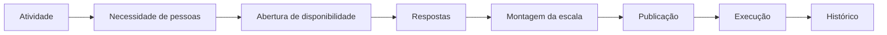

# Experiência da aplicação web

## Motivação

O Servir apoia o trabalho de pessoas que organizam ministérios, atividades, disponibilidade e escalas. A interface deve tornar esse trabalho compreensível e seguro; ela não é uma representação visual de tabelas, endpoints, Commands ou Aggregates.

Este documento é a referência viva para projetar, implementar e avaliar a experiência web. As regras do domínio continuam soberanas, enquanto decisões de interação seguem adequação à tarefa, usabilidade, acessibilidade e arquitetura da informação.

A organização técnica das pages, features, entities de frontend, estado e dependências está definida em [Arquitetura do frontend web](frontend-architecture.md). Experiência determina o que a pessoa precisa realizar; arquitetura técnica determina onde o comportamento reside.

## Hierarquia de autoridade

Quando critérios entrarem em tensão, aplicar esta ordem:

1. requisitos e regras de negócio do domínio do Servir;
2. princípios de interação da ISO 9241-110:2020;
3. heurísticas de usabilidade de Nielsen;
4. princípios de design de interação de Don Norman;
5. WCAG 2.2 e HTML semântico;
6. princípios de percepção e organização visual, incluindo Gestalt;
7. convenções da web e padrões consistentes do Servir;
8. preferências visuais e tendências, somente quando não contradisserem os anteriores.

## Princípio central

Projetar para a tarefa, não para a entidade. Toda página deve responder a uma pergunta relevante ou permitir concluir uma tarefa reconhecível pelo usuário.

| Área            | Pergunta orientadora                          |
| --------------- | --------------------------------------------- |
| Início          | O que precisa da minha atenção agora?         |
| Escalas         | Quem vai servir?                              |
| Disponibilidade | Quem pode servir?                             |
| Atividades      | Quando precisamos de pessoas?                 |
| Ministérios     | Como a estrutura ministerial está organizada? |
| Pessoas         | Quem são as pessoas e onde elas servem?       |

Uma capacidade existente no backend não justifica, isoladamente, uma página, item de menu ou card. A interface pode combinar várias consultas e ações para sustentar uma única tarefa; o BFF pode compor contratos orientados a essa experiência sem expor a topologia da API privada.

## Separação de responsabilidades

| Backend                                     | Frontend                                            |
| ------------------------------------------- | --------------------------------------------------- |
| Preserva invariantes e consistência         | Conduz tarefas e preserva o contexto do usuário     |
| Modela Aggregates, Entities e Value Objects | Modela páginas, jornadas e estados percebidos       |
| Expõe Commands e Queries                    | Oferece ações e informações em linguagem de produto |
| Produz falhas estruturadas                  | Explica o problema e orienta a recuperação          |
| Controla autorização e isolamento do tenant | Torna possibilidades e restrições compreensíveis    |
| Persiste fatos e histórico                  | Comunica progresso, resultado e próximos passos     |

A separação técnica entre componentes, serviços e gateways permanece. Esses limites evitam acoplamento com transporte, mas não devem copiar nomes ou camadas do backend por simetria. Componentes Vue não dependem de `fetch`, rotas do BFF, DTOs da API privada ou conceitos técnicos que não sejam úteis ao usuário.

## Arquitetura de informação

A navegação principal representa o trabalho:

- **Início:** atenção, pendências e próximos passos;
- **Operação:** escalas, atividades e disponibilidade;
- **Pessoas:** membros e equipes;
- **Ministérios:** ministérios, funções ministeriais e equipes;
- **Administração:** organização, acessos e configurações.

Os agrupamentos não obrigam todos os destinos a existirem desde o primeiro corte. Funcionalidades essenciais não ficam escondidas por conveniência visual, e a navegação deve manter localização e contexto ao avançar ou voltar. O `organizationId` na URL continua sendo contexto explícito, não conteúdo a ser memorizado ou digitado pelo usuário.

## Fluxo prioritário do produto



A evolução da interface prioriza cortes verticais desse fluxo. Cadastros de suporte entram quando ajudam a concluí-lo, não como uma coleção antecipada de CRUDs.

## Especificações por área

### Início

Responde “O que precisa da minha atenção agora?”. Mostra próxima atividade relevante, escalas pendentes de montagem ou publicação, coletas de disponibilidade abertas com progresso e uma lista curta de próximas atividades quando esses dados existirem. Não vira coleção de métricas sem ação. Cards só entram quando comunicam estado ou ação, nunca como decoração.

### Escalas

- Apresentar atividade, data, horário, ministério, equipe e pessoas alocadas.
- Diferenciar inequivocamente rascunho e publicação.
- Manter salvar rascunho e publicar como ações principais quando aplicáveis.
- Confirmar publicação quando seus efeitos forem relevantes.
- Preservar histórico e versões; nunca sobrescrever silenciosamente uma escala publicada.
- Indicar conflitos e ausência de disponibilidade antes da publicação.
- Oferecer ao membro uma visualização própria após a publicação.

### Atividades

- Oferecer lista e calendário, não apenas calendário.
- Distinguir atividade planejada de ocorrência concreta.
- Mostrar data, horário, local ou contexto, ministérios envolvidos e estado.
- Permitir acesso rápido à escala e à disponibilidade relacionadas.
- Não misturar configuração da atividade e execução da ocorrência sem necessidade.

### Disponibilidade

- Mostrar período da coleta e atividade ou contexto relacionado.
- Comunicar progresso de respostas, como `8 de 12`.
- Distinguir disponível, indisponível e não respondeu por texto ou semântica além de cor.
- Nunca interpretar silêncio como disponibilidade.
- Oferecer filtros por ministério ou equipe somente quando o volume justificar.

### Ministérios

- Listar ministérios com resumo útil de membros, funções e equipes quando os dados existirem.
- Separar visão geral, pessoas, funções e equipes no detalhe.
- Não expor nomes de Aggregates, Commands ou endpoints.
- Manter linguagem coerente com o trabalho ministerial.

### Pessoas

- Permitir busca e filtros por ministério, equipe e estado quando o volume justificar.
- Consolidar ministérios, funções, equipes e disponibilidade relevantes na página da pessoa.
- Não confundir função ministerial com permissão técnica.
- Usar “função ministerial” para Vocal, Músico e responsabilidades equivalentes.
- Usar “acesso” ou “permissão” para Administrador, Coordenador e autorizações técnicas.

## Princípios de interação

### ISO 9241-110:2020

- **Adequação à tarefa:** apoiar o trabalho real sem etapas ou informações desnecessárias.
- **Autoexplicatividade:** tornar significado, estado e uso compreensíveis pela própria interface.
- **Conformidade com expectativas:** preservar termos, controles e resultados previsíveis.
- **Adequação ao aprendizado:** permitir compreensão progressiva sem memorização arbitrária.
- **Controlabilidade:** permitir iniciar, interromper, voltar, revisar ou desfazer quando fizer sentido.
- **Robustez contra erros:** prevenir erros, tolerar entradas razoáveis e apoiar recuperação.
- **Engajamento do usuário:** considerar necessidades, preferências e contexto de uso.

### Heurísticas de Nielsen

1. Comunicar continuamente o estado do sistema.
2. Usar linguagem e conceitos do trabalho da igreja.
3. Preservar controle, liberdade e saídas apropriadas.
4. Manter consistência interna e convenções da plataforma.
5. Prevenir erros antes que ocorram.
6. Favorecer reconhecimento em vez de lembrança.
7. Atender iniciantes sem impedir eficiência de usuários frequentes.
8. Manter somente conteúdo relevante à tarefa; minimalismo não significa ausência de informação.
9. Explicar erros e orientar diagnóstico e recuperação.
10. Oferecer ajuda contextual quando a interface não puder ser autoexplicativa.

### Don Norman e correspondência entre controle e resultado

- **Affordance:** considerar o que o elemento permite fazer.
- **Signifier:** tornar perceptível que algo é clicável, editável, selecionável ou arrastável.
- **Feedback:** toda ação relevante produz resposta observável.
- **Mapping:** a relação entre controle e resultado precisa ser compreensível.
- **Constraints:** limitar ações inválidas antes que aconteçam.
- **Modelo conceitual:** formar um modelo mental coerente com o produto.

Um elemento que parece acionável deve realizar uma ação observável. Um link para a página atual, sem mudança de estado ou contexto, não deve conservar aparência e cursor de link. Da mesma forma, conteúdo estático não recebe signifiers de controle.

Em conjunto, cada experiência deve:

- apoiar a tarefa sem exigir trabalho ou dados desnecessários;
- explicar por si mesma significado, estado e ações disponíveis;
- seguir linguagem da igreja e convenções previsíveis da web;
- oferecer feedback observável depois de toda ação relevante;
- prevenir estados inválidos quando a restrição já for conhecida;
- favorecer reconhecimento em vez de memorização;
- permitir cancelar, voltar, revisar ou confirmar quando o efeito justificar;
- explicar erros em linguagem clara e indicar a próxima ação;
- revelar ajuda contextual somente quando a própria interface não bastar.

Affordances e signifiers devem tornar ações reconhecíveis. Aparência clicável, foco, labels, agrupamento e posição precisam corresponder ao resultado produzido. Animação ou decoração não substitui feedback.

## Percepção visual, Gestalt e carga cognitiva

- **Proximidade:** itens próximos comunicam relação.
- **Similaridade:** aparência semelhante comunica função ou categoria semelhante.
- **Região comum:** limites visuais agrupam uma unidade real.
- **Continuidade:** alinhamento e fluxo orientam a leitura.
- **Figura e fundo:** conteúdo principal se distingue do contexto.
- **Hierarquia visual:** tamanho, peso, posição, espaço e contraste determinam a ordem de atenção.
- **Espaço em branco:** espaçamento comunica agrupamento e separação; não é sobra.

A interface mantém contexto visível durante tarefas longas, divide tarefas complexas em etapas compreensíveis e não pede dados que o sistema já possui. Códigos internos e identificadores técnicos ficam ocultos quando não ajudam o usuário. Informação essencial não fica escondida em menus ou estados difíceis de descobrir. Cor, ícone e posição nunca são o único canal de significado.

## Estados como contrato

Loading, vazio, erro e sucesso não são acabamentos posteriores. Todo fluxo assíncrono ou recurso relevante avalia os estados aplicáveis:

- carregando;
- salvando e salvo;
- sucesso;
- erro recuperável;
- vazio;
- indisponível;
- rascunho;
- publicado.

O estado deve ser comunicado por texto ou semântica acessível além de cor e posição. Um estado vazio explica o contexto e, quando possível, oferece o próximo passo. Um erro preserva a entrada válida, identifica o problema e permite tentar novamente. A interface nunca apresenta sucesso antes da confirmação real da operação.

Botões primários representam a ação principal da tela. Ações destrutivas são visualmente distintas e pedem confirmação quando houver risco. Busca, filtros, tabelas, listas, paginação, ordenação e formulários mantêm contratos uniformes. Carregando, vazio, sucesso, erro, desabilitado, salvando, salvo, rascunho e publicado são estados de primeira classe dos componentes aos quais se aplicam.

## Formulários e prevenção de erros

- Labels são persistentes; placeholder não substitui label.
- Erros aparecem próximos ao campo e são associados programaticamente.
- Dados digitados são preservados após falha.
- Defaults precisam ser seguros e compreensíveis.
- Opções impossíveis são desabilitadas quando a regra já é conhecida.
- Campos relacionados formam grupos conceituais.
- A ação principal descreve o resultado esperado, não apenas “Enviar”.
- Confirmação adicional é reservada a efeitos relevantes ou difíceis de reverter.

Validação no cliente melhora prevenção e feedback, mas não substitui invariantes, autorização ou validação no backend.

## Acessibilidade e HTML

A interface segue WCAG 2.2 e os princípios Perceptível, Operável, Compreensível e Robusta:

- HTML semântico e hierarquia coerente de headings são o padrão;
- todas as operações essenciais funcionam por teclado;
- foco é visível, segue uma ordem compreensível e não fica preso;
- labels, nomes acessíveis e mensagens não dependem somente de ícones ou cor;
- mudanças assíncronas relevantes são anunciadas a tecnologias assistivas;
- contraste, tamanho dos alvos e espaçamento atendem ao contexto de uso;
- preferências de movimento, contraste, zoom e esquema de cores preservam a tarefa;
- ARIA complementa a semântica nativa somente quando necessário.

Atalhos aceleram tarefas frequentes, mas nunca substituem controles visíveis. Devem ser documentados na própria interface, evitar campos editáveis, preservar o comportamento esperado das teclas e administrar o foco na abertura e no fechamento. Grupos de seleção seguem a navegação de teclado convencional, incluindo setas e, quando aplicável, `Home` e `End`.

## Responsividade

Projetar para diferentes larguras, não para uma lista de aparelhos. Mobile não é o desktop comprimido: conteúdo e ações são priorizados conforme a tarefa.

Tabelas extensas exigem uma estratégia explícita, como colunas prioritárias, rolagem controlada, lista resumida ou navegação para detalhes. Ações críticas não podem desaparecer apenas por falta de espaço, e `hover` nunca é requisito para descobrir ou executar uma operação.

## Navegação

- A navegação principal é estável e torna a localização atual perceptível.
- Breadcrumbs entram somente quando a profundidade justificar.
- Funcionalidades essenciais não ficam escondidas sem necessidade.
- Voltar preserva contexto sempre que possível.
- URLs representam recursos ou tarefas de maneira previsível.
- Controles de navegação só apresentam affordance de link quando podem mudar página, contexto ou estado de forma observável.

## Linguagem visual e componentes

A direção visual vigente usa navy como signifier persistente da navegação, ação principal indigo, superfícies neutras e estados semânticos independentes. A navegação não precisa ocupar uma grande superfície escura: no desktop pode usar uma sidebar leve e, no mobile, tabs visíveis enquanto houver poucos destinos. O [guia visual do Servir](design-system/servir-ux-ui-reference.md) e seus mockups complementam este documento; imagens de telas futuras são conceituais e não autorizam dados ou capacidades simuladas. As decisões estão registradas nos [ADRs 062](decisions/062-indigo-navy-product-identity.md) e [065](decisions/065-lightweight-responsive-navigation-shell.md).

O nome da organização é contexto primário da área autenticada e permanece legível fora da coluna estreita de navegação. Nomes extensos podem ocupar mais de uma linha; truncamento só é aceitável quando houver uma forma evidente e acessível de obter o conteúdo completo.

Hierarquia nasce de conteúdo, tipografia, espaço, alinhamento e contraste antes de efeitos decorativos. Proximidade, similaridade e região comum indicam relações. Cards são usados quando comunicam uma unidade, estado ou ação; não são o contêiner padrão de todo conteúdo.

Tokens semânticos representam papéis como superfície, texto, ação, informação, atenção, sucesso e perigo nos temas claro e escuro. Ícones reforçam significado, mas não substituem labels ambíguas.

Um padrão só se torna componente compartilhado quando consumidores reais demonstram o mesmo contrato de interação. Compartilhar aparência sem compartilhar comportamento não é justificativa suficiente.

Botões seguem o contrato específico do [Button Design System](design-system/button.md), incluindo escolha semântica, hierarquia, microcopy, target, estados, feedback e acessibilidade. Um link pode compartilhar aparência de ação, mas continua semanticamente responsável por navegação.

A escala tipográfica e o espaçamento são consistentes. Hierarquia de títulos e conteúdo precede cores decorativas. Contraste serve à leitura e à prioridade; estilos concorrentes, bordas, sombras, gradientes e efeitos são limitados ao que acrescenta significado. Cores semânticas de sucesso, atenção, erro e informação preservam o mesmo papel. Tendências visuais não são adotadas sem justificativa funcional.

## Organização de uma experiência Vue

O Single-File Component preserva o template semântico e conecta dependências de apresentação. Quando uma view possui estado, efeitos ou ações relevantes, essa funcionalidade reside em um composable `use-*.ts` próximo à tela. Estilos exclusivos ficam em uma folha `*.css` importada pelo próprio SFC; tokens, resets e regras verdadeiramente transversais permanecem globais.

```text
experience/
├── ExperienceView.vue
├── use-experience-view.ts
├── experience-view.css
└── ExperienceView.test.ts
```

O template não é extraído para `.html`, pois o SFC é a unidade de apresentação compreendida pelo compilador e pelas ferramentas Vue. Componentes pequenos sem lógica de tela não exigem um composable vazio. CSS e comportamento só são promovidos para compartilhamento quando consumidores reais comprovam o mesmo contrato.

## Critérios de aceite de uma experiência

### Ordem de decisão antes de implementar

1. Qual tarefa do usuário esta experiência resolve?
2. Qual informação é mais importante para essa tarefa?
3. Qual é o estado atual do sistema e como ele será comunicado?
4. Quais ações são possíveis e quais signifiers deixam isso claro?
5. Quais erros podem ocorrer e como preveni-los?
6. O usuário reconhece as opções sem memorizar informações?
7. O comportamento é consistente com outras experiências?
8. A tarefa funciona por teclado e atende à WCAG aplicável?
9. A experiência permanece compreensível em carregamento, vazio, erro e sucesso?
10. A linguagem ubíqua é preservada sem expor detalhes técnicos desnecessários?

### Checklist antes de considerar uma tela pronta

Verificar:

- a tarefa principal e a informação mais importante são evidentes;
- o usuário sabe onde está, o que pode fazer e o resultado da ação;
- controles aparentam ser acionáveis somente quando produzem resultado observável;
- loading, vazio, erro, sucesso e demais estados aplicáveis foram projetados;
- erros comuns são prevenidos e erros ocorridos permitem recuperação;
- mensagens explicam como recuperar-se do problema;
- o usuário não memoriza algo que poderia permanecer visível;
- termos correspondem ao trabalho real, sem IDs ou jargão técnico desnecessário;
- padrões de navegação, formulários, filtros e ações permanecem consistentes;
- a tarefa funciona por teclado, em diferentes larguras e sem depender de cor;
- foco é visível, previsível e não fica preso;
- o resultado de cada ação é comunicado;
- a página contém somente informação útil à tarefa atual.

Testes automatizados devem preferir papéis, nomes e comportamento acessíveis. Eles complementam, mas não substituem revisão visual, navegação real por teclado e auditorias de contraste e responsividade.

## Cortes implementados

- Criação da organização conduz ao espaço identificado na URL.
- Início comunica honestamente que pendências operacionais dependem de dados ainda não disponíveis e orienta o próximo passo útil.
- Ministérios oferece busca, criação e listagem de ativos, distinguindo organização sem ministérios, busca sem resultado, carregamento e erro recuperável.
- O detalhe do ministério apresenta identidade, estado e funções ministeriais reais, permite adicionar uma função com feedback de validação e atualização confirmada pelo backend, e oferece navegação a partir da lista; pessoas, times e liderança aguardam read models orientados à experiência.

O Início ainda não apresenta próximas atividades, coletas de disponibilidade ou escalas pendentes porque esses read models não estão implementados. Informação operacional não deve ser simulada para preencher o layout.

## Anti-patterns

- Criar uma página porque uma Entity, Aggregate ou endpoint existe.
- Transformar cada Aggregate em item da navegação.
- Nomear ações da interface como Commands técnicos.
- Expor IDs quando o usuário pode reconhecer nome e contexto.
- Usar cards para todo agrupamento.
- Ocultar ações essenciais em menus arbitrários.
- Exibir hover, cursor, foco ou aparência de controle em conteúdo sem ação observável.
- Usar cor, ícone ou posição como único significado.
- Criar padrões diferentes para a mesma operação.
- Substituir feedback funcional por animação decorativa.
- Priorizar tendência visual sobre tarefa, compreensão ou acessibilidade.
- Tratar um framework ou design system como justificativa de UX.

## Referências

Esta orientação consolida a especificação de UI/UX fornecida para o Servir e se apoia em ISO 9241-110:2020, heurísticas de Nielsen, princípios de Don Norman, WCAG 2.2, HTML semântico e princípios de percepção da Gestalt. A decisão arquitetural correspondente está no [ADR 060](decisions/060-task-oriented-frontend-experience.md).

A identidade visual e o uso normativo dos mockups estão registrados no [ADR 062](decisions/062-indigo-navy-product-identity.md).
