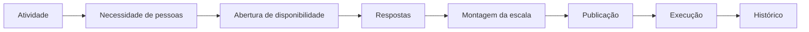

# Experiência da aplicação web

## Motivação

O Servir apoia o trabalho de pessoas que organizam ministérios, atividades, disponibilidade e escalas. A interface deve tornar esse trabalho compreensível e seguro; ela não é uma representação visual de tabelas, endpoints, Commands ou Aggregates.

Este documento é a referência viva para projetar, implementar e avaliar a experiência web. As regras do domínio continuam soberanas, enquanto decisões de interação seguem adequação à tarefa, usabilidade, acessibilidade e arquitetura da informação.

## Princípio central

Projetar para a tarefa, não para a entidade. Toda página deve responder a uma pergunta relevante ou permitir concluir uma tarefa reconhecível pelo usuário.

| Área | Pergunta orientadora |
| --- | --- |
| Início | O que precisa da minha atenção agora? |
| Escalas | Quem vai servir? |
| Disponibilidade | Quem pode servir? |
| Atividades | Quando precisamos de pessoas? |
| Ministérios | Como a estrutura ministerial está organizada? |
| Pessoas | Quem são as pessoas e onde elas servem? |

Uma capacidade existente no backend não justifica, isoladamente, uma página, item de menu ou card. A interface pode combinar várias consultas e ações para sustentar uma única tarefa; o BFF pode compor contratos orientados a essa experiência sem expor a topologia da API privada.

## Separação de responsabilidades

| Backend | Frontend |
| --- | --- |
| Preserva invariantes e consistência | Conduz tarefas e preserva o contexto do usuário |
| Modela Aggregates, Entities e Value Objects | Modela páginas, jornadas e estados percebidos |
| Expõe Commands e Queries | Oferece ações e informações em linguagem de produto |
| Produz falhas estruturadas | Explica o problema e orienta a recuperação |
| Controla autorização e isolamento do tenant | Torna possibilidades e restrições compreensíveis |
| Persiste fatos e histórico | Comunica progresso, resultado e próximos passos |

A separação técnica entre componentes, serviços e gateways permanece. Esses limites evitam acoplamento com transporte, mas não devem copiar nomes ou camadas do backend por simetria. Componentes Vue não dependem de `fetch`, rotas do BFF, DTOs da API privada ou conceitos técnicos que não sejam úteis ao usuário.

## Arquitetura de informação

A navegação principal representa o trabalho:

- **Início:** atenção, pendências e próximos passos;
- **Operação:** escalas, atividades e disponibilidade;
- **Pessoas:** membros e equipes;
- **Ministérios:** ministérios, funções ministeriais e equipes;
- **Administração:** organização, acessos e configurações.

Os agrupamentos não obrigam todos os destinos a existirem desde o primeiro corte. Funcionalidades essenciais não ficam escondidas por conveniência visual, e a navegação deve manter localização e contexto ao avançar ou voltar. O `organizationId` na URL continua sendo contexto explícito, não conteúdo a ser memorizado ou digitado pelo usuário.

## Fluxo prioritário do produto

A evolução da interface prioriza cortes verticais desse fluxo. Cadastros de suporte entram quando ajudam a concluí-lo, não como uma coleção antecipada de CRUDs.

## Princípios de interação

Cada experiência deve:

- apoiar a tarefa sem exigir trabalho ou dados desnecessários;
- explicar por si mesma significado, estado e ações disponíveis;
- seguir linguagem da igreja e convenções previsíveis da web;
- oferecer feedback observável depois de toda ação relevante;
- prevenir estados inválidos quando a restrição já for conhecida;
- favorecer reconhecimento em vez de memorização;
- permitir cancelar, voltar, revisar ou confirmar quando o efeito justificar;
- explicar erros em linguagem clara e indicar a próxima ação;
- revelar ajuda contextual somente quando a própria interface não bastar.

Affordances e signifiers devem tornar ações reconhecíveis. Aparência clicável, foco, labels, agrupamento e posição precisam corresponder ao resultado produzido. Animação ou decoração não substitui feedback.

## Estados como contrato

Loading, vazio, erro e sucesso não são acabamentos posteriores. Todo fluxo assíncrono ou recurso relevante avalia os estados aplicáveis:

- carregando;
- salvando e salvo;
- sucesso;
- erro recuperável;
- vazio;
- indisponível;
- rascunho;
- publicado.

O estado deve ser comunicado por texto ou semântica acessível além de cor e posição. Um estado vazio explica o contexto e, quando possível, oferece o próximo passo. Um erro preserva a entrada válida, identifica o problema e permite tentar novamente. A interface nunca apresenta sucesso antes da confirmação real da operação.

## Formulários e prevenção de erros

- Labels são persistentes; placeholder não substitui label.
- Erros aparecem próximos ao campo e são associados programaticamente.
- Dados digitados são preservados após falha.
- Defaults precisam ser seguros e compreensíveis.
- Opções impossíveis são desabilitadas quando a regra já é conhecida.
- Campos relacionados formam grupos conceituais.
- A ação principal descreve o resultado esperado, não apenas “Enviar”.
- Confirmação adicional é reservada a efeitos relevantes ou difíceis de reverter.

Validação no cliente melhora prevenção e feedback, mas não substitui invariantes, autorização ou validação no backend.

## Acessibilidade e HTML

A interface segue WCAG 2.2 e os princípios Perceptível, Operável, Compreensível e Robusta:

- HTML semântico e hierarquia coerente de headings são o padrão;
- todas as operações essenciais funcionam por teclado;
- foco é visível, segue uma ordem compreensível e não fica preso;
- labels, nomes acessíveis e mensagens não dependem somente de ícones ou cor;
- mudanças assíncronas relevantes são anunciadas a tecnologias assistivas;
- contraste, tamanho dos alvos e espaçamento atendem ao contexto de uso;
- preferências de movimento, contraste, zoom e esquema de cores preservam a tarefa;
- ARIA complementa a semântica nativa somente quando necessário.

## Responsividade

Projetar para diferentes larguras, não para uma lista de aparelhos. Mobile não é o desktop comprimido: conteúdo e ações são priorizados conforme a tarefa.

Tabelas extensas exigem uma estratégia explícita, como colunas prioritárias, rolagem controlada, lista resumida ou navegação para detalhes. Ações críticas não podem desaparecer apenas por falta de espaço, e `hover` nunca é requisito para descobrir ou executar uma operação.

## Linguagem visual e componentes

Hierarquia nasce de conteúdo, tipografia, espaço, alinhamento e contraste antes de efeitos decorativos. Proximidade, similaridade e região comum indicam relações. Cards são usados quando comunicam uma unidade, estado ou ação; não são o contêiner padrão de todo conteúdo.

Tokens semânticos representam papéis como superfície, texto, ação, informação, atenção, sucesso e perigo nos temas claro e escuro. Ícones reforçam significado, mas não substituem labels ambíguas.

Um padrão só se torna componente compartilhado quando consumidores reais demonstram o mesmo contrato de interação. Compartilhar aparência sem compartilhar comportamento não é justificativa suficiente.

## Critérios de aceite de uma experiência

Antes de considerar uma página ou fluxo pronto, verificar:

- a tarefa principal e a informação mais importante são evidentes;
- o usuário sabe onde está, o que pode fazer e o resultado da ação;
- loading, vazio, erro, sucesso e demais estados aplicáveis foram projetados;
- erros comuns são prevenidos e erros ocorridos permitem recuperação;
- termos correspondem ao trabalho real, sem IDs ou jargão técnico desnecessário;
- padrões de navegação, formulários, filtros e ações permanecem consistentes;
- a tarefa funciona por teclado, em diferentes larguras e sem depender de cor;
- a página contém somente informação útil à tarefa atual.

Testes automatizados devem preferir papéis, nomes e comportamento acessíveis. Eles complementam, mas não substituem revisão visual, navegação real por teclado e auditorias de contraste e responsividade.

## Cortes implementados

- Criação da organização conduz ao espaço identificado na URL.
- Início comunica honestamente que pendências operacionais dependem de dados ainda não disponíveis e orienta o próximo passo útil.
- Ministérios oferece busca, criação e listagem de ativos, distinguindo organização sem ministérios, busca sem resultado, carregamento e erro recuperável.

O Início ainda não apresenta próximas atividades, coletas de disponibilidade ou escalas pendentes porque esses read models não estão implementados. Informação operacional não deve ser simulada para preencher o layout.

## Anti-patterns

- Criar uma página porque uma Entity, Aggregate ou endpoint existe.
- Transformar cada Aggregate em item da navegação.
- Nomear ações da interface como Commands técnicos.
- Expor IDs quando o usuário pode reconhecer nome e contexto.
- Usar cards para todo agrupamento.
- Ocultar ações essenciais em menus arbitrários.
- Usar cor, ícone ou posição como único significado.
- Criar padrões diferentes para a mesma operação.
- Priorizar tendência visual sobre tarefa, compreensão ou acessibilidade.
- Tratar um framework ou design system como justificativa de UX.

## Referências

Esta orientação consolida a especificação de UI/UX fornecida para o Servir e se apoia em ISO 9241-110:2020, heurísticas de Nielsen, princípios de Don Norman, WCAG 2.2, HTML semântico e princípios de percepção da Gestalt. A decisão arquitetural correspondente está no [ADR 060](decisions/060-task-oriented-frontend-experience.md).
