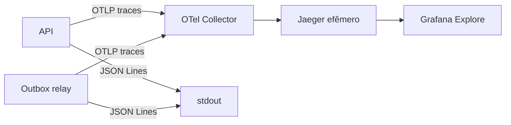

# Observabilidade

## Objetivo

Permitir que desenvolvimento e operação respondam, em ordem:

1. o sistema apresenta degradação?
2. qual fluxo foi afetado?
3. onde o tempo ou a falha ocorreu?
4. qual acontecimento detalhado explica o resultado?

Observabilidade é de melhor esforço e não substitui estado persistido, Domain Events, Integration Events ou auditoria durável.

## Responsabilidade dos sinais

| Sinal             | Pergunta principal                               | Garantia e limite                                       |
| ----------------- | ------------------------------------------------ | ------------------------------------------------------- |
| Trace             | Como a operação atravessou serviços e recursos?  | Amostrado e efêmero; descreve duração e causalidade     |
| Log               | Qual acontecimento detalhado ocorreu?            | Pesquisável e best effort; não é contrato de integração |
| Métrica           | Quanto, com que frequência e quão lento?         | Agregada; não é fonte de verdade do negócio             |
| Auditoria         | Quem fez uma ação relevante e qual foi o efeito? | Durável conforme política própria                       |
| Domain Event      | Qual fato ocorreu dentro do domínio?             | Semântica do domínio, não sinal de telemetria           |
| Integration Event | Qual fato público foi comunicado?                | Contrato versionado e entregue pela outbox              |

## Topologia atual



O Collector é o gateway vendor-neutral. Jaeger armazena traces localmente e Grafana oferece a entrada principal de investigação. Logs continuam no stdout; BFF, Loki, métricas, Prometheus e exemplars estão planejados, não implementados.

## Convenções de traces

Nomes de spans são estáveis e de baixa cardinalidade. IDs e valores de entrada pertencem a atributos, nunca ao nome.

| Fronteira          | Exemplos implementados                                                                 |
| ------------------ | -------------------------------------------------------------------------------------- |
| HTTP e PostgreSQL  | Instrumentação automática conforme Semantic Conventions do OpenTelemetry               |
| Caso de uso da API | Nome semântico declarado pelo `MessageToken`, com `servir.use_case.name`               |
| Relay              | `outbox.relay.batch` e `outbox.message.process`                                        |
| Mensageria         | `messaging.message.id`, `messaging.destination.name` e atributos técnicos padronizados |

Não criar spans para cada método, validação, condição ou query já coberta por autoinstrumentação. Um span manual precisa representar uma operação com duração, falha independente e valor para diagnóstico.

Fluxos assíncronos não fingem uma relação pai-filho contínua. A mensagem reclamada pelo relay inicia processamento próprio e mantém a origem navegável por `Span Link`; o contexto ativo do relay é propagado aos consumidores seguintes.

## Atributos

Semantic Conventions têm precedência quando houver contrato aplicável. Conceitos próprios usam `servir.*`.

### Resources

```text
service.name
service.version
deployment.environment.name
service.instance.id
```

### Execução e negócio

```text
servir.use_case.name
servir.messaging.event_type
servir.outbox.attempt
servir.organization.id
servir.ministry.id
servir.member.id
servir.activity.id
servir.result
```

Nem todo atributo deve aparecer em todo span. IDs são admitidos em traces quando necessários à investigação e sujeitos a minimização, retenção e controle de acesso. IDs de entidade, tenant, usuário, mensagem, trace ou request não podem virar labels de métricas.

## Convenções de logs

Logs usam nome de evento estável, severidade, contexto permitido e atributos estruturados. O adapter adiciona `traceId` e `spanId` a partir do span ativo.

Não registrar payloads, headers, cookies, tokens, JWKs, SQL parameters, entidades completas, nomes pessoais ou listas extensas. Uma falha deve ser registrada uma vez na fronteira que possui contexto; adapters que relançam a exceção não duplicam o registro.

## Investigação local

Depois de gerar uma operação, acesse `http://localhost:3002`, abra **Explore** e selecione `Servir traces`.

### Caso de uso da API

1. restrinja o intervalo de tempo;
2. selecione `servir-api`;
3. filtre pelo nome do span ou `servir.use_case.name`;
4. refine por status e duração;
5. abra o trace e localize spans HTTP/PostgreSQL lentos ou com erro.

### Publicação da outbox

1. selecione `servir-outbox-relay`;
2. procure `outbox.relay.batch` para o resultado agregado;
3. procure `outbox.message.process` para uma mensagem;
4. refine por `servir.messaging.event_type` ou `servir.outbox.attempt`;
5. use o link de origem para alcançar a operação que gravou a outbox quando disponível.

Consultas recorrentes devem nascer de uma pergunta operacional real antes de virar dashboard. Uma tela preenchida por métricas sem ação ou ownership não melhora a observabilidade.

## Evolução planejada

1. instrumentar logging, tracing e propagação no BFF;
2. revisar se API, BFF e relay respondem às perguntas operacionais prioritárias;
3. adicionar Loki para logs simples e correlacionar trace-to-logs no Grafana;
4. definir contrato mínimo de métricas técnicas e semânticas;
5. provisionar Prometheus, dashboards, alertas e SLOs quando existirem métricas reais;
6. adotar exemplars após traces e métricas estabilizarem;
7. avaliar Tempo somente se as limitações do backend Jaeger permanecerem após a experiência no Grafana.

Elasticsearch para busca do produto é uma infraestrutura diferente de logs operacionais: possui dados derivados, índices, acesso, retenção e reconstrução próprios, mesmo que seja adotado futuramente para pesquisa textual eficiente.

## Relações

- [Logger](primitives/logger.md)
- [Arquitetura](architecture.md)
- [ADR 010 — Propagação de contexto](decisions/010-telemetry-context-propagation.md)
- [ADR 031 — Visualização local de traces](decisions/031-local-trace-visualization.md)
- [ADR 033 — Tracing semântico do relay](decisions/033-outbox-relay-semantic-tracing.md)
- [ADR 068 — Contexto causal e auditoria](decisions/068-causal-execution-context-and-audit-boundary.md)
- [ADR 071 — Grafana sobre Jaeger](decisions/071-grafana-over-existing-jaeger-traces.md)
