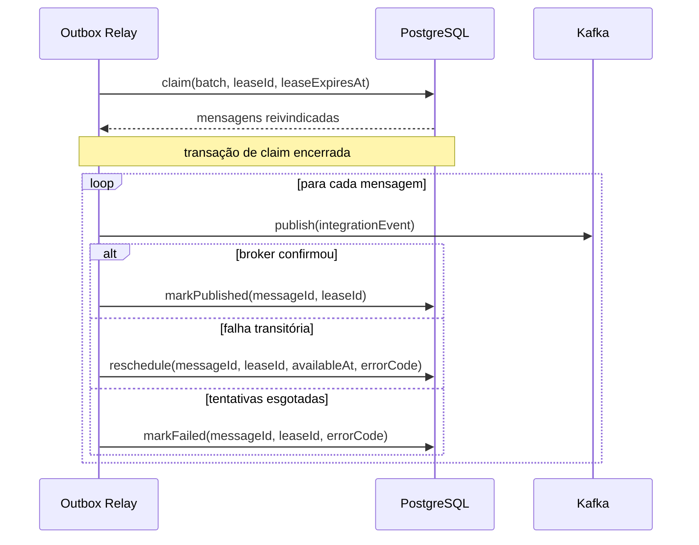

# Relay durável de outbox

## Motivação

Entregar eventos de integração sem tornar a disponibilidade do Kafka parte da transação ou da resposta da API.

## Responsabilidades

- Reivindicar mensagens disponíveis sem manter transações abertas durante I/O de rede.
- Publicar Integration Events versionados com identidade, correlação e causalidade.
- Confirmar somente mensagens aceitas pelo broker.
- Reagendar falhas transitórias e tornar falhas terminais operáveis.
- Produzir telemetria contextual sem registrar payloads por padrão.

## Limites

- Não executa regras de domínio nem casos de uso da API.
- Não transforma sucesso no Kafka em entrega exatamente uma vez ao consumidor.
- Não promete ordem global nem ordem por Aggregate antes de existir uma versão monotônica desse Aggregate.
- Não administra tópicos, ACLs ou infraestrutura Kafka no startup.

## Ciclo de entrega

O claim seleciona apenas mensagens sem estado terminal, disponíveis pelo relógio do banco e sem lease válida. `FOR UPDATE SKIP LOCKED` permite concorrência entre instâncias. A atualização posterior exige o mesmo `lease_id`, impedindo que um worker confirme trabalho cuja lease expirou e foi assumida por outro.

## Estado persistido

| Campo | Semântica |
|---|---|
| `event_version` | Versão positiva do contrato de integração |
| `aggregate_id` | Identidade opcional usada para correlação e evolução de ordenação |
| `partition_key` | Chave opcional de partição, sem espaços em branco |
| `metadata` | Objeto JSON para metadados permitidos; não é extensão arbitrária do payload |
| `persisted_at` | Instante em que a mensagem entrou na outbox |
| `available_at` | Primeiro instante em que uma tentativa pode começar |
| `attempt_count` | Quantidade não negativa de claims realizados |
| `lease_id` e `lease_expires_at` | Par indivisível que representa posse temporária |
| `published_at` | Estado terminal de publicação confirmada |
| `failed_at` | Estado terminal após esgotamento ou falha não recuperável |
| `last_error_code` | Código técnico estável e seguro, nunca mensagem de exceção |

Não existe coluna `status`: pendência, lease e estados terminais são derivados dos campos acima, evitando combinações redundantes e contraditórias.

## Concorrência e falhas

Publicação ocorre fora da transação PostgreSQL. Se Kafka confirmar e o processo falhar antes de `markPublished`, a mensagem poderá ser publicada novamente. Esse é o ponto conhecido da garantia `at-least-once`. `message_id` deve acompanhar a mensagem e ser usado para idempotência pelos consumidores.

Falhas transitórias usam backoff exponencial com jitter calculado a partir de um `Clock` injetado. A política concreta, os limites e a classificação de erros serão especificados no primeiro corte executável.

## Observabilidade

Cada ciclo, claim e publicação deve produzir spans apropriados. Logs estruturados incluem códigos, `messageId`, tentativa, tópico e contexto de correlação quando necessários; não incluem payload, credenciais, stack trace ou mensagem bruta do driver. Métricas mínimas futuras incluem backlog disponível, idade da mensagem mais antiga, publicações, retries, falhas terminais e duração de publicação.

## Evoluções planejadas

- Criar a aplicação `outbox-relay` com ports orientados ao seu consumidor.
- Definir o mapper de `OrganizationCreated` para seu primeiro Integration Event.
- Implementar claim, confirmação e reagendamento PostgreSQL com testes de concorrência.
- Adicionar o publisher Kafka e propagação OpenTelemetry.
- Definir operação explícita de reprocessamento e retenção de mensagens publicadas.
