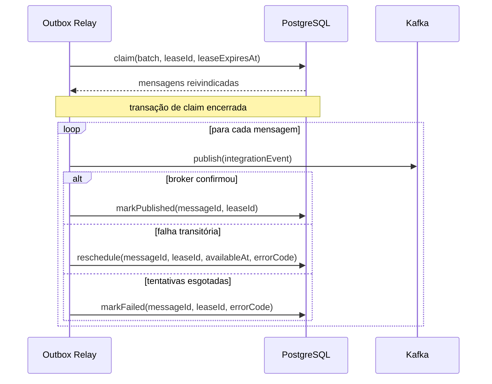
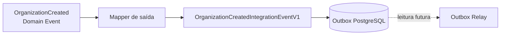

# Relay durável de outbox

## Motivação

Entregar eventos de integração sem tornar a disponibilidade do Kafka parte da transação ou da resposta da API.

## Responsabilidades

- Reivindicar mensagens disponíveis sem manter transações abertas durante I/O de rede.
- Publicar Integration Events versionados com identidade, correlação e causalidade.
- Confirmar somente mensagens aceitas pelo broker.
- Reagendar falhas transitórias e tornar falhas terminais operáveis.
- Produzir telemetria contextual sem registrar payloads por padrão.

## Limites

- Não executa regras de domínio nem casos de uso da API.
- Não transforma sucesso no Kafka em entrega exatamente uma vez ao consumidor.
- Não promete ordem global nem ordem por Aggregate antes de existir uma versão monotônica desse Aggregate.
- Não administra tópicos, ACLs ou infraestrutura Kafka no startup.

## Ciclo de entrega

O claim seleciona apenas mensagens sem estado terminal, disponíveis pelo relógio do banco e sem lease válida. `FOR UPDATE SKIP LOCKED` permite concorrência entre instâncias. A atualização posterior exige o mesmo `lease_id`, impedindo que um worker confirme trabalho cuja lease expirou e foi assumida por outro.

## Fronteira de escrita

O caso de uso entrega o `EventEnvelope` interno ao port de outbox dentro da Unit of Work. No adapter PostgreSQL, um mapper injetado seleciona explicitamente nome, versão, payload público, Aggregate e chave de partição. Um Domain Event sem mapper produz falha técnica codificada antes do `INSERT`, mantendo Aggregate e outbox na mesma decisão transacional. O relay receberá uma representação já pronta para transporte e não conhecerá o Domain Event nem o módulo Organizations.

O tipo serializável de `IntegrationEvent` reside em `backend/packages/integration-messaging`. Ele contém somente strings, números, booleanos, nulos, coleções e objetos JSON; `occurredAt` cruza a fronteira como UTC ISO. API e relay compartilham esse contrato sem compartilhar Domain Events, entidades ou primitivas internas.

## Primeiro comportamento executável

`ProcessOutboxBatch` pertence à application do relay e depende dos ports `OutboxMessageStore`, `IntegrationEventPublisher`, `Clock`, `LeaseIdGenerator` e `RetryPolicy`. O caso de uso cria uma lease, reivindica até o limite configurado e processa cada mensagem. Sucesso no publisher é seguido de confirmação no storage; falha de publicação é classificada por código estável e resulta em reagendamento ou falha terminal conforme a policy.

Falha de confirmação não é tratada como falha de publicação. Ela é propagada e deixa a mensagem recuperável, pois o broker pode já tê-la aceitado. Esse caminho materializa a duplicidade conhecida da entrega `at-least-once`.

Os adapters em memória especificam posse exclusiva durante a lease, recuperação após expiração, incremento de tentativas e rejeição de transições feitas por outro worker. Eles não substituem PostgreSQL ou Kafka.

## Storage PostgreSQL

`PostgresOutboxMessageStore` implementa o mesmo port com statements atômicos. O claim usa uma CTE materializada para selecionar mensagens disponíveis em ordem, aplica `FOR UPDATE SKIP LOCKED` e atualiza lease e tentativa antes de retornar as linhas. A transação implícita termina junto com o statement, antes de qualquer publicação no broker.

Confirmação, reagendamento e falha terminal exigem `message_id`, o `lease_id` atual e uma lease cujo instante de expiração seja estritamente posterior à transição. No limite exato de `lease_expires_at`, a posse já expirou. Cada transição limpa a lease; falha de posse ou expiração produz código estável da Application, enquanto falhas do driver são classificadas pelo adapter.

As linhas retornadas são validadas e convertidas para o contrato serializável antes de cruzarem o port. Payload e metadata são copiados e congelados; nenhuma mensagem de erro do PostgreSQL passa a definir comportamento.

## Estado persistido

| Campo | Semântica |
|---|---|
| `event_version` | Versão positiva do contrato de integração |
| `aggregate_id` | Identidade opcional usada para correlação e evolução de ordenação |
| `partition_key` | Chave opcional de partição, sem espaços em branco |
| `metadata` | Objeto JSON para metadados permitidos; não é extensão arbitrária do payload |
| `persisted_at` | Instante em que a mensagem entrou na outbox |
| `available_at` | Primeiro instante em que uma tentativa pode começar |
| `attempt_count` | Quantidade não negativa de claims realizados |
| `lease_id` e `lease_expires_at` | Par indivisível que representa posse temporária |
| `published_at` | Estado terminal de publicação confirmada |
| `failed_at` | Estado terminal após esgotamento ou falha não recuperável |
| `last_error_code` | Código técnico estável e seguro, nunca mensagem de exceção |

Não existe coluna `status`: pendência, lease e estados terminais são derivados dos campos acima, evitando combinações redundantes e contraditórias.

## Concorrência e falhas

Publicação ocorre fora da transação PostgreSQL. Se Kafka confirmar e o processo falhar antes de `markPublished`, a mensagem poderá ser publicada novamente. Esse é o ponto conhecido da garantia `at-least-once`. `message_id` deve acompanhar a mensagem e ser usado para idempotência pelos consumidores.

Falhas transitórias usarão backoff exponencial com jitter calculado a partir de dependências controláveis. A política concreta, os limites e a classificação entre falhas transitórias e terminais permanecem no próximo incremento.

## Observabilidade

Cada ciclo, claim e publicação deve produzir spans apropriados. Logs estruturados incluem códigos, `messageId`, tentativa, tópico e contexto de correlação quando necessários; não incluem payload, credenciais, stack trace ou mensagem bruta do driver. Métricas mínimas futuras incluem backlog disponível, idade da mensagem mais antiga, publicações, retries, falhas terminais e duração de publicação.

## Evoluções planejadas

- Implementar uma política concreta de retry com backoff exponencial e jitter.
- Adicionar o publisher Kafka e propagação OpenTelemetry.
- Compor o processo contínuo com configuração e encerramento seguro.
- Definir operação explícita de reprocessamento e retenção de mensagens publicadas.
