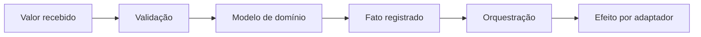

# Filosofia

## Motivação

Tratar uma aplicação como composição de responsabilidades pequenas, à semelhança de etapas especializadas de um compilador.

## Problema que resolve

Objetos e serviços grandes escondem decisões, misturam efeitos e dificultam testes. Responsabilidades indivisíveis tornam comportamento e mudança locais.

## Responsabilidades

- Favorecer composição sobre herança.
- Expressar contratos, invariantes e falhas nos tipos.
- Separar comunicação de comportamento.
- Preferir imutabilidade e evolução incremental.

## O que não faz

- Não busca abstração máxima.
- Não elimina pragmatismo nem código procedural local.
- Não copia integralmente DDD, CQRS ou programação funcional.

## Fluxo

## Exemplos

- Validar um valor antes de construir um value object.
- Registrar um evento em vez de chamar diretamente um serviço externo.
- Retornar `Result` para uma falha prevista.

## Relacionamento com outras primitivas

Cada primitiva existe para uma responsabilidade: identidade, valor, decisão, regra, fato, contexto ou porta.

## Possíveis evoluções

Refinar critérios para criação, fusão e remoção de primitivas conforme os testes revelarem padrões reais.

## Boas práticas

- Perguntar qual responsabilidade muda e por quê.
- Nomear conceitos na linguagem do domínio.
- Remover abstrações que não reduzam acoplamento cognitivo.

## Anti-patterns

- Herança usada apenas para reutilizar código.
- Exceções em validação esperada.
- “Clean Architecture” reduzida a estrutura de pastas.
