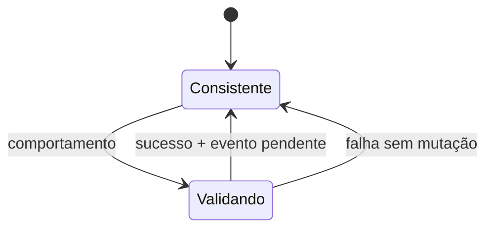

# Aggregate Root

## Motivação

Definir uma fronteira de consistência e um único ponto de entrada para mudanças relacionadas.

## Problema que resolve

Alterações diretas em objetos internos permitem estados inválidos e transações sem limite claro.

## Responsabilidades

- Ser uma Entity e proteger invariantes do Aggregate.
- Controlar acesso e mutação de objetos internos.
- Registrar, expor e limpar Domain Events pendentes.

## O que não faz

- Não publica eventos nem abre transações.
- Não representa automaticamente toda relação de dados.
- Não é uma classe base com dependências de infraestrutura.

## Fluxo



## Exemplos

`Organization` controla suas equipes e registra `TeamAdded`; objetos internos não são persistidos por repositories independentes sem uma nova fronteira.

```ts
class Organization extends AggregateRoot<
  OrganizationId,
  OrganizationProps,
  OrganizationEvent
> {
  addTeam(
    team: Team,
    eventId: DomainEventId,
    occurredAt: Instant,
  ): Result<void, TeamError> {
    // valida e altera o estado
    this.recordDomainEvent(teamAdded(eventId, occurredAt, team));
    return success();
  }
}
```

`pendingDomainEvents` devolve um snapshot imutável sem remover eventos. Depois que estado e outbox forem confirmados, `acknowledgeDomainEvents(events)` remove somente o prefixo persistido. Eventos registrados depois do snapshot continuam pendentes; uma confirmação fora da sequência falha com código estável sem alterar a fila.

## Relacionamento com outras primitivas

Especializa Entity, usa Value Objects e Result/Notification, registra Domain Events e é unidade de Repository.

## Possíveis evoluções

Definir concorrência otimista, versionamento e integração da confirmação de eventos com adapters transacionais reais.

## Boas práticas

- Manter aggregates pequenos e orientados a invariantes.
- Executar mudança e registro do fato atomicamente em memória.
- Não registrar eventos ao reconstituir estado persistido.
- Confirmar somente o snapshot persistido depois do commit.

## Anti-patterns

- Agregado como espelho do banco.
- Setters públicos em objetos internos.
- Agregado chamando repository ou event bus.
- Consumidor mutando a coleção interna de eventos.
- Remover eventos pendentes antes da confirmação transacional.
