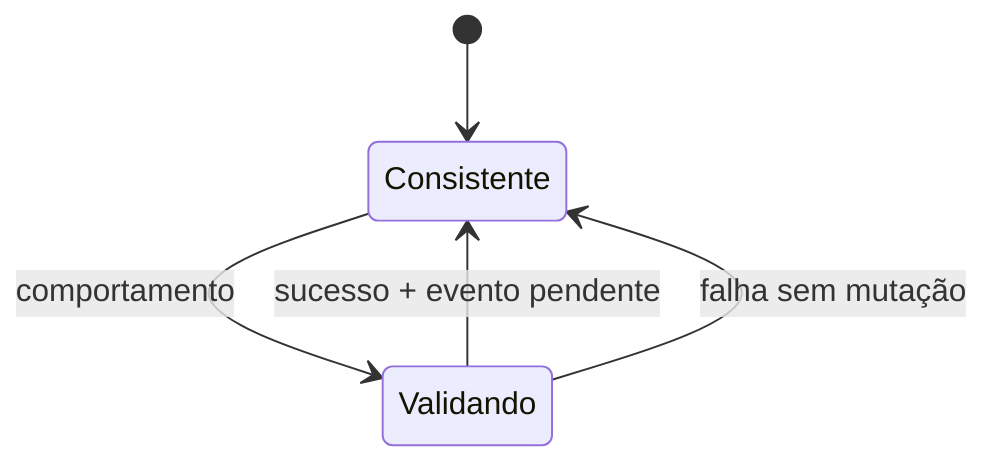

# Aggregate Root

## Motivação

Definir uma fronteira de consistência e um único ponto de entrada para mudanças relacionadas.

## Problema que resolve

Alterações diretas em objetos internos permitem estados inválidos e transações sem limite claro.

## Responsabilidades

- Ser uma Entity e proteger invariantes do Aggregate.
- Controlar acesso e mutação de objetos internos.
- Registrar, expor e limpar Domain Events pendentes.

## O que não faz

- Não publica eventos nem abre transações.
- Não representa automaticamente toda relação de dados.
- Não é uma classe base com dependências de infraestrutura.

## Fluxo

## Exemplos

`Organization` controla suas equipes e registra `TeamAdded`; objetos internos não são persistidos por repositories independentes sem uma nova fronteira.

## Relacionamento com outras primitivas

Especializa Entity, usa Value Objects e Result/Notification, registra Domain Events e é unidade de Repository.

## Possíveis evoluções

Definir concorrência otimista, versionamento e política de eventos pendentes após o ciclo transacional.

## Boas práticas

- Manter aggregates pequenos e orientados a invariantes.
- Executar mudança e registro do fato atomicamente em memória.

## Anti-patterns

- Agregado como espelho do banco.
- Setters públicos em objetos internos.
- Agregado chamando repository ou event bus.
