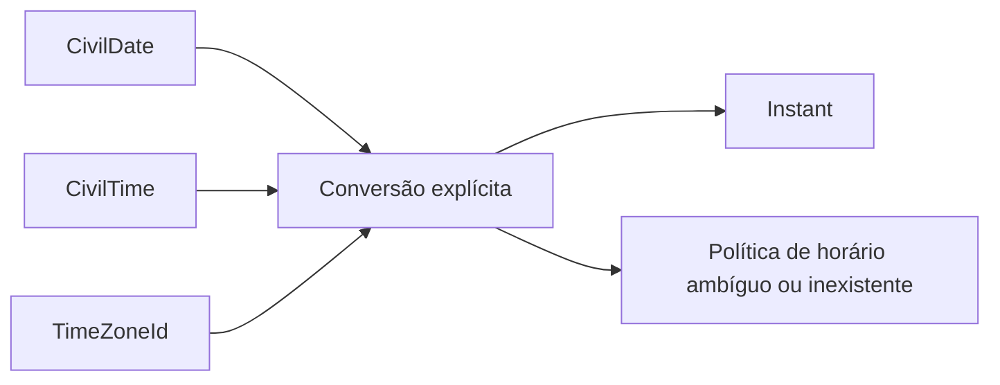

# Valores temporais civis

## Motivação

Representar datas e horários percebidos pelas pessoas sem confundi-los com um ponto absoluto na linha do tempo.

## Problema que resolve

Uma atividade marcada para `09/08/2026 às 10:00` ainda não identifica um `Instant`: a conversão depende das regras da zona IANA e pode encontrar um horário inexistente ou ambíguo durante uma transição de offset. `Date`, timestamps e offsets fixos escondem essas diferenças.

## Responsabilidades

- `CivilDate` representa uma data gregoriana canônica em `YYYY-MM-DD`, entre os anos 0001 e 9999.
- `CivilTime` representa um horário em `HH:mm`, com precisão de minuto.
- `TimeZoneId` representa uma zona IANA válida e canônica, como `America/Sao_Paulo`.
- `SchedulePeriod` representa um intervalo inclusivo entre duas `CivilDate` válidas.

## O que não fazem

- Não representam um ponto absoluto; essa responsabilidade pertence a `Instant`.
- Não convertem silenciosamente data, horário e zona para UTC.
- Não escolhem como resolver horários inexistentes ou ambíguos em mudanças de offset.
- Não aceitam offset fixo como substituto de uma zona IANA.
- Não impõem duração máxima a um período antes de um caso de uso exigir essa regra.

## Fluxo



## Exemplos

```ts
const date = CivilDate.create("2026-08-09");
const time = CivilTime.create("10:00");
const zone = TimeZoneId.create("America/Sao_Paulo");
```

Os três valores permanecem separados. `ScheduleManualActivityOccurrence` usa um adapter Temporal para convertê-los: rejeita horários inexistentes e exige `earlier` ou `later` quando o horário ocorre duas vezes. A ocorrência preserva também o offset resolvido e o `Instant` resultante.

`SchedulePeriod` inclui as duas extremidades. Portanto, o período de `2026-08-01` a `2026-08-31` contém ambos os dias, e um período com início e fim iguais representa um único dia.

## Relações

- `ActivityOccurrence` consome data civil, horário civil e zona no fluxo manual.
- `AvailabilityRequest` e `TeamSchedule` usarão `SchedulePeriod`.
- `Instant` continuará representando fatos já posicionados na linha do tempo, como criação de eventos.
- `Locale` continuará tratando idioma e apresentação, não timezone.

## Evolução

- Criar um fluxo controlado que, após atualização das regras IANA, re-resolva ocorrências futuras e sinalize divergências para revisão sem alterar compromissos silenciosamente.
- Avaliar calendários, precisão de segundos ou períodos máximos somente diante de requisito concreto.
- Acompanhar atualizações da base IANA no runtime sem expor uma biblioteca temporal no contrato do domínio.

## Boas práticas

- Receber strings canônicas nas bordas e construir Value Objects antes de executar I/O.
- Persistir os componentes civis separadamente quando a intenção local precisar sobreviver a alterações futuras de offset.
- Comparar datas civis por sua ordem de calendário e zonas por seu identificador canônico.

## Anti-patterns

- Usar `new Date('2026-08-09T10:00')` para uma intenção civil.
- Persistir apenas o `Instant` e depois tentar reconstruir a intenção local original.
- Aceitar `-03:00` como se contivesse as regras históricas e futuras de uma localidade.
- Ajustar automaticamente `02:30` para outro horário numa transição de DST.
