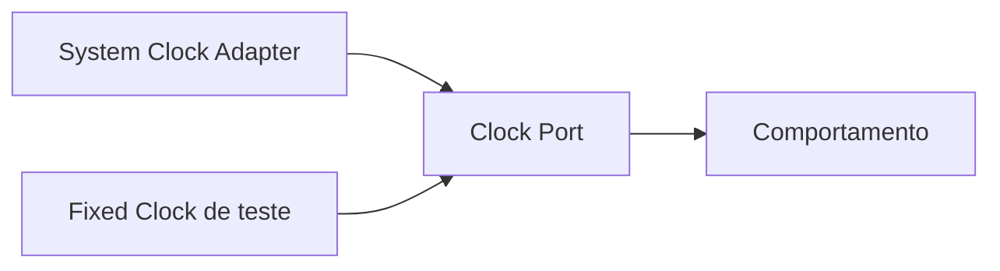

# Clock

## Motivação

Tratar tempo como dependência explícita e controlável.

## Problema que resolve

Uso disperso de `Date` torna testes não determinísticos e esconde a origem temporal de decisões.

## Responsabilidades

- Fornecer o instante atual como `Instant` por contrato.
- Permitir implementação fixa/controlada em testes.
- Definir representação e precisão temporal.

## O que não faz

- Não agenda tarefas.
- Não formata datas por locale.
- Não é calendário de regras de negócio.

## Fluxo

## Exemplos

Um handler obtém `Instant` por `clock.now()` uma vez e o passa ao agregado, evitando leituras temporais divergentes.

## Relacionamento com outras primitivas

Events recebem `occurredAt: Instant`; Policies temporais recebem instante explícito; adapters implementam o port.

## Possíveis evoluções

Adicionar monotonic clock para duração, separado do relógio civil.

## Boas práticas

- Preferir UTC e tipos imutáveis.
- Ler o relógio na borda da operação.

## Anti-patterns

- `new Date()` dentro de regras.
- Clock global substituível por monkey patch.
- Misturar instante e fuso/locale.
