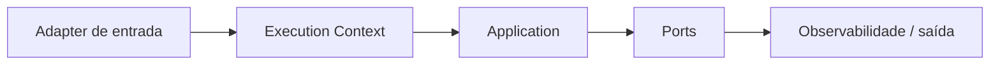

# Context

## Motivação

Transportar metadados da execução sem acoplar o núcleo a HTTP, filas ou jobs.

## Problema que resolve

Objetos de framework vazam transporte, estado global e detalhes de autenticação para application/domain.

## Responsabilidades

- Conter somente os metadados exigidos pelos consumidores; inicialmente `CorrelationId` e `RequestId`.
- Ser imutável e explicitamente propagado.
- Distinguir ausência de valor de valor inválido.

## O que não faz

- Não é container de dependências.
- Não substitui entidade User nem regra de autorização.
- Não contém request/response de framework.

## Fluxo



## Exemplos

Um adapter HTTP valida ou cria `CorrelationId` e `RequestId` antes de construir o `ExecutionContext`; um job cria o mesmo contrato por outra origem.

```ts
interface ExecutionContext {
  readonly correlationId: CorrelationId;
  readonly requestId?: RequestId;
}
```

O contrato cresce apenas quando mensagens, autorização ou tenancy demonstrarem a necessidade de novos campos.

## Relacionamento com outras primitivas

Logger e `EventEnvelope` usam `CorrelationId`; adapters propagam tracing técnico conforme W3C Trace Context sem expor tipos do OpenTelemetry ao núcleo. Policies podem receber identidade do ator quando semanticamente necessário.

## Possíveis evoluções

Adicionar causalidade, ator, tenant e locale junto aos consumidores que definirem sua semântica. Baggage permanece desabilitado por padrão e exige allowlist explícita.

## Boas práticas

- Manter campos mínimos e tipos fortes.
- Criar o contexto na borda.
- Manter `CorrelationId` independente de `traceId`.

## Anti-patterns

- Async-local global como única API.
- Colocar clients, repositories ou payload no contexto.
- Propagar dados pessoais sem necessidade.
- Expor `Span`, `Tracer` ou outros tipos do SDK OpenTelemetry no núcleo.
