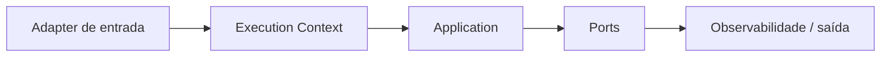

# Context

## Motivação

Transportar metadados da execução sem acoplar o núcleo a HTTP, filas ou jobs.

## Problema que resolve

Objetos de framework vazam transporte, estado global e detalhes de autenticação para application/domain.

## Responsabilidades

- Conter somente os metadados exigidos pelos consumidores: correlação e, conforme consumidores forem implementados, actor, executor e source.
- Ser imutável e explicitamente propagado.
- Distinguir ausência de valor de valor inválido.

## O que não faz

- Não é container de dependências.
- Não substitui entidade User nem regra de autorização.
- Não contém request/response de framework.

## Fluxo



## Exemplos

Um adapter HTTP valida ou cria `CorrelationId` e `RequestId` antes de construir o `ExecutionContext`; um job cria o mesmo contrato por outra origem.

```ts
interface ExecutionContext {
  readonly actor?: Actor;
  readonly executor?: Executor;
  readonly source?: ExecutionSource;
  readonly correlationId: CorrelationId;
  readonly requestId?: RequestId;
}
```

Esse é o modelo alvo, ainda não a API completamente implementada. O código atual usa `AuthenticatedActor` com `issuer + subject`; a migração aprovada separará essa afirmação externa de bootstrap do actor operacional identificado por `UserId`.

Actor representa quem causou a operação. Executor identifica o serviço responsável pela etapa atual. Source descreve opcionalmente a origem inicial, como web, API, mensagem ou job. Em processamento assíncrono, o actor causal é preservado e o executor muda. Rotas anônimas não inventam actor; a presença de `organizationId` na URL nunca concede acesso.

IP e user agent não são identidades. Quando necessários, pertencem a uma source web criada pelo BFF a partir de proxies confiáveis, com tipos, limites, minimização e retenção explícitos. Objetos HTTP, headers livres, JWTs e dependências não entram no contexto.

## Relacionamento com outras primitivas

Logger e `EventEnvelope` usam `CorrelationId`; adapters propagam tracing técnico conforme W3C Trace Context sem expor tipos do OpenTelemetry ao núcleo. A captura e a extração W3C são implementadas uma vez em `@servir/node-observability`, enquanto cada aplicação decide em quais fronteiras usá-las. Policies podem receber a identidade de domínio já resolvida quando semanticamente necessário; não recebem tokens nem claims do transporte. `ExecutionContext` também não substitui um `AuditRecord`: ele fornece metadados para que um consumidor registre um fato auditável.

## Possíveis evoluções

Implementar incrementalmente actor por User/Service/System, executor por ServiceId e sources tipadas junto aos primeiros consumidores. Tenant e locale permanecem separados até demonstrarem semântica transversal. Baggage continua desabilitado por padrão e exige allowlist explícita.

## Boas práticas

- Manter campos mínimos e tipos fortes.
- Criar o contexto na borda.
- Manter `CorrelationId` independente de `traceId`.

## Anti-patterns

- Async-local global como única API.
- Colocar clients, repositories ou payload no contexto.
- Propagar dados pessoais sem necessidade.
- Expor `Span`, `Tracer` ou outros tipos do SDK OpenTelemetry no núcleo.
