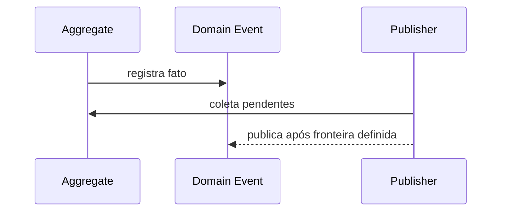

# Domain Event

## Motivação

Expressar um fato de negócio relevante sem acoplar quem o produz a quem reage.

## Problema que resolve

Chamadas diretas do domínio para integrações misturam invariantes com efeitos colaterais e criam dependências entre módulos.

## Responsabilidades

- Nomear um fato no passado.
- Carregar apenas dados necessários para interpretar o fato.
- Registrar instante e identidade do evento por contratos explícitos.
- Preservar um payload JSON-like profundamente imutável.

## O que não faz

- Não executa efeito colateral.
- Não é command, log ou modelo de persistência.
- Não precisa ser o contrato público de integração.

## Fluxo



## Exemplos

`OrganizationCreated`, `MemberAssigned` e `SchedulePublished` descrevem fatos; `CreateOrganization` é command.

```ts
const event = createDomainEvent({
  eventId,
  name: 'organization.created',
  occurredAt,
  payload: { organizationId },
});
```

`eventId` e `occurredAt` são obtidos antes da criação do evento. A factory não lê relógio, não gera identidade e não publica o fato.

## Relacionamento com outras primitivas

É registrado por Aggregate Root, distribuído por Event Bus e pode ser transformado em Application ou Integration Event.

## Possíveis evoluções

Definir envelope, versionamento, causalidade, deduplicação e tradução entre contextos.

## Boas práticas

- Preferir payload imutável e semanticamente mínimo.
- Evitar referências a objetos mutáveis do agregado.
- Representar `occurredAt` com `Instant`.

## Anti-patterns

- Evento chamado `CreateX`.
- Handler embutido no evento.
- Publicação direta pelo domínio em broker.
- Factory de evento lendo `Date.now()` ou gerando ID implicitamente.
