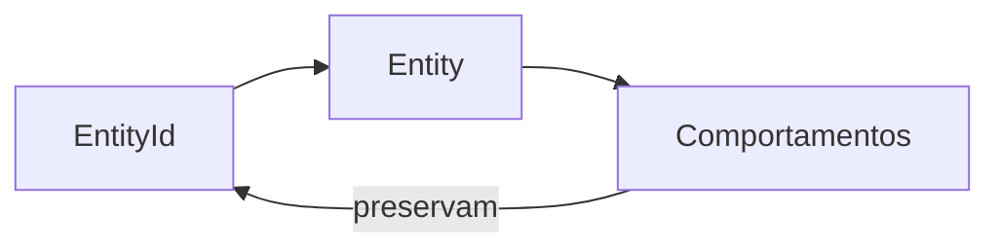

# Entity

## Motivação

Modelar objetos cuja identidade persiste apesar da mudança de atributos.

## Problema que resolve

Igualdade estrutural confunde objetos distintos com os mesmos dados e espalha regras de identidade.

## Responsabilidades

- Possuir identidade tipada e estável.
- Definir igualdade pela identidade compatível.
- Encapsular comportamento associado à continuidade do objeto.

## O que não faz

- Não implica persistência.
- Não registra eventos, salvo quando também é Aggregate Root.
- Não expõe mutação indiscriminada de propriedades.

## Fluxo

## Exemplos

Duas organizações com nomes iguais continuam distintas quando seus IDs diferem. A implementação inicial está em `backend/src/shared/domain/entity`.

## Relacionamento com outras primitivas

Usa EntityId; pode conter Value Objects; Aggregate Root é uma Entity com responsabilidades adicionais.

## Possíveis evoluções

Definir factories e formatos de IDs concretos conforme cada domínio exigir, sem ampliar a classe base.

## Boas práticas

- Usar IDs nominais para impedir mistura entre tipos.
- Comparar identidade, não todas as propriedades.

## Anti-patterns

- Entidade anêmica com setters.
- UUID concreto como dependência universal da abstração.
- Igualdade entre tipos de entidade incompatíveis.
