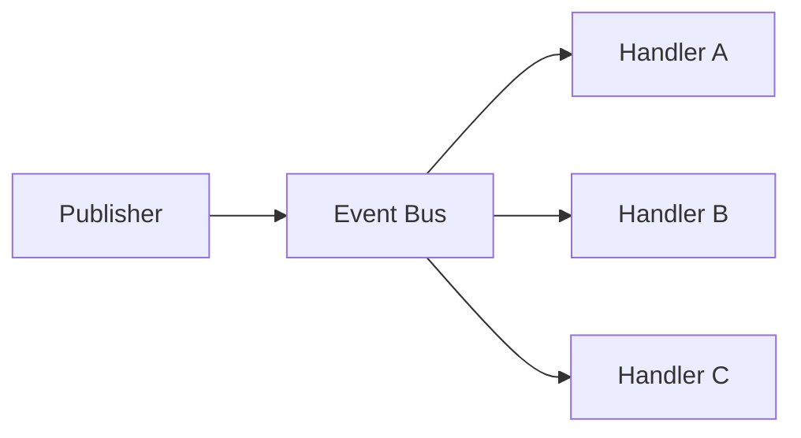

# Event Bus

## Motivação

Distribuir eventos sem tornar produtores dependentes da existência ou quantidade de consumidores.

## Problema que resolve

Coordenação direta cria cascatas de dependências e dificulta adicionar auditoria, métricas ou integrações.

## Responsabilidades

- Registrar assinaturas por contrato.
- Encaminhar eventos aos handlers aplicáveis.
- Tornar política de erro e execução explícita.

## O que não faz

- Não contém regra de negócio.
- Não garante persistência, entrega ou ordenação sem contrato adicional.
- Não é necessariamente um broker distribuído.

## Fluxo



## Exemplos

```ts
bus.subscribe<OrganizationCreated>(
  'organization.created',
  auditOrganizationCreated,
);

await publisher.publish(envelope);
```

O bus em memória inicia todos os handlers inscritos e aguarda suas conclusões concorrentemente. Se houver falhas, lança `EventDispatchError` somente depois que todos terminarem, preservando o nome e a causa de cada handler. Ausência de handlers é sucesso e a ordem de conclusão não é garantida.

## Relacionamento com outras primitivas

`EventPublisher` e `EventHandler` são ports da application. O adapter em memória recebe `EventEnvelope`, resolve subscriptions pelo nome do evento e invoca handlers sem alterar o Domain Event.

## Possíveis evoluções

Adapters duráveis com retry, idempotência, dead-letter e observabilidade. Brokers não precisam reproduzir a concorrência local, mas devem preservar a independência e tornar falhas observáveis.

## Boas práticas

- Documentar semântica de falha e ordem.
- Manter o contrato independente do transporte.
- Usar nome estável para identificar cada handler.

## Anti-patterns

- Service locator disfarçado.
- Engolir falhas de handlers.
- Prometer “exactly once” sem mecanismo verificável.
- Usar o bus em memória como substituto de outbox ou broker durável.
