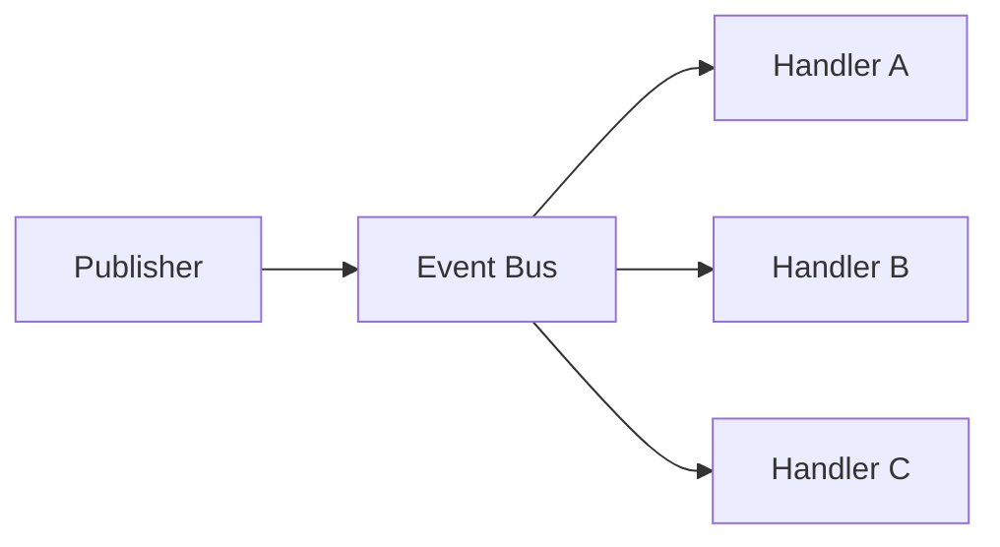

# Event Bus

## Motivação

Distribuir eventos sem tornar produtores dependentes da existência ou quantidade de consumidores.

## Problema que resolve

Coordenação direta cria cascatas de dependências e dificulta adicionar auditoria, métricas ou integrações.

## Responsabilidades

- Registrar assinaturas por contrato.
- Encaminhar eventos aos handlers aplicáveis.
- Tornar política de erro e execução explícita.

## O que não faz

- Não contém regra de negócio.
- Não garante persistência, entrega ou ordenação sem contrato adicional.
- Não é necessariamente um broker distribuído.

## Fluxo

## Exemplos

Um bus em memória pode apoiar testes; um adapter pode mapear o port para Kafka sem alterar o domínio.

## Relacionamento com outras primitivas

Recebe Domain/Application Events, invoca Handlers e pode usar Logger e Context.

## Possíveis evoluções

Políticas de concorrência, retry, idempotência, dead-letter e observabilidade.

## Boas práticas

- Documentar semântica de falha e ordem.
- Manter o contrato independente do transporte.

## Anti-patterns

- Service locator disfarçado.
- Engolir falhas de handlers.
- Prometer “exactly once” sem mecanismo verificável.
