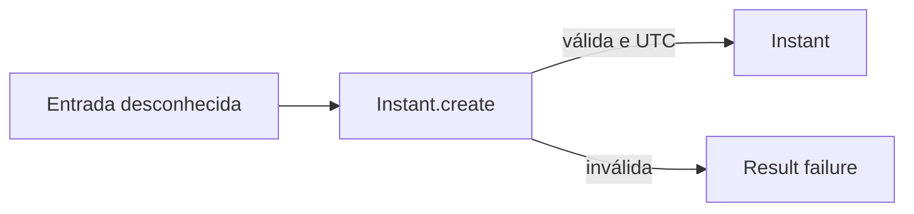

# Instant

## Motivação

Representar um ponto absoluto na linha do tempo sem expor a API mutável e ambígua de `Date` nem acoplar o núcleo a Luxon, Temporal ou outra biblioteca.

## Problema que resolve

Strings, datas civis e objetos de bibliotecas podem ser confundidos com instantes, carregar timezone implícito ou produzir resultados diferentes conforme o ambiente.

## Responsabilidades

- Representar um instante absoluto normalizado em UTC.
- Ser imutável e comparado por conteúdo.
- Validar e serializar no formato ISO 8601 UTC canônico com precisão de milissegundos.

## O que não faz

- Não representa data ou horário civil.
- Não carrega timezone IANA ou locale.
- Não obtém o instante atual.
- Não expõe `Date`, Luxon ou Temporal no contrato.

## Fluxo

## Exemplos

`Instant.create('2026-07-27T15:00:00.000Z')` cria um ponto absoluto. `2026-07-27T15:00:00` é rejeitado porque não informa offset ou zona.

## Relacionamento com outras primitivas

Domain Events recebem `occurredAt: Instant`; futuramente, `Clock.now()` retorna `Instant`. Datas civis, horários locais e zonas IANA serão tipos distintos quando os casos de uso de escala exigirem essa semântica.

## Possíveis evoluções

Usar Temporal ou Luxon internamente para operações temporais sem alterar o contrato público. Introduzir precisão maior que milissegundos somente diante de requisito real.

A apresentação temporal permanece planejada: APIs devem transmitir o `Instant` canônico em UTC, enquanto frontend, emails, PDFs e outros presenters podem convertê-lo usando locale e timezone IANA do observador. O timezone não será inferido do processo. Sua origem e precedência entre valor explícito da operação, preferência do usuário, organização e padrão da aplicação serão definidas com o primeiro consumidor.

Agendamentos futuros não serão reduzidos prematuramente a `Instant`: data civil, horário civil e timezone IANA serão modelados separadamente, pois expressam a intenção local mesmo quando regras de offset mudam.

## Boas práticas

- Persistir e transmitir em UTC.
- Converter para timezone apenas em regras civis ou apresentação.
- Obter o instante atual por Clock.

## Anti-patterns

- Usar timezone local do processo implicitamente.
- Confundir `Instant` com horário agendado em uma localidade.
- Expor objetos mutáveis ou dependentes de biblioteca.
