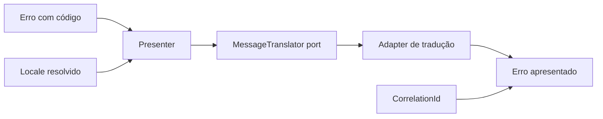

# Localização de erros

## Motivação

Apresentar falhas esperadas no idioma negociado sem colocar mensagens, transporte ou catálogos no domínio e na application.

## Problema que resolve

Erros de domínio precisam manter códigos estáveis para tratamento, enquanto mensagens destinadas a pessoas variam por locale e podem evoluir independentemente das regras.

## Responsabilidades

- Representar os locales suportados e definir um fallback explícito.
- Traduzir códigos estáveis com parâmetros estruturados.
- Apresentar código, mensagem, campo, parâmetros e correlation ID.
- Manter catálogos específicos próximos da apresentação de cada módulo.

## O que não faz

- Não adiciona mensagens a erros de domínio.
- Não negocia headers ou conhece HTTP.
- Não converte falhas técnicas em falhas esperadas.
- Não coloca locale no `ExecutionContext` sem um consumidor da application.

## Fluxo

## Exemplos

`organization.name.too_long` permanece estável no domínio. A apresentação solicita sua mensagem em `pt-BR` ou `en-US` e interpola `maxLength` sem interpretar texto para decidir comportamento. Os aliases `pt` e `en` são normalizados para esses locales canônicos; outras regiões não são aproximadas implicitamente.

## Relacionamento com outras primitivas

Consome erros estruturados de `Result`/`Notification` e a correlação do `ExecutionContext`. Adapters de entrada negociam o locale; adapters de tradução implementam `MessageTranslator`.

Locale define idioma e convenções de apresentação; não define timezone. Quando a apresentação temporal for implementada, o mesmo `Instant` UTC poderá ser exibido em horários locais diferentes conforme a zona IANA do observador, sem alterar o valor persistido.

## Possíveis evoluções

Negociação de `Accept-Language`, catálogos externos, pluralização, formatação temporal com timezone IANA e locale preservado em mensagens assíncronas serão introduzidos somente com consumidores concretos.

## Boas práticas

- Tratar códigos como contratos e mensagens como apresentação.
- Usar fallback seguro e previsível.
- Preservar parâmetros estruturados na resposta.
- Manter detalhes de falhas técnicas fora da resposta.

## Anti-patterns

- Comparar mensagens para decidir comportamento.
- Traduzir dentro de Entity, Value Object ou caso de uso.
- Expor texto de exceções técnicas ao cliente.
- Usar o locale como substituto de timezone.
