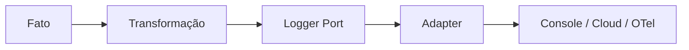

# Logger

## Motivação

Registrar fatos estruturados de forma independente do destino de observabilidade.

## Problema que resolve

Strings e chamadas diretas a console/SDK espalham formato, destino e dados sensíveis pelo núcleo.

## Responsabilidades

- Aceitar nível, nome do fato e atributos estruturados.
- Preservar contexto de correlação.
- Ser implementado por adapters.

## O que não faz

- Não substitui Domain Events.
- Não decide regra de negócio.
- Não expõe CloudWatch, Datadog ou OpenTelemetry ao núcleo.

## Fluxo



## Exemplos

```ts
logger.log(createLogRecord({
  level: LogLevels.Info,
  eventName: 'http.request.completed',
  context: {
    correlationId: context.correlationId,
    requestId: context.requestId,
  },
  attributes: {
    'http.request.method': 'POST',
    'http.route': '/organizations',
    'http.response.status_code': 201,
    'duration.ms': 42,
  },
}));
```

`LogContext` aceita apenas `CorrelationId`, `RequestId`, `MessageId` e `causationId` nesta etapa. O adapter JSON consulta o contexto ativo do OpenTelemetry e acrescenta `traceId` e `spanId` no momento da escrita, sem alterar o port nem exigir esses dados dos casos de uso. Resource attributes como serviço, versão e ambiente pertencem ao SDK e ao backend de observabilidade, não a cada chamada de log.

## Relacionamento com outras primitivas

Consome metadados permitidos de Context e Message; adapters implementam o port. A borda HTTP registra conclusão ou falha uma única vez, enquanto Domain Events permanecem reservados a reações orientadas a fatos de negócio. Logger é observabilidade de melhor esforço e não substitui um `AuditWriter` durável.

## Possíveis evoluções

O adapter JSON para stdout limita tamanho, profundidade e quantidade de atributos antes da escrita e já correlaciona o registro ao span ativo. Cada linha representa uma única ocorrência nessa codificação, mas JSON Lines não faz parte do contrato do port. Permanecem planejados um exporter OTLP, políticas configuráveis de redaction e tratamento estruturado compartilhado de exceções.

Um incremento próprio alinhará o modelo interoperável ao OpenTelemetry Logs Data Model e às Semantic Conventions que estiverem estáveis, sem expor tipos do SDK no port. O contrato deverá distinguir timestamp do evento e de observação, severidade, nome do evento, trace/span, resource, instrumentation scope e atributos da ocorrência. Convenções ainda instáveis exigirão decisão e versão explícitas antes de adoção.

JSON Lines e OTLP serão codificações de adapters. ECS, `@timestamp`, index templates, data streams, labels e mappings equivalentes pertencerão ao collector ou ao adapter de cada destino. Elasticsearch, Loki, Datadog, CloudWatch ou outro backend poderão ser substituídos sem alterar `Logger`, Application ou domínio. Retenção e políticas específicas de indexação permanecerão na infraestrutura escolhida.

Falhas de adapters PostgreSQL são registradas na fronteira HTTP ou no worker que possui `ExecutionContext`, nunca simultaneamente no adapter que irá relançá-las. A instrumentação automática do driver produz spans técnicos separados com `db.query.text` parametrizado, sem valores dos parâmetros; logs preservam apenas o código estável e o contexto necessário, usando `traceId` para navegação até a query.

A API emite `http.request.completed` para respostas abaixo de 500 e `http.request.failed` para falhas técnicas. O registro contém duração total monotônica, método, rota normalizada e status. Mensagem e stack trace da exceção não são copiadas; spans automáticos e o span semântico do caso de uso fornecem a decomposição temporal correlacionada.

## Boas práticas

- Usar nomes estáveis e atributos pesquisáveis.
- Remover segredos e minimizar dados pessoais.
- Preferir IDs, códigos, contagens, duração e resultado da operação.
- Emitir um único registro final por requisição em vez de logs de início e fim.
- Manter atributos de resource e trace fora das chamadas da application.

## Anti-patterns

- Log textual como contrato de integração.
- Logger dentro de Value Object ou Entity.
- Capturar e ignorar erro após logar.
- Copiar payload, headers, tokens, entidades ou dados pessoais por conveniência.
- Repetir em logs a query e as durações já disponíveis no trace PostgreSQL.
- Usar IDs de alta cardinalidade como dimensões de métricas automaticamente.
