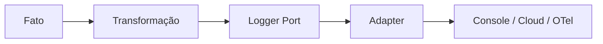

# Logger

## Motivação

Registrar fatos estruturados de forma independente do destino de observabilidade.

## Problema que resolve

Strings e chamadas diretas a console/SDK espalham formato, destino e dados sensíveis pelo núcleo.

## Responsabilidades

- Aceitar nível, nome do fato e atributos estruturados.
- Preservar contexto de correlação.
- Ser implementado por adapters.

## O que não faz

- Não substitui Domain Events.
- Não decide regra de negócio.
- Não expõe CloudWatch, Datadog ou OpenTelemetry ao núcleo.

## Fluxo



## Exemplos

```ts
logger.log(createLogRecord({
  level: LogLevels.Info,
  eventName: 'schedule.published',
  occurredAt: envelope.event.occurredAt,
  context: {
    correlationId: envelope.correlationId,
    messageId: envelope.messageId,
    causationId: envelope.causationId,
  },
  attributes: {
    'schedule.id': envelope.event.payload.scheduleId,
  },
}));
```

`LogContext` aceita apenas `CorrelationId`, `RequestId`, `MessageId` e `causationId` nesta etapa. O adapter acrescenta trace/span IDs e resource attributes como serviço, versão e ambiente.

## Relacionamento com outras primitivas

Consome metadados permitidos de Context e Message; handlers de eventos podem transformar Domain Events em registros; adapters implementam o port. Logger é observabilidade de melhor esforço e não substitui um `AuditWriter` durável.

## Possíveis evoluções

O adapter JSON para stdout limita tamanho, profundidade e quantidade de atributos antes da escrita. Permanecem planejados o adapter OpenTelemetry, políticas configuráveis de redaction, tratamento estruturado compartilhado de exceções e enriquecimento de resource/trace context.

## Boas práticas

- Usar nomes estáveis e atributos pesquisáveis.
- Remover segredos e minimizar dados pessoais.
- Preferir IDs, códigos, contagens, duração e resultado da operação.
- Manter atributos de resource e trace fora das chamadas da application.

## Anti-patterns

- Log textual como contrato de integração.
- Logger dentro de Value Object ou Entity.
- Capturar e ignorar erro após logar.
- Copiar payload, headers, tokens, entidades ou dados pessoais por conveniência.
- Usar IDs de alta cardinalidade como dimensões de métricas automaticamente.
