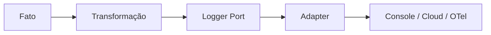

# Logger

## Motivação

Registrar fatos estruturados de forma independente do destino de observabilidade.

## Problema que resolve

Strings e chamadas diretas a console/SDK espalham formato, destino e dados sensíveis pelo núcleo.

## Responsabilidades

- Aceitar nível, nome do fato e atributos estruturados.
- Preservar contexto de correlação.
- Ser implementado por adapters.

## O que não faz

- Não substitui Domain Events.
- Não decide regra de negócio.
- Não expõe CloudWatch, Datadog ou OpenTelemetry ao núcleo.

## Fluxo

## Exemplos

`logger.info("schedule.published", { scheduleId, correlationId })`, criado fora do agregado.

## Relacionamento com outras primitivas

Consome Context; handlers de eventos podem transformar Domain Events em registros; adapters implementam o port.

## Possíveis evoluções

Definir schema de atributos, redaction, métricas derivadas e tracing.

## Boas práticas

- Usar nomes estáveis e atributos pesquisáveis.
- Remover segredos e minimizar dados pessoais.

## Anti-patterns

- Log textual como contrato de integração.
- Logger dentro de Value Object ou Entity.
- Capturar e ignorar erro após logar.
