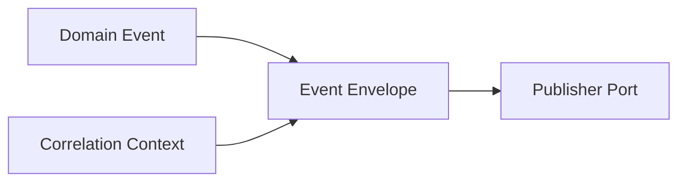

# Message

## Motivação

Transportar fatos e intenções com identidade e metadados de execução sem misturar essas informações ao payload de domínio.

## Problema que resolve

Eventos isolados não preservam correlação e causalidade entre requisições, commands, handlers e processos assíncronos. Colocar esses metadados no payload torna o fato dependente da forma de entrega.

## Responsabilidades

- Identificar cada mensagem por `MessageId`.
- Associar payload e metadados em um envelope imutável.
- Preservar `CorrelationId` e `causationId` entre etapas do fluxo.

## O que não faz

- Não publica ou persiste mensagens.
- Não representa garantia de entrega.
- Não contém request HTTP, SDK de tracing ou dependências.
- Não transforma automaticamente Domain Event em Integration Event.

## Fluxo



## Exemplos

```ts
const envelope = createEventEnvelope({
  messageId,
  event,
  correlationId,
  causationId: commandMessageId,
});
```

`event.eventId` identifica o fato; `messageId` identifica sua representação como mensagem. `causationId` aponta para a mensagem imediatamente anterior e `correlationId` permanece estável no workflow.

## Relacionamento com outras primitivas

`EventEnvelope` envolve Domain Event e metadados do Execution Context. Event Bus e outbox consomem envelopes sem alterar o fato interno.

## Possíveis evoluções

Adicionar ator, tenant e trace carrier quando seus adapters e consumidores definirem a semântica. Commands, Queries e Integration Events podem adotar envelopes próprios ou uma base comum após repetição comprovada.

## Boas práticas

- Manter payload e metadados separados.
- Criar IDs por ports explícitos.
- Preservar correlação e atualizar causalidade ao produzir nova mensagem.

## Anti-patterns

- Usar `traceId` como única correlação de negócio.
- Tornar `DomainEventId` e `MessageId` intercambiáveis.
- Colocar objetos de transporte no envelope.
