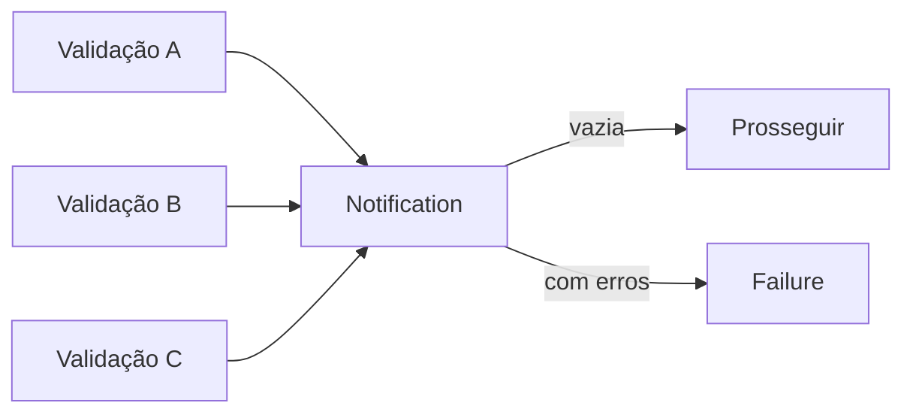

# Notification

## Motivação

Acumular violações independentes para que o consumidor receba um diagnóstico completo.

## Problema que resolve

Validação fail-fast força ciclos de correção e exceções agregadas misturam falhas previstas com falhas inesperadas.

## Responsabilidades

- Adicionar e combinar erros estruturados.
- Consultar erros por código ou campo.
- Expor coleção somente leitura.

## O que não faz

- Não traduz mensagens, status HTTP ou formato de UI.
- Não substitui `Result` para sucesso/falha.
- Não decide regras de negócio.

## Fluxo

## Exemplos

Erros usam `code`, `field` opcional e parâmetros serializáveis. A implementação inicial está em `backend/applications/api/src/shared/domain/notification`.

## Relacionamento com outras primitivas

Pode ser a falha de `Result`; Validators produzem itens; factories impedem criação inválida após avaliar a notificação.

## Possíveis evoluções

Evoluir para uma API persistentemente imutável somente se consumidores reais precisarem compartilhar versões intermediárias.

## Boas práticas

- Manter códigos estáveis e mensagens fora do domínio.
- Acumular somente validações independentes.
- Copiar e congelar erros na entrada e devolver snapshots congelados.
- Acumular entradas estruturais independentes antes de I/O e transportar um snapshot imutável na falha do Result.
- Manter o primeiro erro como diagnóstico primário somente para compatibilidade; consumidores devem preservar a coleção completa.

## Anti-patterns

- Usar como saco global de erros.
- Misturar warnings, logs e exceções técnicas.
- Expor array interno mutável.
