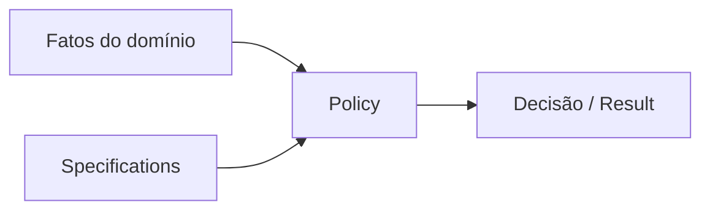

# Policy

## Motivação

Tornar decisões de negócio complexas explícitas quando não pertencem naturalmente a uma única entidade.

## Problema que resolve

Decisões espalhadas por handlers e controllers perdem nome, consistência e testabilidade.

## Responsabilidades

- Produzir uma decisão a partir de fatos explícitos.
- Explicar negação por erro tipado quando necessário.
- Permanecer livre de efeitos colaterais.

## O que não faz

- Não orquestra caso de uso.
- Não carrega dados de infraestrutura.
- Não é uma coleção genérica de regras.

## Fluxo

## Exemplos

`SchedulePublicationPolicy.evaluate(organization, period, actor)`.

## Relacionamento com outras primitivas

Pode usar Specifications e Value Objects; retorna decisão ou Result; o caso de uso executa a consequência.

## Possíveis evoluções

Adicionar explicações compostas e versionamento de políticas quando requisitos reais exigirem auditoria.

## Boas práticas

- Nomear a pergunta de negócio.
- Passar fatos, não serviços técnicos.

## Anti-patterns

- Policy como service locator.
- Booleano sem motivo quando o consumidor precisa explicar a decisão.
- Misturar autorização técnica e decisão de domínio.
