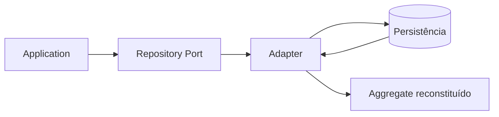

# Repository

## Motivação

Oferecer ao núcleo uma visão de coleção de Aggregates sem revelar mecanismo de persistência.

## Problema que resolve

ORMs e consultas técnicas no domínio acoplam regras ao esquema, lifecycle e capacidades de uma tecnologia.

## Responsabilidades

- Carregar Aggregate Roots quando uma decisão de domínio exige seu estado e comportamento.
- Persistir mudanças na fronteira do Aggregate.
- Explicitar ausência e falhas relevantes por contrato.

## O que não faz

- Não é CRUD genérico para qualquer entidade.
- Não retorna modelos do ORM.
- Não abre transação ou publica eventos sozinho.

## Fluxo

## Exemplos

`OrganizationRepository.findById` e `save` operam `Organization`. Uma Query como `GetMemberDetails` define um `MemberDetails` Read Model e usa um `MemberDetailsReader`, sem adicionar projeções ao `MemberRepository`.

O port nasce junto ao primeiro consumidor que demonstra essas operações. A fundação não fornece uma interface compartilhada de Repository apenas para antecipar contratos ainda desconhecidos.

## Relacionamento com outras primitivas

Opera Aggregate Roots e EntityIds; participa de Unit of Work; adapters usam Mappers.

## Possíveis evoluções

Criar os primeiros Repository ports específicos junto aos Commands consumidores. Queries, Readers, paginação e Read Models nascem juntos à primeira necessidade concreta de leitura. Separar armazenamento físico de escrita e leitura somente quando houver motivo operacional.

## Boas práticas

- Desenhar pelo consumidor, não pela API do banco.
- Manter contrato pequeno e específico do Aggregate.
- Tratar ausência esperada sem convertê-la em falha técnica; o caso de uso atribui a semântica de negócio.

## Anti-patterns

- `GenericRepository<T>`.
- Expor query builder ao application/domain.
- Repository por tabela ou entidade interna.
- Retornar DTO ou Read Model de apresentação por Repository.
- Criar `GenericReadRepository<T>` para consultas sem consumidor definido.
