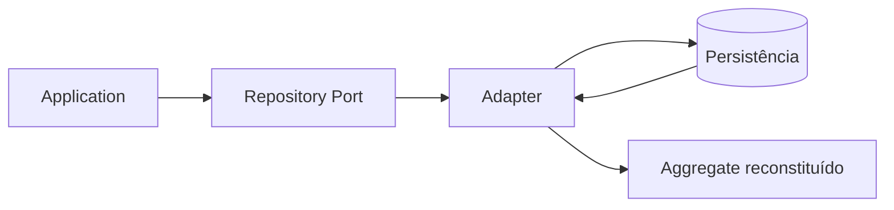

# Repository

## Motivação

Oferecer ao núcleo uma visão de coleção de Aggregates sem revelar mecanismo de persistência.

## Problema que resolve

ORMs e consultas técnicas no domínio acoplam regras ao esquema, lifecycle e capacidades de uma tecnologia.

## Responsabilidades

- Carregar Aggregate Roots quando uma decisão de domínio exige seu estado e comportamento.
- Persistir mudanças na fronteira do Aggregate.
- Explicitar ausência e falhas relevantes por contrato.

## O que não faz

- Não é CRUD genérico para qualquer entidade.
- Não retorna modelos do ORM.
- Não abre transação ou publica eventos sozinho.

## Fluxo

## Exemplos

`OrganizationRepository.findById` e `save` operam `Organization`. Uma Query como `GetMemberDetails` define um `MemberDetails` Read Model e usa um `MemberDetailsReader`, sem adicionar projeções ao `MemberRepository`.

Quando um mesmo Repository atende criação e alteração, os verbos podem distinguir o ciclo esperado do Aggregate. `add(aggregate)` introduz uma root nova na coleção e deve rejeitar colisões em vez de atualizar estado existente. `save(aggregate)` persiste mudanças de uma root previamente carregada, preservando sua identidade. Essa distinção não representa diretamente `INSERT`, `UPDATE` ou `UPSERT`: o adapter escolhe as operações físicas necessárias e não transforma uma criação em atualização silenciosa.

Em adapters PostgreSQL de roots mutáveis, `save(aggregate)` pode comparar o estado atual com um snapshot de persistência capturado por `findById` ou `add`. O snapshot é local ao Repository do write scope, contém uma whitelist explícita de propriedades persistíveis e permite atualizar somente as colunas alteradas. Ausência de mudança não executa SQL; Aggregate não rastreado falha tecnicamente. Esse mecanismo não pertence ao domínio, não adiciona versão ao schema e não substitui locks ou outra estratégia de concorrência. A decisão está no [ADR 072](../decisions/072-repository-local-persistence-snapshots.md).

No módulo Ministries, `add(ministry)` atende `CreateMinistry`, enquanto `findById` seguido de `save(ministry)` atende `DefineMinistryRole`. A separação impede que uma colisão de `MinistryId` durante criação seja interpretada como alteração de outro Aggregate e deixa explícita a pré-condição de cada operação.

O port nasce junto ao primeiro consumidor que demonstra essas operações. A fundação não fornece uma interface compartilhada de Repository apenas para antecipar contratos ainda desconhecidos.

## Relacionamento com outras primitivas

Opera Aggregate Roots e EntityIds; participa de Unit of Work; adapters usam Mappers.

## Possíveis evoluções

Criar os primeiros Repository ports específicos junto aos Commands consumidores. Queries, Readers, paginação e Read Models nascem juntos à primeira necessidade concreta de leitura. Separar armazenamento físico de escrita e leitura somente quando houver motivo operacional.

## Boas práticas

- Desenhar pelo consumidor, não pela API do banco.
- Manter contrato pequeno e específico do Aggregate.
- Distinguir adição de root nova e persistência de root carregada quando os consumidores exigirem garantias diferentes.
- Em Repositories mutáveis, manter snapshots específicos no adapter e limitados à instância da Unit of Work; renovar o snapshot somente após persistência bem-sucedida.
- Tratar ausência esperada sem convertê-la em falha técnica; o caso de uso atribui a semântica de negócio.
- Escolher paginação pelo consumidor e pelo volume esperado. `LIMIT/OFFSET` com total exato favorece coleções pequenas e navegação por páginas; cursor favorece feeds, grandes volumes e navegação sequencial. Nenhuma estratégia é padrão universal.
- Alinhar índices à combinação concreta de tenant, filtros, busca e ordenação. Busca por prefixo, substring, relevância textual e navegação keyset possuem requisitos diferentes; novas estruturas exigem demanda ou medição.

## Anti-patterns

- `GenericRepository<T>`.
- Expor query builder ao application/domain.
- Repository por tabela ou entidade interna.
- Retornar DTO ou Read Model de apresentação por Repository.
- Criar `GenericReadRepository<T>` para consultas sem consumidor definido.
- Passar campos alterados pela Application ou criar um método de Repository para cada ação de domínio.
- Usar tracking genérico, reflexão ou Domain Events como patches implícitos de persistência.
