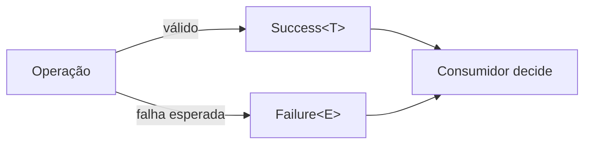

# Result

## Motivação

Representar sucesso ou falha esperada como valor tipado e obrigar o consumidor a considerar ambos.

## Problema que resolve

Exceções ocultam fluxos previstos e assinaturas ambíguas confundem ausência, erro e sucesso.

## Responsabilidades

- Conter exatamente um sucesso ou uma falha.
- Preservar tipos de valor e erro.
- Permitir composição explícita sem efeitos colaterais.

## O que não faz

- Não acumula vários erros; use [Notification](notification.md).
- Não captura defeitos, indisponibilidade inesperada ou violações de programação.
- Não registra logs nem traduz erros para HTTP.

## Fluxo

## Exemplos

`Result<OrganizationName, OrganizationNameError>` diferencia construção válida de entrada inválida. A implementação inicial está em `backend/applications/api/src/shared/core/result`.

## Relacionamento com outras primitivas

Pode carregar uma `Notification`; factories de Entity e Value Object podem retorná-lo; handlers o consomem antes de executar efeitos.

## Possíveis evoluções

Adicionar combinadores (`map`, `flatMap`, `mapError`) somente após usos reais demonstrarem necessidade e sem esconder fluxo.

## Boas práticas

- Usar união discriminada e valores imutáveis.
- Modelar erros estáveis por código e parâmetros.
- Combinar Results independentes com Notification; manter fail-fast quando uma avaliação depende do sucesso anterior.

## Anti-patterns

- `Result<T, Error>` genérico em toda API.
- Retornar falha e lançar exceção para a mesma condição.
- Inspecionar strings de mensagem para decidir comportamento.
