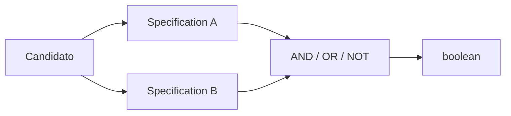

# Specification

## Motivação

Representar condições de negócio reutilizáveis como predicados explícitos e combináveis.

## Problema que resolve

Condições duplicadas e expressões booleanas extensas tornam regras difíceis de nomear, testar e recombinar.

## Responsabilidades

- Avaliar uma condição sem efeito colateral.
- Compor `and`, `or` e `not` preservando semântica.
- Ser testável isoladamente.

## O que não faz

- Não executa decisões ou mudanças.
- Não consulta infraestrutura implicitamente.
- Não substitui Policy quando há decisão contextual.

## Fluxo

## Exemplos

`ActiveMemberSpecification.and(AvailableOnDateSpecification)`.

## Relacionamento com outras primitivas

Policies podem compor Specifications; Repositories podem receber specifications somente se a tradução e limitações forem explícitas.

## Possíveis evoluções

Separar especificações executáveis em memória de representações traduzíveis para consulta.

## Boas práticas

- Dar nome de condição.
- Manter avaliação determinística com entradas explícitas.

## Anti-patterns

- Specification que salva ou publica.
- Árvore genérica criada antes de haver regras reutilizadas.
- Reutilizar objeto de consulta como regra de domínio.
