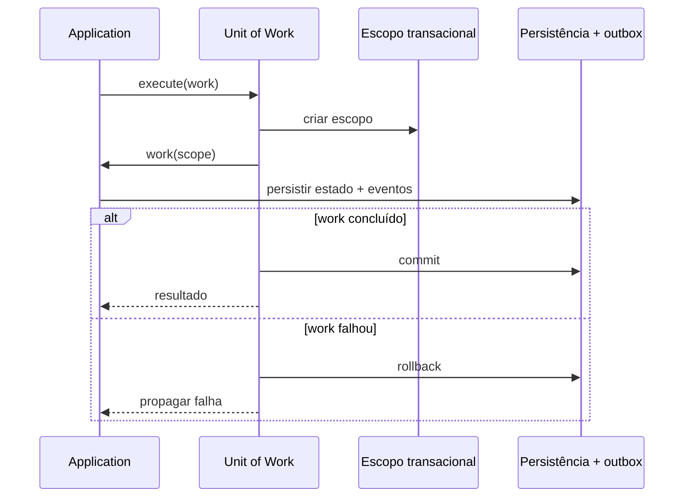

# Unit of Work

## Motivação

Coordenar persistência e publicação de eventos em uma fronteira de consistência explícita.

## Problema que resolve

Persistir estado e publicar fatos separadamente pode gerar eventos sem estado ou estado sem eventos.

## Responsabilidades

- Delimitar início, commit e rollback quando aplicáveis.
- Coordenar repositories participantes.
- Liberar eventos somente conforme a política transacional definida.

## O que não faz

- Não contém regra de negócio.
- Não promete atomicidade entre banco e broker sem outbox ou mecanismo equivalente.
- Não deve ser conhecido pelo domínio.

## Fluxo



## Exemplos

Um adapter transacional salva aggregates e outbox no mesmo commit; outro processo publica a outbox.

```ts
export interface UnitOfWork<TScope extends object> {
  execute<TResult>(
    work: (scope: TScope) => Promise<TResult>,
  ): Promise<TResult>;
}
```

O bounded context define o escopo com seus Repository ports e sua outbox. O callback concluído autoriza commit; uma exceção autoriza rollback e é propagada. `DirectUnitOfWork` executa o mesmo contrato sem oferecer transação e serve somente para testes ou composições que não exigem atomicidade real.

Eventos pendentes são observados sem remoção antes do commit. Depois do commit, `acknowledgeDomainEvents(events)` confirma somente o snapshot persistido; no rollback, eles permanecem pendentes e a instância alterada deve ser descartada.

## Relacionamento com outras primitivas

Coordena Repositories, Aggregate Roots e Event Publisher; pode usar Context e Logger na camada externa.

## Possíveis evoluções

Integrar o adapter transacional PostgreSQL ao relay durável. Inbox, retries, idempotência e sagas entram quando houver requisitos distribuídos reais.

## Boas práticas

- Documentar exatamente quando eventos se tornam publicáveis.
- Manter escopo curto e explícito.
- Recarregar e reexecutar a decisão em retries; não reutilizar Aggregate alterado após rollback.
- Compartilhar a mesma conexão entre todos os adapters do escopo transacional.

## Anti-patterns

- Publicar antes do commit.
- Transação distribuída assumida sem suporte.
- UoW global atravessando múltiplas requisições.
- Adapter sem transação apresentado como garantia de atomicidade.
