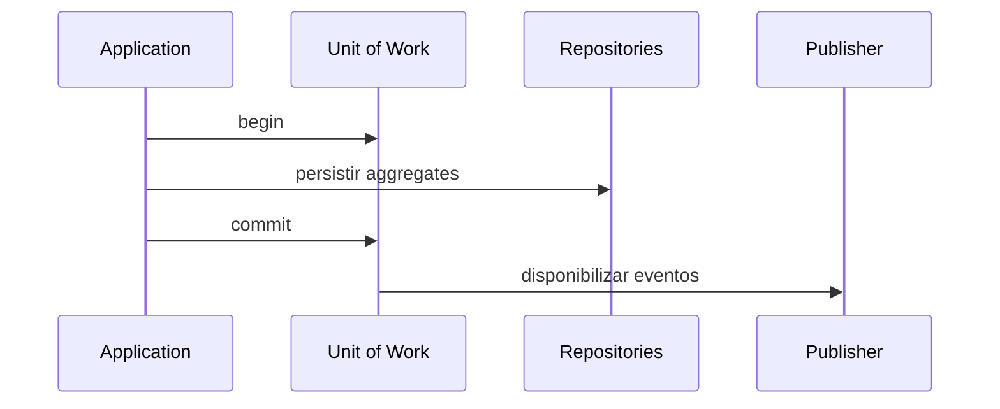

# Unit of Work

## Motivação

Coordenar persistência e publicação de eventos em uma fronteira de consistência explícita.

## Problema que resolve

Persistir estado e publicar fatos separadamente pode gerar eventos sem estado ou estado sem eventos.

## Responsabilidades

- Delimitar início, commit e rollback quando aplicáveis.
- Coordenar repositories participantes.
- Liberar eventos somente conforme a política transacional definida.

## O que não faz

- Não contém regra de negócio.
- Não promete atomicidade entre banco e broker sem outbox ou mecanismo equivalente.
- Não deve ser conhecido pelo domínio.

## Fluxo

## Exemplos

Um adapter transacional salva aggregates e outbox no mesmo commit; outro processo publica a outbox.

## Relacionamento com outras primitivas

Coordena Repositories, Aggregate Roots e Event Publisher; pode usar Context e Logger na camada externa.

## Possíveis evoluções

Outbox, inbox, retries, idempotência e sagas quando houver requisitos distribuídos reais.

## Boas práticas

- Documentar exatamente quando eventos se tornam publicáveis.
- Manter escopo curto e explícito.

## Anti-patterns

- Publicar antes do commit.
- Transação distribuída assumida sem suporte.
- UoW global atravessando múltiplas requisições.
