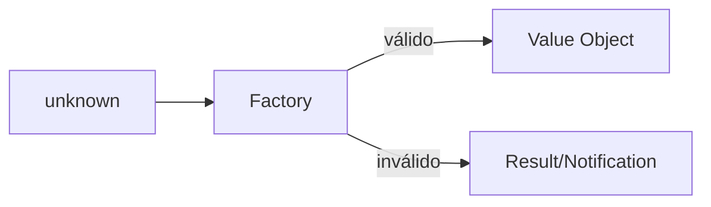

# Value Object

## Motivação

Dar nome, invariantes e comportamento a valores relevantes do domínio.

## Problema que resolve

Primitivos dispersos permitem combinações inválidas, perdem unidade semântica e duplicam validações.

## Responsabilidades

- Ser criado somente em estado válido.
- Ser imutável e comparado por conteúdo.
- Encapsular operações próprias do valor.

## O que não faz

- Não possui identidade ou ciclo de vida independente.
- Não é DTO nem wrapper sem semântica.
- Não depende de framework de validação.

## Fluxo

## Exemplos

`OrganizationName`, `Email` e `Money`. A implementação base inicial está em `backend/applications/api/src/shared/domain/value-object`.

## Relacionamento com outras primitivas

Compõe Entities, Aggregates, Events e Context; factories podem retornar Result.

## Possíveis evoluções

Ampliar tipos estruturados suportados somente quando casos concretos exigirem novas semânticas de igualdade.

## Boas práticas

- Fazer cópia defensiva e não expor estado mutável.
- Copiar e congelar profundamente arrays e objetos estruturados recebidos.
- Nomear operações na linguagem do domínio.

## Anti-patterns

- Herança para compartilhar campos sem semântica.
- Aceitar estado inválido temporário.
- Usar JSON stringify como igualdade universal.
