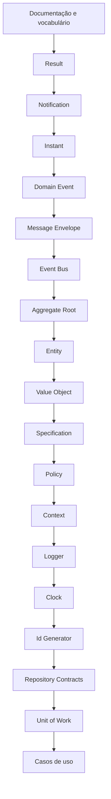

# Roadmap da Fundação

## Motivação

Controlar dependências entre conceitos e impedir que implementação prematura cristalize contratos frágeis.

## Problema que resolve

Primitivas construídas fora de ordem tendem a duplicar responsabilidades ou depender de conceitos ainda indefinidos.

## Responsabilidades

- Tornar a sequência e os critérios de conclusão explícitos.
- Registrar o estado real sem confundir código existente com contrato estabilizado.

## O que não faz

- Não é cronograma.
- Não garante estabilidade sem revisão e testes.

## Fluxo e etapas

| Etapa | Estado | Critério de saída |
|---|---|---|
| Vocabulário e documentação | Em andamento | Links, ADRs e contratos revisados |
| Result | Implementação inicial | Semântica e testes estabilizados |
| Notification | Implementação inicial | Acúmulo, imutabilidade e testes decididos |
| Instant | Implementação inicial | UTC, imutabilidade, igualdade e serialização testadas |
| Domain Event | Implementação inicial | Identidade, instante, imutabilidade e testes definidos |
| Message Envelope | Implementação inicial | Identidade, correlação, causalidade e imutabilidade testadas |
| Event Bus | Planejado | Contratos, falhas e ordenação definidos |
| Aggregate Root | Implementação inicial | Registro, snapshot, ordem e retirada testados |
| Entity | Implementação inicial | Identidade, igualdade e construção testadas |
| Value Object | Implementação inicial | Imutabilidade e igualdade testadas |
| Specification e Policy | Planejado | Cada contrato documentado e testado |
| Context | Implementação inicial | IDs fortes, imutabilidade e testes definidos |
| Logger a Unit of Work | Planejado | Cada contrato documentado e testado |
| Casos de uso e adaptadores | Bloqueado | Fundação concluída |

## Exemplos

Uma implementação existente pode permanecer “inicial” até que sua API e invariantes tenham testes de contrato.

## Relacionamento com outras primitivas

A ordem expressa dependências conceituais, não herança ou dependência obrigatória de código.

## Possíveis evoluções

Adicionar critérios mensuráveis, versões da fundação e marcos por bounded context.

## Boas práticas

- Atualizar estado e documentação na mesma mudança.
- Não marcar concluído apenas porque existe código.

## Anti-patterns

- Iniciar infraestrutura para “validar” um contrato ainda indefinido.
- Expandir escopo silenciosamente.
