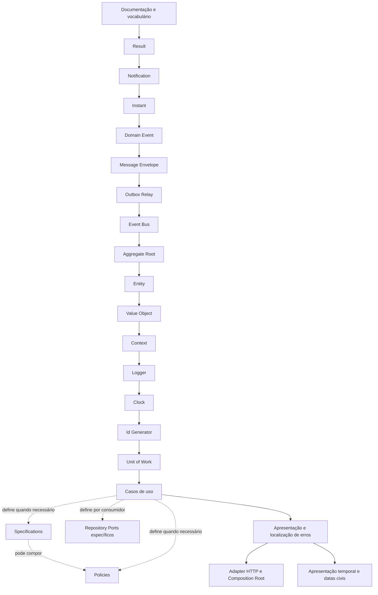

# Roadmap da Fundação

## Motivação

Controlar dependências entre conceitos e impedir que implementação prematura cristalize contratos frágeis.

## Problema que resolve

Primitivas construídas fora de ordem tendem a duplicar responsabilidades ou depender de conceitos ainda indefinidos.

## Responsabilidades

- Tornar a sequência e os critérios de conclusão explícitos.
- Registrar o estado real sem confundir código existente com contrato estabilizado.

## O que não faz

- Não é cronograma.
- Não garante estabilidade sem revisão e testes.

## Fluxo e etapas

| Etapa | Estado | Critério de saída |
|---|---|---|
| Vocabulário e documentação | Em andamento | Links, ADRs e contratos revisados |
| Documentação bilíngue | Planejado | Português definido como fonte canônica; versões em inglês organizadas em `docs/en/`; navegação entre idiomas e processo de sincronização definidos; skills voltadas apenas a agentes avaliadas para padronização em inglês |
| Result | Implementação inicial | Semântica e testes estabilizados |
| Notification | Implementação inicial | Acúmulo, imutabilidade e testes decididos |
| Instant | Implementação inicial | UTC, imutabilidade, igualdade e serialização testadas |
| Domain Event | Implementação inicial | Identidade, instante, imutabilidade e testes definidos |
| Message Envelope | Implementação inicial | Identidade, correlação, causalidade e imutabilidade testadas |
| Event Bus | Implementação inicial | Ports, concorrência, falhas e subscriptions testados |
| Outbox Relay | Implementação inicial | Adapter em memória publica em ordem, confirma após sucesso, preserva pendências em falha e evita flush concorrente; relay durável permanece planejado |
| Aggregate Root | Implementação inicial | Registro, snapshot, ordem e confirmação seletiva testados |
| Entity | Implementação inicial | Identidade, igualdade e construção testadas |
| Value Object | Implementação inicial | Imutabilidade e igualdade testadas |
| Specification e Policy | Diretrizes definidas | Tipos concretos são criados quando regras consumidoras demonstrarem reuso ou decisão contextual |
| Context | Implementação inicial | IDs fortes, imutabilidade e testes definidos |
| Logger | Implementação inicial | Registro, contexto, imutabilidade, adapter de teste e adapter JSON limitado para stdout definidos; o adapter enriquece registros com o trace/span ativo sem acoplar o port ao OpenTelemetry; redaction configurável permanece planejada |
| Clock | Implementação inicial | Port, SystemClock, FixedClock e testes definidos |
| Id Generator | Implementação inicial | Port tipado, sequência determinística, validação canônica dos IDs persistidos e adapter UUIDv7 com factory nominal e falhas técnicas codificadas estão testados |
| Repository | Diretriz definida | Ports específicos são criados com o primeiro caso de uso, sem contrato genérico compartilhado |
| Unit of Work | Implementação inicial | Port com escopo tipado, adapter direto e confirmação seletiva de eventos testados; adapter transacional permanece planejado |
| Primeiro corte vertical | Implementação inicial | CreateOrganization persiste Organization e EventEnvelope pelo mesmo Unit of Work; adapters tecnológicos permanecem planejados |
| Infraestrutura de banco e migrations | Implementação inicial | PostgreSQL local, changelog Liquibase externo ao backend e schema inicial de Organization + outbox estão definidos; execução em container, adapter PostgreSQL, credenciais de runtime e IaC de ambientes compartilhados permanecem planejados |
| Apresentação e localização de erros | Implementação inicial | Locale e fallback, port de tradução, adapter em memória, erro apresentado, primeiro Presenter e títulos HTTP localizados estão definidos |
| Adapter HTTP e Composition Root | Implementação inicial | Factory Fastify, contexto por request, negociação de locale, Problem Details RFC 9457, representação direta do recurso, rota `POST /organizations`, composição executável e tracing HTTP/Fastify com OpenTelemetry estão testados; spans manuais do relay e adapters tecnológicos de persistência permanecem planejados |
| Apresentação temporal e datas civis | Planejado | API preserva `Instant` UTC; apresentação converte com locale e timezone IANA; agendamentos modelam data civil, horário civil e zona separadamente; precedência entre timezone da operação, usuário, organização e aplicação permanece por definir com o primeiro consumidor |

## Exemplos

Uma implementação existente pode permanecer “inicial” até que sua API e invariantes tenham testes de contrato.

## Relacionamento com outras primitivas

A ordem expressa dependências conceituais, não herança ou dependência obrigatória de código.

## Possíveis evoluções

Adicionar critérios mensuráveis, versões da fundação e marcos por bounded context.

## Boas práticas

- Atualizar estado e documentação na mesma mudança.
- Não marcar concluído apenas porque existe código.

## Anti-patterns

- Iniciar infraestrutura para “validar” um contrato ainda indefinido.
- Expandir escopo silenciosamente.
