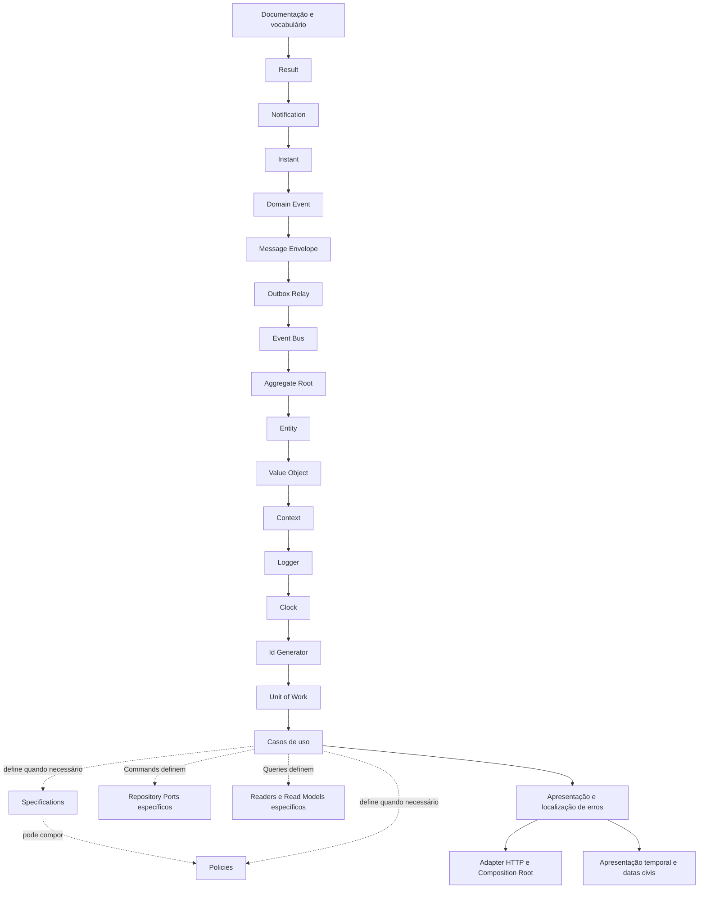

# Roadmap da Fundação

## Motivação

Controlar dependências entre conceitos e impedir que implementação prematura cristalize contratos frágeis.

## Problema que resolve

Primitivas construídas fora de ordem tendem a duplicar responsabilidades ou depender de conceitos ainda indefinidos.

## Responsabilidades

- Tornar a sequência e os critérios de conclusão explícitos.
- Registrar o estado real sem confundir código existente com contrato estabilizado.

## O que não faz

- Não é cronograma.
- Não garante estabilidade sem revisão e testes.

## Fluxo e etapas

| Etapa                                    | Estado                    | Critério de saída                                                                                                                                                                                                                                                                                                                                                                                                                                                                                                                                                                                    |
| ---------------------------------------- | ------------------------- | ---------------------------------------------------------------------------------------------------------------------------------------------------------------------------------------------------------------------------------------------------------------------------------------------------------------------------------------------------------------------------------------------------------------------------------------------------------------------------------------------------------------------------------------------------------------------------------------------------- |
| Vocabulário e documentação               | Em andamento              | Links, ADRs e contratos revisados                                                                                                                                                                                                                                                                                                                                                                                                                                                                                                                                                                    |
| Documentação bilíngue                    | Planejado                 | Português definido como fonte canônica; versões em inglês organizadas em `docs/en/`; navegação entre idiomas e processo de sincronização definidos; skills voltadas apenas a agentes avaliadas para padronização em inglês                                                                                                                                                                                                                                                                                                                                                                           |
| Busca eficiente e global                 | Planejado                 | Evolução orientada por consumidores desde prefixo/B-tree até trigram, Full Text Search ou índice externo; autocomplete, sinônimos, ranking e consistência eventual entram somente com volume e UX comprovados                                                                                                                                                                                                                                                                                                                                                                                        |
| Result                                   | Implementação inicial     | Semântica e testes estabilizados                                                                                                                                                                                                                                                                                                                                                                                                                                                                                                                                                                     |
| Notification                             | Implementação inicial     | Acúmulo, imutabilidade e testes decididos                                                                                                                                                                                                                                                                                                                                                                                                                                                                                                                                                            |
| Instant                                  | Implementação inicial     | UTC, imutabilidade, igualdade e serialização testadas                                                                                                                                                                                                                                                                                                                                                                                                                                                                                                                                                |
| Domain Event                             | Implementação inicial     | Identidade, instante, imutabilidade e testes definidos                                                                                                                                                                                                                                                                                                                                                                                                                                                                                                                                               |
| Message Envelope e Integration Event     | Implementação inicial     | Contratos externos versionados definem canal, source e type; Organization e Membership possuem mappers explícitos e roteamento persistido por mensagem                                                                                                                                                                                                                                                                                                                                                                                                                                               |
| Event Bus                                | Implementação inicial     | Ports, concorrência, falhas e subscriptions testados                                                                                                                                                                                                                                                                                                                                                                                                                                                                                                                                                 |
| Outbox Relay                             | Implementação inicial     | `ProcessOutboxBatch` coordena as transições; adapters em memória e PostgreSQL validam claim concorrente, limite, disponibilidade temporal, posse, expiração, recuperação e estados terminais                                                                                                                                                                                                                                                                                                                                                                                                         |
| Aggregate Root                           | Implementação inicial     | Registro, snapshot, ordem e confirmação seletiva testados                                                                                                                                                                                                                                                                                                                                                                                                                                                                                                                                            |
| Entity                                   | Implementação inicial     | Identidade, igualdade e construção testadas                                                                                                                                                                                                                                                                                                                                                                                                                                                                                                                                                          |
| Value Object                             | Implementação inicial     | Imutabilidade e igualdade testadas                                                                                                                                                                                                                                                                                                                                                                                                                                                                                                                                                                   |
| Specification e Policy                   | Implementação inicial     | `MemberRegistrationPolicy` é a primeira decisão contextual concreta: recebe fatos explícitos de Reader, não consulta infraestrutura e possui testes próprios                                                                                                                                                                                                                                                                                                                                                                                                                                         |
| Context                                  | Implementação inicial     | CorrelationId, RequestId, imutabilidade e propagação explícita estão implementados; modelo causal aprovado separa actor por User/Service/System, executor por ServiceId e source inicial confiável, mas a migração do AuthenticatedActor externo e a propagação assíncrona permanecem planejadas                                                                                                                                                                                                                                                                                                     |
| Logger                                   | Implementação inicial     | Contrato, parsing de severidade, adapter JSON e atributos seguros de falhas são compartilhados por API e relay; contexto, imutabilidade, filtro por `LOG_LEVEL`, limites, correlação e narrativas de negócio estão testados; revisão das perguntas técnicas/operacionais, logging e tracing do BFF, redaction configurável e pipeline vendor-neutral para busca permanecem planejados                                                                                                                                                                                                                |
| Fundação OpenTelemetry para Node         | Implementação inicial     | SDK, OTLP, W3C Trace Context, lifecycle, erros técnicos, instrumentação PostgreSQL segura e mecânica de spans estão centralizados em `node-observability`; API e relay preservam composição e semântica próprias; configuração avançada de sampling e exporters permanece planejada                                                                                                                                                                                                                                                                                                                  |
| Schema e governança de logs operacionais | Planejado                 | Contrato interoperável alinhado ao OpenTelemetry Logs Data Model e às Semantic Conventions estáveis; timestamp do evento, severidade, nome, trace/span, resource, instrumentation scope e atributos tipados definidos; redaction e controle de volume testados; JSON Lines, OTLP e mappings para destinos específicos permanecem responsabilidades de adapters e infraestrutura                                                                                                                                                                                                                      |
| Clock                                    | Implementação inicial     | Port, SystemClock, FixedClock e testes definidos                                                                                                                                                                                                                                                                                                                                                                                                                                                                                                                                                     |
| Estratégia de testes                     | Implementação inicial     | Suítes unitária e PostgreSQL separadas; handlers usam doubles locais mínimos dos ports, enquanto composições HTTP, repositories, readers, transações, constraints e isolamento multi-tenant são validados no PostgreSQL real; adapters compartilhados de persistência em memória foram removidos                                                                                                                                                                                                                                                                                                     |
| Id Generator                             | Implementação inicial     | Port tipado compartilhado em `application-foundation`, sequência determinística, validação canônica dos IDs persistidos, LeaseId nominal e adapters UUIDv7 com factories e falhas técnicas codificadas estão testados                                                                                                                                                                                                                                                                                                                                                                                |
| Commands, Queries e Repository           | Implementação inicial     | Commands usam Repositories orientados a Aggregates; GetMemberDetails concretiza a primeira Query com Reader, Read Model e suíte de contrato para memória/PostgreSQL; nenhum contrato genérico ou separação física é antecipado                                                                                                                                                                                                                                                                                                                                                                       |
| Unit of Work                             | Implementação inicial     | Port com escopo tipado, confirmação seletiva de eventos e adapter PostgreSQL com commit/rollback testados; testes unitários implementam localmente apenas o mínimo do port necessário para observar a orquestração                                                                                                                                                                                                                                                                                                                                                                                   |
| Primeiro corte vertical                  | Implementação inicial     | CreateOrganization persiste Organization e outbox atomicamente; PostgreSQL traduz `OrganizationCreated` para contrato externo v1; relay publica o CloudEvent no Kafka e confirma a outbox; fluxo real validado manualmente, com teste de sistema automatizado ainda planejado                                                                                                                                                                                                                                                                                                                        |
| Descoberta do domínio ministerial        | Em andamento              | Contextos de Organizations, Membership, Ministries, Activities e Scheduling mapeados; linguagem confirmada separada de hipóteses; primeiro incremento selecionado após fechar questões do Aggregate consumidor                                                                                                                                                                                                                                                                                                                                                                                       |
| Member e vínculo organizacional          | Corte vertical inicial    | Núcleo, RegisterMember, GetMemberDetails, ListMembers paginado, Policy, Readers, persistência PostgreSQL, schema com status numérico, Integration Event v1 e entradas HTTP localizadas implementados                                                                                                                                                                                                                                                                                                                                                                                                 |
| Identity & Access                        | Implementação inicial     | User global, provisionamento PostgreSQL idempotente, identidades de bootstrap e ator separadas, access JWT e bootstrap assertion próprios com RS256, audience, purpose, expiração e rotação por kid estão implementados; OIDC direto com Google e depois Microsoft, sessão, vinculação explícita de provedores, proteção de rotas, OrganizationAccess, MemberAccessInvitation, autorização e interface permanecem planejados                                                                                                                                                                         |
| Ministry e funções                       | Cortes verticais iniciais | CreateMinistry e DefineMinistryRole estão implementados com invariantes de nomes ativos, persistência/outbox atômicas, Integration Events v1 e entradas HTTP; desativação e reativação permanecem orientadas por consumidores futuros                                                                                                                                                                                                                                                                                                                                                                |
| Participação e qualificação ministerial  | Cortes verticais iniciais | RequestMinistryMembership, ApproveMinistryMembership e QualifyMemberForMinistryRole implementados na root separada, com persistência/outbox atômicas, Integration Events v1 e entradas HTTP; rejeição, estados posteriores e revogação de qualificação permanecem planejados                                                                                                                                                                                                                                                                                                                         |
| Times ministeriais                       | Cortes verticais iniciais | CreateMinistryTeam, AssignMemberToTeam e AppointTeamLeader implementados como roots históricas separadas, com isolamento por Organization, persistência/outbox atômicas, Integration Events v1 e entradas HTTP; substituição de liderança e responsabilidade por escala permanecem planejadas                                                                                                                                                                                                                                                                                                        |
| Activities e ocorrências                 | Implementação inicial     | CreateActivity, ListActivities, GetActivityDetails e ScheduleManualActivityOccurrence estão implementados com limites tenant-safe; a interface oferece criação, busca e detalhe com ministérios participantes, enquanto recorrência finita, revisão de regras IANA, reagendamento e cancelamento permanecem futuros                                                                                                                                                                                                                                                                                  |
| Disponibilidade                          | Corte vertical inicial    | OpenAvailabilityRequest cria coleta tenant-safe por time e período civil, com prazo UTC e persistência/outbox atômicas; declarações, precedência, resposta explícita, fechamento e lembretes permanecem planejados                                                                                                                                                                                                                                                                                                                                                                                   |
| Escalas por time                         | Planejado                 | Necessidades, atribuições, conflito global, apoio, snapshots publicados e substituições históricas testados                                                                                                                                                                                                                                                                                                                                                                                                                                                                                          |
| Workspaces de aplicações                 | Implementação inicial     | `backend` coordena workspaces npm; API e relay possuem manifestos próprios; `integration-messaging`, `application-foundation` e `node-observability` possuem ownership explícito e consumidores reais                                                                                                                                                                                                                                                                                                                                                                                                |
| Aplicação de relay durável               | Implementação inicial     | Storage PostgreSQL, retry com jitter, publisher Kafka/CloudEvents, propagação W3C por links e records, spans semânticos por lote/mensagem, logs correlacionados, ciclo contínuo cancelável e encerramento seguro estão implementados; métricas, operação de reprocessamento e testes reais com Kafka permanecem planejados                                                                                                                                                                                                                                                                           |
| Infraestrutura local e migrations        | Implementação inicial     | Terraform administra cinco bridges segmentadas, volumes protegidos, PostgreSQL, Kafka, observabilidade e recursos independentes de frontend, API e relay sem construir imagens; somente o BFF publica HTTP, enquanto a API permanece privada; Liquibase continua externo e registry/CI, readiness, RLS e IaC compartilhada permanecem planejados                                                                                                                                                                                                                                                     |
| Apresentação e localização de erros      | Implementação inicial     | Locale e fallback, port de tradução, adapter em memória, erro apresentado, primeiro Presenter e títulos HTTP localizados estão definidos                                                                                                                                                                                                                                                                                                                                                                                                                                                             |
| Adapter HTTP e Composition Root          | Implementação inicial     | Factory Fastify, container restrito à composição, tokens tipados, Mediator, módulos instaláveis e persistência PostgreSQL registrada pelo módulo estão testados; write scopes recebem outbox automaticamente, mappers usam registry O(1), contexto permanece explícito e fluxos HTTP persistentes são cobertos por integração real                                                                                                                                                                                                                                                                   |
| Visualização local de traces             | Implementação inicial     | Terraform provisiona Collector vendor-neutral e Jaeger efêmero; API e relay exportam por OTLP/HTTP; melhorar filtros e navegação dos traces será avaliado por perguntas operacionais reais, mantendo OTLP/Collector desacoplados do backend escolhido; Elasticsearch/Kibana é candidato futuro para busca de logs, não dependência da Application                                                                                                                                                                                                                                                    |
| Apresentação temporal e datas civis      | Implementação inicial     | `CivilDate`, `CivilTime`, `TimeZoneId` e `SchedulePeriod` preservam intenção civil; ocorrências manuais resolvem offset e `Instant`, rejeitam lacunas e exigem desambiguação em sobreposições; reconciliação após mudanças IANA permanece futura                                                                                                                                                                                                                                                                                                                                                     |
| Aplicação web                            | Cortes verticais iniciais | Workspace independente com web Vue e BFF Fastify; somente o BFF conhece a API privada; estrutura `app/pages/features/entities/shared`, APIs públicas sem deep imports, restrições de dependência no ESLint e migrações de Organization e Ministries estão implementadas; contexto de Organization e busca de ministérios na URL, shell leve e responsivo, temas, HTML semântico e layout mobile-first sustentam CreateOrganization, Início e gestão de ministérios; pessoas, times, fluxo operacional principal, refinamento das páginas e auditorias reais de acessibilidade permanecem em evolução |

## Exemplos

Uma implementação existente pode permanecer “inicial” até que sua API e invariantes tenham testes de contrato.

## Relacionamento com outras primitivas

A ordem expressa dependências conceituais, não herança ou dependência obrigatória de código.

## Possíveis evoluções

Adicionar critérios mensuráveis, versões da fundação e marcos por bounded context.

## Boas práticas

- Atualizar estado e documentação na mesma mudança.
- Não marcar concluído apenas porque existe código.

## Anti-patterns

- Iniciar infraestrutura para “validar” um contrato ainda indefinido.
- Expandir escopo silenciosamente.
