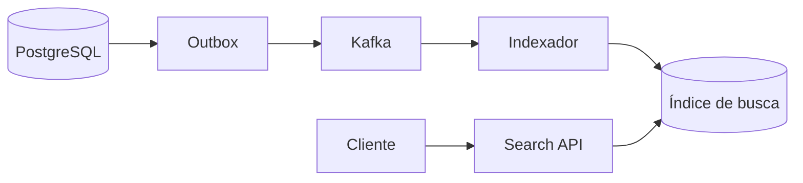

# Estratégia evolutiva de busca

## Motivação

Preservar buscas simples enquanto o domínio e o volume são pequenos, sem fechar o caminho para recuperação textual eficiente, tolerância a erros e ranking quando consumidores reais exigirem essas capacidades.

## Princípio

Busca é uma decisão orientada pelo consumidor. Complexidade operacional e índices adicionais entram somente quando volume, latência ou qualidade dos resultados demonstrarem necessidade.

## Estágios

| Estágio | Capacidade | Solução candidata | Quando usar |
|---|---|---|---|
| Lista administrativa | filtro por prefixo, ordenação e total | PostgreSQL e B-tree | coleções pequenas e navegação numerada |
| Busca parcial | substring e pequenas diferenças de escrita | `pg_trgm` com GIN ou GiST | nomes numerosos ou UX que exige correspondência aproximada |
| Busca textual | termos, linguagem, pesos e ranking | `tsvector`, `tsquery` e GIN | documentos ou múltiplos campos textuais |
| Busca global | autocomplete, sinônimos, relevância e múltiplas entidades | OpenSearch ou mecanismo equivalente | escala, ranking e operação justificam uma projeção própria |

## Estado atual

`ListMinistries` usa busca por prefixo dentro da Organization, ordenação estável e paginação por `LIMIT/OFFSET` com total exato. O volume esperado é de dezenas de ministérios por igreja, portanto cursor e índice trigram seriam desproporcionais.

## Evolução de uma busca global

Uma futura busca de membros, ministérios, atividades e escalas pode usar uma projeção assíncrona:

O PostgreSQL permanece fonte de verdade. O índice especializado é uma projeção reconstruível e eventualmente consistente.

## Critérios de decisão

- cardinalidade e crescimento da coleção;
- padrões reais de consulta e latência medida;
- prefixo, substring, erro de digitação ou linguagem natural;
- necessidade de autocomplete, sinônimos e ranking;
- custo adicional de escrita, armazenamento e operação;
- tolerância do consumidor à consistência eventual;
- necessidade de total exato ou navegação arbitrária.

## Anti-patterns

- adicionar Elasticsearch para uma lista pequena;
- tratar `LIKE '%termo%'` como solução universal;
- criar índices sem observar o plano de execução;
- acoplar o domínio ao formato do mecanismo de busca;
- apresentar uma projeção eventualmente consistente como fonte de verdade.
